### AnonCreds Issuance Data Flow

```mermaid
sequenceDiagram
    autonumber
    participant L as Verifiable<br>Data Registry
    participant I as Issuer
    participant H as Holder  


    %%I ->> I: issuer_create_credential_offer<br>(wallet_handle, cred_def_id)
    %%I ->> H: Send offer-credential
    %%H ->> H: Process offer-credential
    %%H ->> H: build_get_cred_def_request(issuer_DID, cred_def_id)
    %%H ->> L: submit_request(pool_handle, get_cred_def_request)
    %%H ->> H: parse_get_cred_def_response(get_cred_def_response)
    %%H ->> I: prover_create_credential_req(wallet_handle, issuer_DID,<br>credential_offer, cred_def, master_secret_id)
    %%H ->> I: send credential request
 
    %%I ->> I: Prepare RAW attribute values and encode them
    %%I ->> I: issuer_create_credential(wallet_handle,<br>credential_offer, credential_request <br>transcript_cred_values, None, None)
    %%I ->> H: Send credential
    %%H ->> H: prover_store_credential(wallet_handle, None,<br>credential_request, meta_data, %%credential,<br>credential_definition, None)

    I ->> I: Create Credential Offer
    I ->> H: Send Credential Offer
    H ->> H: Process Credential Offer
    H ->> L: Request SCHEMA and CRED_DEF
    L ->> H: Return SCHEMA and CRED_DEF
    H ->> H: Create Credential Request<br>by using SCHEMA and CRED_DEF
    H ->> I: Send Credential Request
    I ->> I: Process Credential Request
    I ->> I: Issue Credential
    I ->> H: Send Credential
    H ->> H: Store Credential



    rect rgb(191, 223, 255)
      Note left of H: 💡The "Verifier" and "Schema Publisher" roles are<br>omitted in this diagram, since it is not required<br>for the credential issuance data flow.
    end
```

The issuance of an anonymous [[ref:credential]] takes several steps and involves the roles [[ref:issuer]], [[ref:holder]] as well as the [[ref: Verifiable Data Registry]] (see diagramm above).

The [[ref:issuer]] prepares a [[ref:Credential Offer]] for the [[ref:holder]] (step 1). A [[ref:Credential Offer]] includes information about what kind of [[ref:credential]] (based on which [[ref: CRED_DEF]]) the [[ref:issuer]] is intending to issue to the [[ref:holder]]. The [[ref:issuer]] sends the [[ref:Credential Offer]] to the [[ref:holder]] (step 2), who evaluates the incoming offer (step 3) and subsequently fetches required data (the [[ref:CRED_DEF]]) from the [[ref: Verifiable Data Registry]] (step 4).

Based on the [[ref:CRED_DEF]] received from the [[ref:Verfiable Data Registry]] (step 5), the [[ref:holder]] prepares a [[ref:Credential Request]] (step 6). A [[ref: Credential Request]] is a formal request from a [[ref:holder]] to an [[ref:issuer]] to get a [[ref:credential]] based on the given [[ref:CRED_DEF]] issued to the [[ref:holder]]. The [[ref:holder]] sends the [[ref: Credential Request]] to the [[ref:issuer]] (step 7), who then evaluates the incoming request (step 8).

The [[ref:issuer]] can decide whether to accept the received [[ref: Credential Request]] and issues the [[ref:credential]] (step 9) in the case of request acceptance. The [[ref:issuer]] sends the credential to the [[ref:holder]] (step 10), who then can store the received [[ref:credential]] in his wallet.

::: todo
Document the steps of Issuance -- Credential Offer, Credential Request and Issue Credential
:::

#### Credential Offer

#### Credential Request

#### Issue Credential
