### AnonCreds Issuance Data Flow

The issuance of an anonymous [[ref:credential]] takes several steps and involves the roles [[ref:issuer]], [[ref:holder]] as well as the [[ref: Verifiable Data Registry]] (see diagramm below).

```mermaid
sequenceDiagram
    autonumber
    participant L as Verifiable<br>Data Registry
    participant I as Issuer
    participant H as Holder  


    %%I ->> I: issuer_create_credential_offer<br>(wallet_handle, cred_def_id)
    %%I ->> H: Send offer-credential
    %%H ->> H: Process offer-credential
    %%H ->> H: build_get_cred_def_request(issuer_DID, cred_def_id)
    %%H ->> L: submit_request(pool_handle, get_cred_def_request)
    %%H ->> H: parse_get_cred_def_response(get_cred_def_response)
    %%H ->> I: prover_create_credential_req(wallet_handle, issuer_DID,<br>credential_offer, cred_def, master_secret_id)
    %%H ->> I: send credential request
 
    %%I ->> I: Prepare RAW attribute values and encode them
    %%I ->> I: issuer_create_credential(wallet_handle,<br>credential_offer, credential_request <br>transcript_cred_values, None, None)
    %%I ->> H: Send credential
    %%H ->> H: prover_store_credential(wallet_handle, None,<br>credential_request, meta_data, %%credential,<br>credential_definition, None)

  I ->> I: Create Credential Offer
  I ->> H: Send Credential Offer
  H ->> H: Process Credential Offer
  H ->> L: Request CRED_DEF
  L ->> H: Return CRED_DEF
  H ->> H: Create Credential Request
  H ->> I: Send Credential Request
  I ->> I: Process Credential Request
  I ->> I: Issue Credential
  I ->> H: Send Credential
  H ->> H: Store Credential


  rect rgb(191, 223, 255)
    Note left of H: 💡The "Verifier" and "Schema Publisher" roles are<br>omitted in this diagram, since it is not required<br>for the credential issuance data flow.
  end
```



The [[ref:issuer]] prepares a [[ref:Credential Offer]] for the [[ref:holder]] (step 1). A [[ref:Credential Offer]] includes information about what kind of [[ref:credential]] (based on which [[ref: CRED_DEF]]) the [[ref:issuer]] is intending to issue to the [[ref:holder]]. The [[ref:issuer]] sends the [[ref:Credential Offer]] to the [[ref:holder]] (step 2), who evaluates the incoming offer (step 3) and subsequently fetches required data (the [[ref:CRED_DEF]]) from the [[ref: Verifiable Data Registry]] (step 4).

Based on the [[ref:CRED_DEF]] received from the [[ref:Verfiable Data Registry]] (step 5), the [[ref:holder]] prepares a [[ref:Credential Request]] (step 6). A [[ref: Credential Request]] is a formal request from a [[ref:holder]] to an [[ref:issuer]] to get a [[ref:credential]] based on the given [[ref:CRED_DEF]] issued to the [[ref:holder]]. The [[ref:holder]] sends the [[ref: Credential Request]] to the [[ref:issuer]] (step 7), who then evaluates the incoming request (step 8).

The [[ref:issuer]] can decide whether to accept the received [[ref: Credential Request]] and issues the [[ref:credential]] (step 9) in the case of request acceptance. The [[ref:issuer]] sends the credential to the [[ref:holder]] (step 10), who then can store the received [[ref:credential]] in his wallet (step 11).


#### Credential Offer

Before issuing a credential to the [[ref:holder]], the [[ref:issuer]] has to send a [[ref:Credential Offer]] to the [[ref:holder]] (step 1 and 2), which contains information about the credential the [[ref:issuer]] intends to issue and send to the [[ref:holder]]. For creating a [[ref:Credential Offer]], the [[ref:issuer]] is required to fetch the [[ref:CRED_DEF]] as well as its correctness proof from the [[ref: Verifiable Data Registry]].

The resulting JSON for a created [[ref:Credential Offer]] is shown here:

```json
{
    "schema_id": string,
    "cred_def_id": string,
    // Fields below can depend on Cred Def type
    "nonce": string,
    "key_correctness_proof" : <key_correctness_proof>
}
```
* `schema_id`: The ID of the [[ref:SCHEMA]] on which the [[ref:CRED_DEF]] for the offered [[ref:Credential]] is based.
* `cred_def_id`: The ID of the [[ref:CRED_DEF]] on which the [[ref:Credential]] to be issued will be based.
* `nonce`: Used for avoiding replay attacks. Has to be reused within a [[ref:Credential Request]] by the [[ref:holder]].
* `key_correctness_proof`: TODO.

The [[ref:issuer]] sends the [[ref:Credential Offer]] JSON to the [[ref:holder]], who then can reply with a [[ref:Credential Request]] in order to obtain the offered credential.

:::todo
 - Add info to key_correctness_proof
:::

#### Credential Request

A [[ref:Credential Request]] is a formal request from a [[ref:holder]] to an [[ref:issuer]] to get a [[ref:credential]] based on a concrete [[ref:CRED_DEF]] issued by the [[ref:issuer]] to the [[ref:holder]]. 

In order to be able as a [[ref:holder]] to express within a [[ref:Credential Request]] to the [[ref:issuer]] which kind of credential the [[ref:issuer]] shall issue to the [[ref:holder]], the [[ref:holder]] requires the [[ref:SCHEMA]] and the [[ref:CRED_DEF]] from the [[ref:Verifiable Data Registry]] if not already available in local storage. The [[ref:Credential Request]] has to reference the same [[ref:CRED_DEF]] and [[ref:nonce]] as given in the preceding [[ref:Credential Offer]]. Besides the [[ref:CRED_DEF]] and [[ref:SCHEMA]], the [[ref:holder]] also requires his [[ref:link secret]] in a blinded form, as well as the corresponding [[ref: Correctness Proof]] of his [[ref:link secret]].

::: todo
- How does the link secret get blinded? How does the cryptography work? How does it work with correctness proof? ==> Out of scope?
:::

The resulting JSON for a [[ref:Credential Request]] is shown here:

```json
{
  "prover_did" : string,
  "cred_def_id" : string,
  // Fields below can depend on Cred Def type
  "blinded_ms" : string,
  "blinded_ms_correctness_proof" : string,
  "nonce": string
}
```
* `prover_did`: The [[ref:DID]] of the [[ref:holder]].
* `cred_def_id`: The ID of the [[ref:CRED_DEF]] on which the [[ref:Credential]] to be issued shall be based.
* `blinded_ms`: The [[ref:link secret]] in its blinded form.
* `blinded_ms_correctness_proof`: The [[ref: Correctness Proof]] of the blinded [[ref:link secret]].
* `nonce`: Used for avoiding replay attacks. Reused from the received [[ref:Credential Offer]].

::: todo
```json
 cred_req_metadata_json: Credential request metadata json for further processing of received form 
```
Figure out how cred_req_metadata_json looks like. Is this even required yet / sent to the issuer? Seems to me like it is stored locally and loaded when an issuer "replies" to the credential request with an issued credential, so that the credential can be mapped to the preceding credential request.
:::

The [[ref:issuer]] sends the [[ref:Credential Request]] JSON to the [[ref:issuer]], who then can reply with an issued credential to the [[ref:holder]].


#### Issue Credential

After the [[ref:issuer]] received the [[ref:Credential Request]] from the [[ref:holder]], the [[ref:issuer]] is able to issue a credential to the [[ref:holder]]. Therefore the [[ref:issuer]] needs to execute the following steps:

1. The [[ref:issuer]] has to fetch the [[ref:CRED_DEF]] for the `cred_def_id` given in the [[ref:Credential Request]] either from the ledger (or his local storage if already available).
2. Every raw attribute value for each attribute in the [[ref:CRED_DEF]] respectively [[ref:Schema]], which the [[ref:issuer]] intends to issue to the [[ref:holder]], needs to be defined and set.
3. The [[ref:issuer]] has to fetch the [[ref:holder]]`s blinded [[ref:link secret]] from the received the [[ref:Credential Request]]. The blinded [[ref:link secret]] is treated as raw attribute value.
4. Every raw attribute value, that cannot successfully be parsed into an iteger, has to be encoded. The same rule applies to the blinded [[ref:link secret]].
5. Every raw attribute value, that can successfully be parsed into an integer (e.g. "2015"), shall not be encoded explicitely. In this case it is sufficient to use the raw value also as encoded value.
6. Every encoded attribute value has to be signed by using the corresponding private key as defined in the private part of the [[ref:CRED_DEF]].
7. The [[ref:issuer]] has to provide the raw and encoded versions of the attribute values in a JSON as follows:


```json
{
    "first_name": {"raw": "Alice", "encoded": "1139481716457488690172217916278103335"},
    "last_name": {"raw": "Garcia", "encoded": "5321642780241790123587902456789123452"},
    "degree": {"raw": "Bachelor of Science, Marketing", "encoded": "12434523576212321"},
    "status": {"raw": "graduated", "encoded": "2213454313412354"},
    "ssn": {"raw": "123-45-6789", "encoded": "3124141231422543541"},
    "year": {"raw": "2015", "encoded": "2015"},
    "average": {"raw": "5", "encoded": "5"}
}
```

:::todo
- TODO: Probably use the same attributes for SCHEMA and CRED_DEF all over the spec
- What kind of encoding algorithm for strings is used? Seems like this is not defined explicitely (https://jira.hyperledger.org/browse/IS-786)
- Go deeper into signing with CL?
- The shown JSON above is not what the holder gets from the issuer! Provide what holder gets!
- Encoding the blinded link secret is correct?
:::
