## AnonCreds Issuance Data Flow

The issuance of an anonymous [[ref:credential]] requires several steps and involves the roles [[ref:issuer]], [[ref:holder]] as well as the [[ref: Verifiable Data Registry]] (see diagramm below).

```mermaid
sequenceDiagram
    autonumber
    participant L as Verifiable<br>Data Registry
    participant I as Issuer
    participant H as Holder  

  I ->> I: Create Credential Offer
  I ->> H: Send Credential Offer
  H ->> H: Process Credential Offer
  opt
    H ->> L: Request Schema
    L ->> H: Return Schema
  end
  H ->> L: Request CRED_DEF
  L ->> H: Return CRED_DEF
  H ->> H: Create Credential Request
  H ->> I: Send Credential Request
  I ->> I: Process Credential Request
  I ->> I: Issue Credential
  I ->> H: Send Credential
  H ->> H: Store Credential


  rect rgb(191, 223, 255)
    Note left of H: 💡The "Verifier" and "Schema Publisher" roles are<br>omitted in this diagram, since they is not required<br>for the credential issuance data flow.
  end
```



The [[ref:issuer]] prepares a [[ref:Credential Offer]] for the [[ref:holder]] (step 1). A [[ref:Credential Offer]] includes information about what kind of [[ref:credential]] (based on which [[ref: Credential Definition]]) the [[ref:issuer]] is intending to issue to the [[ref:holder]]. The [[ref:issuer]] sends the [[ref:Credential Offer]] to the [[ref:holder]] (step 2), who then evaluates the incoming offer (step 3) and subsequently fetches required data (the [[ref:CRED_DEF]]) from the [[ref: Verifiable Data Registry]] (step 4-7).

Based on the [[ref:CRED_DEF]] received from the [[ref:Verfiable Data Registry]], the [[ref:holder]] prepares a [[ref:Credential Request]] (step 8). A [[ref: Credential Request]] is a formal request from a [[ref:holder]] to an [[ref:issuer]] to get a [[ref:credential]] based on the given [[ref:CRED_DEF]] issued to the [[ref:holder]]. The [[ref:holder]] sends the [[ref: Credential Request]] to the [[ref:issuer]] (step 9), who then evaluates the incoming request (step 10).

The [[ref:issuer]] can decide whether to accept the received [[ref: Credential Request]] and issues the [[ref:credential]] (step 11) in the case of request acceptance. The [[ref:issuer]] sends the credential to the [[ref:holder]] (step 12), who then can store the received [[ref:credential]] in his wallet (step 13).

### Credential Offer

Before issuing a credential to the [[ref:holder]], the [[ref:issuer]] has to send a [[ref:Credential Offer]] to the potential [[ref:holder]] (step 1 and 2). A [[ref:Credential Offer]] contains information about the credential the [[ref:issuer]] intends to issue and send to the [[ref:holder]]. For creating a [[ref:Credential Offer]], the [[ref:issuer]] is required to fetch the [[ref:CRED_DEF]] as well as its [[ref:Credential Key Correctness Proof]] from the [[ref: Verifiable Data Registry]]. The [[ref:issuer]] also prepares a [[ref:nonce]] which will be embedded within the [[ref:Credential Offer]] in order to prevent replay attacks and authenticate between protocol steps.

The resulting JSON for a created [[ref:Credential Offer]] is shown here:

```json
{
    "schema_id": string,
    "cred_def_id": string,
    // Fields below can depend on Cred Def type
    "nonce": string,
    "key_correctness_proof" : <key_correctness_proof>
}
```
* `schema_id`: The ID of the [[ref:Schema]] on which the [[ref:CRED_DEF]] for the offered [[ref:Credential]] is based.
* `cred_def_id`: The ID of the [[ref:CRED_DEF]] on which the [[ref:Credential]] to be issued will be based.
* `nonce`: Used for preventing replay attacks and authentication between protocol steps. Has to be reused within a [[ref:Credential Request]] by the [[ref:holder]].
* `key_correctness_proof`: TODO.

The [[ref:issuer]] sends the [[ref:Credential Offer]] to the [[ref:holder]] (step 2), who then can process the [[ref: Credential Offer]] (step 3). In order to figure out, which kind of credential (which [[ref:CRED_DEF]] and attributes) are offered to the [[ref:holder]], the [[ref:holder]] needs to fetch the underlying [[ref:Schema]] from the [[ref:Verifiable Data Registry]] by using the ```schema_id``` as provided in the received [[ref:Credential Offer]], since the referenced [[ref:Schema]] contains all attribute names of the offered credential (step 4 + 5). 

In case the credential respectively its attributes is of interest for the [[ref:holder]], the [[ref:holder]] can reply to the issuer`s [[ref:Credential Offer]] with a [[ref:Credential Request]] in order to ask the issuer for issuance of the offered credential and its attributes.

:::todo
 - Add info to key_correctness_proof
:::

### Credential Request

A [[ref:Credential Request]] is a formal request from a [[ref:holder]] to an [[ref:issuer]] to get a [[ref:credential]] based on a concrete [[ref:CRED_DEF]] issued by the [[ref:issuer]] to the [[ref:holder]]. 

In order to be able as a [[ref:holder]] to express within a [[ref:Credential Request]] to the [[ref:issuer]] which kind of credential the [[ref:issuer]] shall issue to the [[ref:holder]], the [[ref:holder]] requires the [[ref:CRED_DEF]] from the [[ref:Verifiable Data Registry]] if not already available in local storage (step 6 + 7). The [[ref:Credential Request]] has to reference the same [[ref:CRED_DEF]] and [[ref:nonce]] as given in the preceding [[ref:Credential Offer]]. Besides the [[ref:CRED_DEF]], the [[ref:holder]] also requires his [[ref:link secret]] in a blinded form, as well as the corresponding [[ref:Blinded Secrets Correctness Proof]] of his [[ref:link secret]]. The [[ref: holder]] has now all relevant data for creating the [[ref:Credential Request]] (step 8).

The blinding process requires the target [[ref: Credential Definition]] to construct the blinded secret and the [[ref: Blinded Secrets Correctness Proof]].
The [[ref:holder]] should ensure that the blinded secret is unique per request by producing unique [[ref:blinding factor]] every time.

#### Check Credential Key Correctness Proof

It is important to ensure that[[ref:CRED_DEF_PUBLIC]] used in the blinding process is the intended public key,
otherwise, the received signature from the [[ref:issuer]] will not be valid when generating presentation.

Therefore, the [[ref:holder]] first checks if the [[ref:Credential Key Correctness Proof]] matches the [[ref:CRED_DEF]] retrievable from the [[ref: Credential Offer]].
The [[ref: Credential Key Correctness Proof]] is prepared by the [[ref: issuer]] when creating the [[ref: Credential Definition]].

The proof has the following format:

```json
{
    "c": BigNumber,
    "xz_cap": BigNumber,
    "xr_cap": Vec<(String, BigNumber)>,
}
```

where:

* `c` can be viewed as the committed value derived from the hash of the concatenated byte values in the process of [creating the CRED_DEF](#Issuer-Create-and-Publish-CRED_DEF-Object).

  $c = H(z || {r_i}  || \~{z} ||\~{r_i})$

  where
  * $z$ is $z = s ^ {x_z}\ Mod\ n$ where `z`, `s` and `n` are values in [[ref: CRED_DEF_PUBLIC]]
  * $r_i$ are the values in the `r` map in [[ref: CRED_DEF_PUBLIC]], individual attribute public key
  * $\~z$ is similar to $z$ which equal to $s^{\~{x_z}}$, where $\~{x_z}$ is a randomly selected integer between `2` and `p'q'-1`
  * $r_i$ are the values in the `r` map in [[ref: CRED_DEF_PUBLIC]]
  * $\~{r_i}$ is similar to $r$, which equal to $s^{\~{x_i}}\ mod\ n$, where $\~{x_i}$ are randomly selected integer between `2` and `p'q'-1`

* `xz_cap`:  $\hat{x_z} = c x_z + \~{x_z}$
* `xr_cap`: Vec<(attribute_name_i, $cr_i + \~{r_i}$)>

The check is done as follows:

1. checks that all attributes (except the [[ref: link secret]]) in [[ref:CRED_DEF_PUBLIC]] are included in `xr_cap`
1. Compute $c'$
1. If $c' == c$, proof is accepted

$$c' = H(z || {r_i}  || \hat{z'} ||\hat{r_i'})$$

where we first find the inverse of $z$
$$ z^{-1}z = 1\ (Mod\ n) $$

Then
$$ \hat{z'} = z^{-c} s^{\hat{x_z}} \ (Mod\ n)$$
$$= z^{-c} s^{cx_z + \~{x_z}}\ (Mod\ n)$$
$$= z^{-c} z^{c}  s^{\~{x_z}}\ (Mod\ n)$$

$$ \hat{z'} = \~z$$

Therefore $c'$ is equivalent to $c$ if the proof matches the [[ref:CRED_DEF_PUBLIC]] by simply using the multiplicative inverse of $z$ and $r_i$. 
Since the process is same for both, we have demonstrated for $z$ only.  

#### Blinding Link Secret

The [[ref:link secret]] is a default hidden attribute.
Whilst it is cryptographically possible to have multiple hidden attributes,
in AnonCreds,
only [[ref:link secret]] is used.

A [[ref:blinding factor]] is used as a secret held by the [[ref:holder]] for blinding the [[ref:link secret]] before sending it to issuer and to unblind the signed values in the signature received from the issuer.

The process of blinding uses the [[ref:issuer]]'s `CredentialPrimaryPublicKey`, $P$,
which is included in the [[ref:CRED_DEF_PUBLIC]] containing
`z`, `r`, `s` and `n`.

`r` contains the public keys to all attributes, the one of interest in this process is $r_{link secret}$

The [[ref:link secret]], $A_l$ is blinded by

$A_{bl} = r_{link_secret}^{A_l}\ Mod\ n$

$A_{bl}$ is multiplied by the [[ref:blinding factor]], $v$,

$(s^v \times A_{bl})\ Mod\ n$

#### Creating Blinded Secrets Correctness Proof

::: todo
*- How does it work with correctness proof?
:::

The resulting JSON for a created [[ref:Credential Request]] is shown here:

```json
{
  "prover_did" : string,
  "cred_def_id" : string,
  // Fields below can depend on Cred Def type
  "blinded_ms" : string,
  "blinded_ms_correctness_proof" : string,
  "nonce": string
}
```

:::todo
is the ```prover_did``` the peer DID of the holder?
:::


* `prover_did`: The [[ref:DID]] of the [[ref:holder]].
* `cred_def_id`: The ID of the [[ref:CRED_DEF]] on which the [[ref:Credential]] to be issued shall be based.
* `blinded_ms`: The [[ref:link secret]] in its blinded form.
* `blinded_ms_correctness_proof`: The [[ref: Blinded Secrets Correctness Proof]] of the blinded [[ref:link secret]].
* `nonce`: Used for preventing replay attacks and authentication between protocol steps. Reused from the initially received [[ref:Credential Offer]].

The [[ref:issuer]] sends the [[ref:Credential Request]] to the [[ref:issuer]] (step 9), who then can reply to the [[ref:holder]] by sending an issued credential.

### Issue Credential

After the [[ref:issuer]] received the [[ref:Credential Request]] from the [[ref:holder]], the [[ref:issuer]] processes the [[ref:Credential Request]] and decides whether to issue the credential as requested in the [[ref:Credential Request]] to the [[ref:holder]]. 

In case the [[ref:issuer]] decides to issue the requested credential to the [[ref:holder]], the following steps have to be executed by the [[ref:issuer]]:

:::todo
- check nonce?
- check link secret and blinded secrets correctness proof?
:::

1. The [[ref:issuer]] has to fetch the [[ref:CRED_DEF]] for the `cred_def_id` given in the received [[ref:Credential Request]] either from the ledger or local storage (if already available).
2. Every raw attribute value for each attribute in the fetched [[ref:CRED_DEF]] (respectively its [[ref:Schema]]), which the [[ref:issuer]] intends to issue to the [[ref:holder]], needs to be set.
4. Every raw attribute value, which cannot successfully be parsed into an integer (e.g. "Alice"), must be encoded as integer. The same rule applies to the blinded [[ref:link secret]].
5. Every raw attribute value, which can successfully be parsed into an integer (e.g. "2015"), shall not be encoded explicitely. In this case it is required to use the raw (integer) value also as the encoded one. The intermediate result of raw and encoded credential attribute values is as follows (cred_values_json):

```json
{
    "first_name": {"raw": "Alice", "encoded": "1139481716457488690172217916278103335"},
    "last_name": {"raw": "Garcia", "encoded": "5321642780241790123587902456789123452"},
    "degree": {"raw": "Bachelor of Science, Marketing", "encoded": "12434523576212321"},
    "status": {"raw": "graduated", "encoded": "2213454313412354"},
    "ssn": {"raw": "123-45-6789", "encoded": "3124141231422543541"},
    "year": {"raw": "2015", "encoded": "2015"},
    "average": {"raw": "5", "encoded": "5"},
}
```

6. The [[ref:issuer]] has to fetch the [[ref:holder]]`s blinded [[ref:link secret]] from the received [[ref:Credential Request]]. The blinded [[ref:link secret]] is available in the received [[ref:Credential Request]] at ```blinded_ms```. 
7. The [[ref:issuer]] has to sign each attribute value and the the blinded [[ref:link secret]] by using the corresponding private key for each attribute as defined in the private part of the [[ref:CRED_DEF]] earlier.

:::todo
- check how exactly the signing happens for the whole credential
:::

The [[ref:issuer]] has to transmit the whole credential data to the [[ref:holder]] as follows:


```json
{
    "schema_id": string,
    "cred_def_id": string,
    "rev_reg_id": null,
    "values": {
        "first_name": {
            "raw": "Alice",
            "encoded": "1139481716457488690172217916278103335"
        },
        "last_name": {
            "raw": "Garcia",
            "encoded": "5321642780241790123587902456789123452"
        },
        "degree": {
            "raw": "Bachelor of Science, Marketing",
            "encoded": "12434523576212321"
        },
        "status": {
            "raw": "graduated",
            "encoded": "2213454313412354"
        },
        "ssn": {
            "raw": "123-45-6789",
            "encoded": "3124141231422543541"
        },
        "year": {
            "raw": "2015",
            "encoded": "2015"
        },
        "average": {
            "raw": "5",
            "encoded": "5"
        }
    },
    "signature": {
        "p_credential": {
            "m_2": "99219524012997799443220800218760023447537107640621419137185629243278403921312",
            "a": "548556525746779881166502363060885...94013062295153997068252",
            "e": "25934472305506205990702549148069757193...84639129199",
            "v": "97742322561796582616103087460253...25643543159082080893049915977209167597"
        },
        "r_credential": null
    },
    "signature_correctness_proof": {
        "se": "898650024692810554511924969312...143339518371824496555067302935",
        "c": "93582993140981799598406702841334282100000866001274710165299804498679784215598"
    },
    "rev_reg": null,
    "witness": null
}
```

:::todo
- what is the naming scheme for the CL signatures in p_credential? Since the shown JSON is the result of two mixed examples, the signatures for more than the three presented attributes are missung. m_2 is the link secret...
:::

* `schema_id`: The ID of the [[ref:Schema]] on which the [[ref:CRED_DEF]] for the offered [[ref:Credential]] is based.
* `cred_def_id`: The ID of the [[ref:CRED_DEF]] on which the [[ref:Credential]] issued is based.
* `values`: The raw and encoded credential attribute values as JSON (cred_values_json).
* `signature`: The signatures of the separately signed attributes
* `signature_correctness_proof`: The [[ref: Signature Correctness Proof]] of the signature for the whole credential data.
* `rev_reg`: The revocation registry ID of the revocation registry, the issued credentials is assigned.
* `witness`: Witness information. (See Revocation)

:::todo
- Add description for remaining keys of json shown above
- What kind of encoding algorithm for strings is used? Seems like this is not defined explicitely (https://jira.hyperledger.org/browse/IS-786)
- Go deeper into signing with CL?
- Encoding the raw blinded link secret value and using it as encoded one is correct?
- consider revocation data in case of revocation
:::

After the [[ref:issuer]] sent the credential data to the [[ref:holder]] (step 12), the [[ref:holder]] can accept and store the credential within his wallet (step 13). The credential issuance flow is completed at this point.
