### AnonCreds Issuance Data Flow

```mermaid
sequenceDiagram
    autonumber
    participant L as Verifiable<br>Data Registry
    participant I as Issuer
    participant H as Holder  


    %%I ->> I: issuer_create_credential_offer<br>(wallet_handle, cred_def_id)
    %%I ->> H: Send offer-credential
    %%H ->> H: Process offer-credential
    %%H ->> H: build_get_cred_def_request(issuer_DID, cred_def_id)
    %%H ->> L: submit_request(pool_handle, get_cred_def_request)
    %%H ->> H: parse_get_cred_def_response(get_cred_def_response)
    %%H ->> I: prover_create_credential_req(wallet_handle, issuer_DID,<br>credential_offer, cred_def, master_secret_id)
    %%H ->> I: send credential request
 
    %%I ->> I: Prepare RAW attribute values and encode them
    %%I ->> I: issuer_create_credential(wallet_handle,<br>credential_offer, credential_request <br>transcript_cred_values, None, None)
    %%I ->> H: Send credential
    %%H ->> H: prover_store_credential(wallet_handle, None,<br>credential_request, meta_data, %%credential,<br>credential_definition, None)

    I ->> I: Create Credential Offer
    I ->> H: Send Credential Offer
    H ->> H: Process Credential Offer
    H ->> L: Request SCHEMA and CRED_DEF
    L ->> H: Return SCHEMA and CRED_DEF
    H ->> H: Create Credential Request<br>by using SCHEMA and CRED_DEF
    H ->> I: Send Credential Request
    I ->> I: Process Credential Request
    I ->> I: Issue Credential
    I ->> H: Send Credential
    H ->> H: Store Credential



    rect rgb(191, 223, 255)
      Note left of H: 💡The "Verifier" and "Schema Publisher" roles are<br>omitted in this diagram, since it is not required<br>for the credential issuance data flow.
    end
```

The issuance of an anonymous [[ref:credential]] takes several steps and involves the roles [[ref:issuer]], [[ref:holder]] as well as the [[ref: Verifiable Data Registry]] (see diagramm below).



The [[ref:issuer]] prepares a [[ref:Credential Offer]] for the [[ref:holder]] (step 1). A [[ref:Credential Offer]] is optional for the [[ref:holder]] and includes information about what kind of [[ref:credential]] (based on which [[ref: CRED_DEF]]) the [[ref:issuer]] is intending to issue to the [[ref:holder]]. The [[ref:issuer]] sends the [[ref:Credential Offer]] to the [[ref:holder]] (step 2), who evaluates the incoming offer (step 3) and subsequently fetches required data (the [[ref:CRED_DEF]]) from the [[ref: Verifiable Data Registry]] (step 4).

Based on the [[ref:CRED_DEF]] received from the [[ref:Verfiable Data Registry]] (step 5), the [[ref:holder]] prepares a [[ref:Credential Request]] (step 6). A [[ref: Credential Request]] is a formal request from a [[ref:holder]] to an [[ref:issuer]] to get a [[ref:credential]] based on the given [[ref:CRED_DEF]] issued to the [[ref:holder]]. The [[ref:holder]] sends the [[ref: Credential Request]] to the [[ref:issuer]] (step 7), who then evaluates the incoming request (step 8).

The [[ref:issuer]] can decide whether to accept the received [[ref: Credential Request]] and issues the [[ref:credential]] (step 9) in the case of request acceptance. The [[ref:issuer]] sends the credential to the [[ref:holder]] (step 10), who then can store the received [[ref:credential]] in his wallet.


#### Credential Offer

Before issuing a credential to the [[ref:holder]], the [[ref:issuer]] can send a [[ref:Credential Offer]] to the [[ref:holder]] (steps 1 and 2), which contains information about the credential the [[ref:issuer]] intends to send to the [[ref:holder]]. This step is optional, and can be omitted. In case of omission, the issue credential flow begins with the [[ref: holder]] creating a [[ref: Credential Request]] for the [[ref:issuer]] (step 6).

For creating a [[ref:Credential Offer]] the [[ref:issuer]] is required to fetch the [[ref:CRED_DEF]] correctness proof from the [[ref: Verifiable Data Registry]].

The JSON for a [[ref:Credential Offer]] is shown here:

```json
{
    "schema_id": string,
    "cred_def_id": string,
    // Fields below can depend on Cred Def type
    "nonce": string,
    "key_correctness_proof" : <key_correctness_proof>
}

```
* `schema_id`: The ID of the [[ref:SCHEMA]] on which the [[ref:CRED_DEF]] for the offered [[ref:Credential]] is based
* `cred_def_id`: The ID of the [[ref:CRED_DEF]] on which the [[ref:Credential]] to be issued will be based
* `nonce`: TODO
* `key_correctness_proof`: TODO

The [[ref:issuer]] sends the [[ref:Credential Offer]] JSON to the [[ref:holder]], who then can reply with a [[ref:Credential Request]].


#### Credential Request

```rust
pub extern fn indy_prover_create_credential_req(command_handle: i32,
                                                wallet_handle: i32,
                                                prover_did: *const c_char,
                                                cred_offer_json: *const c_char,
                                                cred_def_json: *const c_char,
                                                master_secret_id: *const c_char,
                                                cb: Option<extern fn(xcommand_handle: i32, err: ErrorCode,
                                                cred_req_json: *const c_char)>) -> ErrorCode
```

 * `command_handle`: command handle to map callback to user context
 * `wallet_handle`: wallet handler (created by open_wallet)
 * `prover_did`: a DID of the prover
 * `cred_offer_json`: credential offer as a json containing information about the issuer and a credential
 * `cred_def_json`: credential definition json related to <cred_def_id> in <cred_offer_json> 

 * `master_secret_id`: the id of the master secret stored in the wallet
 * `cb: Callback that`: takes command result as parameter.


#### Issue Credential

TODO
