### AnonCreds Issuance Data Flow

```mermaid
sequenceDiagram
    autonumber
    participant L as Verifiable<br>Data Registry
    participant I as Issuer
    participant H as Holder  


    %%I ->> I: issuer_create_credential_offer<br>(wallet_handle, cred_def_id)
    %%I ->> H: Send offer-credential
    %%H ->> H: Process offer-credential
    %%H ->> H: build_get_cred_def_request(issuer_DID, cred_def_id)
    %%H ->> L: submit_request(pool_handle, get_cred_def_request)
    %%H ->> H: parse_get_cred_def_response(get_cred_def_response)
    %%H ->> I: prover_create_credential_req(wallet_handle, issuer_DID,<br>credential_offer, cred_def, master_secret_id)
    %%H ->> I: send credential request
 
    %%I ->> I: Prepare RAW attribute values and encode them
    %%I ->> I: issuer_create_credential(wallet_handle,<br>credential_offer, credential_request <br>transcript_cred_values, None, None)
    %%I ->> H: Send credential
    %%H ->> H: prover_store_credential(wallet_handle, None,<br>credential_request, meta_data, %%credential,<br>credential_definition, None)

    I ->> I: Create Credential Offer
    I ->> H: Send Credential Offer
    H ->> H: Process Credential Offer
    H ->> L: Request SCHEMA and CRED_DEF
    L ->> H: Return SCHEMA and CRED_DEF
    H ->> H: Create Credential Request<br>by using SCHEMA and CRED_DEF
    H ->> I: Send Credential Request
    I ->> I: Process Credential Request
    I ->> I: Issue Credential
    I ->> H: Send Credential
    H ->> H: Store Credential



    rect rgb(191, 223, 255)
      Note left of H: 💡The "Verifier" and "Schema Publisher" roles are<br>omitted in this diagram, since it is not required<br>for the credential issuance data flow.
    end
```

::: todo
Document the steps of Issuance -- Credential Offer, Credential Request and Issue Credential
:::

#### Credential Offer

#### Credential Request

#### Issue Credential
