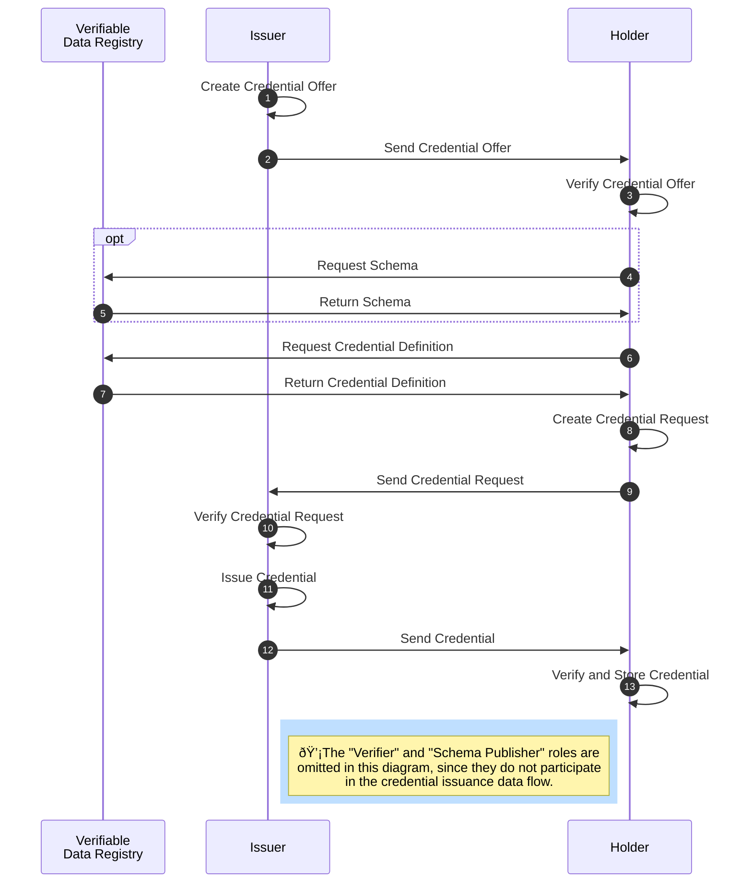

## AnonCreds Issuance Data Flow

The issuance of an anonymous [[ref: credential]] requires several steps and involves the roles [[ref: issuer]], [[ref: holder]] as well as the [[ref: Verifiable Data Registry]] (see diagram below).



The [[ref: issuer]] prepares a [[ref: Credential Offer]] for the [[ref: holder]] (step 1). A [[ref: Credential Offer]] includes a commitment about the [[ref: credential]] (referencing a [[ref: Public Credential Definition]]) the [[ref: issuer]] is intending to issue to the [[ref: holder]]. The [[ref: issuer]] sends the [[ref: Credential Offer]] to the [[ref: holder]] (step 2), who evaluates the offer (step 3) and fetches data about the offer (the [[ref: Public Credential Definition]]) from the [[ref: Verifiable Data Registry]] (steps 4-7).

Using the data from the [[ref: Credential Offer]] and the [[ref: Public Credential Definition]] retrieved from the [[ref: Verifiable Data Registry]], the [[ref: holder]] prepares a [[ref: Credential Request]] (step 8), a formal request to the [[ref: issuer]] to issue a [[ref: credential]] based on the given [[ref: Public Credential Definition]] to the [[ref: holder]]. The [[ref: Credential Request]] includes a cryptographic commitment to the [[ref: holder]]'s [[ref: link secret]]. The [[ref: holder]] sends the [[ref: Credential Request]] to the [[ref: issuer]] (step 9).

The [[ref: issuer]] verifies and decides whether to accept the [[ref: Credential Request]] (step 10) and if so, prepares the [[ref: credential]] (step 11). The [[ref: issuer]] sends the [[ref: credential]] to the [[ref: holder]] (step 12), who verifies the [[ref: credential]] and (usually) securely stores it (step 13).

Details about each step in the issuance process are covered in the following sections.

### Credential Offer

The AnonCreds issuance process begins with the [[ref: issuer]] constructing and sending a [[ref: Credential Offer]] to the potential [[ref: holder]]. The Credential Offer contains the following JSON elements:

```json
{
    "schema_id": string,
    "cred_def_id": string,
    "nonce": string,
    "key_correctness_proof" : <key_correctness_proof>
}
```

* `schema_id`: The ID of the [[ref: Schema]] on which the [[ref: Public Credential Definition]] for the offered [[ref: Credential]] is based.
* `cred_def_id`: The ID of the [[ref: Public Credential Definition]] on which the [[ref: Credential]] to be issued will be based.
* `nonce`: A random number generated for one time use by the [[ref: issuer]] for preventing replay attacks and authentication between protocol steps. The `nonce` must be present in the subsequent [[ref: Credential Request]] from the [[ref: holder]].
* `key_correctness_proof`: The Fiat-Shamir transformation challenge value in the non-interactive mode of [Schnorr Protocol](https://d-nb.info/1156214580/34). It is calculated by the [[ref: issuer]] as the proof of knowledge of the private key used to create the [[ref: Credential Definition]]. This is verified by the [[ref: holder]] during the creation of [[ref: Credential Request]].

The JSON content of the `key_correctness_proof` is:

```json
"key_correctness_proof": {
    "c": "103...961",
    "xz_cap": "563...205",
    "xr_cap": [
        [
            "<attribute 1>",
            "821...452"
        ],
        [
            "master_secret",
            "156...104"
        ],
        [
            "<attribute 1>",
            "196...694"
        ]
    ]
}
```

The values in the proof are generated as follows:

* `c`: (a [[ref: BigNumber]]) can be viewed as the committed value derived from the hash of the concatenated byte values in the process of [creating the Credential Definition].

[creating the Credential Definition]: #generating-a-credential-definition-without-revocation-support

  $$c = H(z || {r_i}  || \tilde{z} ||\tilde{r_i})$$

  where

  * $z = s ^ {x_z}\ Mod\ n$ where $z$, $s$ and $n$ are values in the [[ref: Public Credential Definition]]
  * $r_i$ are the values in the $r$ map in [[ref: Public Credential Definition]], individual attribute public keys
  * $\tilde{z}$ is similar to $z$ which equals to $s^{\tilde{x_z}}\ mod\ n$, where $\tilde{x_z}$ is a randomly selected integer between $2$ and $p'q'-1$
  * $\tilde{r_i}$ is similar to $r$, which equal to $s^{\tilde{x_i}}\ mod\ n$, where $\tilde{x_i}$ are randomly selected integers between $2$ and $p'q'-1$

* `xz_cap`: $\hat{x_z} = c x_z + \tilde{x_z}$
* `xr_cap`: $\{ (attribute_i, cr_i + \tilde{r_i}) \}_{1 < i < L}$ for $L$ attributes

Both  `xz_cap` and the second element in the tuple of the `xr_cap` vector
are [[ref: BigNumbers]].

The [[ref: issuer]] sends the [[ref: Credential Offer]] to the [[ref: holder]].

### Credential Request

A [[ref: Credential Request]] is a formal request from a [[ref: holder]] to an
[[ref: issuer]] to get a [[ref: credential]] based on the [[ref: Credential
Offer]] (and the referenced [[ref: Public Credential Definition]]) sent by the
[[ref: issuer]] to the [[ref: holder]].

On receipt of the [[ref: Credential Offer]], the [[ref: holder]] retrieves the
referenced [[ref: Public Credential Definition]] from a [[ref: Verifiable Data
Registry]]. The holder MAY want to retrieve the [[ref: Schema]] referenced in
the [[ref: Credential Offer]] and verify the consistency between the list of
attributes in the [[ref: Schema]] and in the [[ref: Public Credential
Definition]].

In addition, the [[ref: holder]] also requires access to their [[ref: link
secret]].

#### Verifying the Key Correctness Proof

The [[ref: holder]] must first verify the `key_correctness_proof` in the [[ref:
Credential Offer]] using data from the referenced [[ref: Public Credential Definition]]. The
`key_correctness_proof` data is described in the [previous
section](#credential-offer) about the [[ref: Credential Offer]].

The `key_correctness_proof` verification is as follows:

1. Check that all attributes in [[ref: Public Credential Definition]] and `master_secret` (an
   attribute that will be related to the [[ref: link_secret]]) are included in
   `xr_cap`.
1. Compute $c'$, where  $c' = H(z || {r_i}  || \hat{z'} ||\hat{r_i'})$.
1. If $\hat{z'} == \tilde{z}$ and $\hat{r_i'} == \tilde{r_i}$, then $c' == c$. The proof is accepted.

For $\hat{z'}$, we first find the multiplicative inverse of $z$
$$ z^{-1}z = 1\ (Mod\ n) $$

Then
$$ \hat{z'} = z^{-c} s^{\hat{x_z}} \ (Mod\ n)$$
$$= z^{-c} s^{cx_z + \tilde{x_z}}\ (Mod\ n)$$
$$= z^{-c} z^{c} s^{\tilde{x_z}}\ (Mod\ n)$$
$$ \hat{z'} = \tilde{z}$$

The same can be derived for all $\hat{r_i'}$  by finding the multiplicative inverse of $r_i$, where {1 < i < L} for $L$ attributes.

#### Constructing the Credential Request

The [[ref: holder]] constructs the following [[ref: Credential Request]] JSON structure:

```json
{
    "prover_did": "BZpdQDGp2ifid3u3Up17MG",
    "cred_def_id": "GvLGiRogTJubmj5B36qhYz:3:CL:8:faber.agent.degree_schema",
    "blinded_ms": {
        # Structure detailed below
    },
    "blinded_ms_correctness_proof": {
        # Structure detailed below
    },
    "nonce": "604812518357657692681285"
}
```

::: todo

Complete the data element descriptions in the following list.

:::

* `entropy`: a required string.
  * Called `prover_did` in earlier AnonCreds implementations, and called
  `prover_id` in [Ursa](https://github.com/hyperledger/ursa), `entropy` is a
  random alphanumeric string generated by the [[ref: holder]] and used by the
  [[ref:issuer]] to add entropy in generating the credential signature. The
  value is combined by the [[ref: issuer]] with the credential revocation index
  (`cred_idx`) if the credential is revocable, and the resulting string is hashed
  to create the `credential_context`, an input to the credential signing
  process. The `credential_context` is the `m2` item in the issued verifiable
  credential signature.
  * Historically in Aries agent implementations, the `prover_did` was populated by
  the [[ref: holder]] with a [[ref: DID]] they hold, usually the DIDComm
  peer-to-peer DID shared by the the [[ref: holder]] to the [[ref: issuer]].
  However, the item is not verified by the [[ref: issuer]] as a DID nor as an identifier
  for the [[ref: holder]], and as such an random string is sufficient.
  * The [[ref: holder]] can verify the provide `entropy` value was used by the
    [[ref: issuer] in generating the signature by combining `entropy` with the
    `cred_idx` value from the issuer (if the credential is revocable), hashing
    the resulting string and checking that the hash matches `m2` in the
    credential signature.
* `cred_def_id`: The ID of the [[ref: Public Credential Definition]] on which the [[ref: Credential]] to be issued will be based.
* `blinded_ms`: The [[ref: link secret]] in its blinded form. Described in detail in the section [Blinding the Link Secret](#blinding-the-link-secret) (below).
* `blinded_ms_correctness_proof`: The [[ref: Blinded Secrets Correctness Proof]] of the blinded [[ref: link secret]]. Described in detail in the section [The Blinded Link Secret Correctness Proof](#the-blinded-link-secret-correctness-proof) (below).
* `nonce`: Used for preventing replay attacks and authentication between protocol steps. *Generation Process to be added*

[legacy Indy AnonCreds Method]: https://hyperledger.github.io/anoncreds-methods-registry/#hyperledger-indy-legacy-anoncreds-method

Once constructed, the [[ref: holder]] sends the [[ref: Credential Request]] to the [[ref: issuer]], who then can reply to the [[ref: holder]] by sending an issued credential.

#### Blinding the Link Secret

The `blinded_ms` ([[ref: blinded link secret]]) in the `Credential Request` is a
cryptographic commitment by the [[ref: holder]] to the link secret. The
`blinded_ms` will be signed by the [[ref issuer]], placed in the credential, and
during presentations, is proven by the [[ref holder]] to be associated with the
[[ref: link_secret]] using a proof of knowledge, without revealing the [[ref:
link_secret]] itself. This is the capability that enables the binding of the
credential to the holder without revealing a correlatable identifier.

::: todo

Confirm purpose of the blinding factor and add how it is generated.

:::

The [[ref: blinding factor]] is a secret held by the [[ref: holder]] for blinding
the [[ref: link secret]] before sending it to the [[ref: issuer]], and used later
when generating the proof of knowledge that the [[ref: link secret]] was used in
the signature received from the [[ref: issuer]]. The [[ref: blinding factor]],
$v$ is created by... *TO BE ADDED*

The process of blinding the link secret uses the [[ref: issuer]]'s
`CredentialPrimaryPublicKey`, $P$, which is included in the [[ref: Public Credential Definition]],
and contains `z`, `r`, `s` and `n` (described
[here](#generating-a-cred_def-without-revocation-support)). While `r` contains
the public keys for all of the attributes to be signed, the only one of interest
in this process is $r_{link secret}$

The [[ref: link secret]], $A_l$ is blinded by

$A_{bl} = r_{link_secret}^{A_l}\ Mod\ n$

$A_{bl}$ is multiplied by the [[ref: blinding factor]], $v$,

$(s^v \times A_{bl})\ Mod\ n$

The resulting blinded link secret data structure inserted into the [[ref: Credential Offer]] is defined as follows:

```json
"blinded_ms": {
    "u": "331...544",
    "ur": null,  # Populated when the credential definition supports revoation
    "hidden_attributes": [
        "master_secret"
    ],
    "committed_attributes": {}
}
```

::: todo

Add in the missing details for the items in the list below.

:::

Where:

* `u`: *TO BE ADDED*
* `ur`: is `null` if revocation is not active for the [[ref: Public Credential Definition], and if revocation is active is *TO BE ADDED*
* `hidden_attributes`: is an array of hidden attributes from the list of [[ref: Public Credential Definition]. For AnonCreds v1.0, it is always a single entry of `master_secret`.
  * The [[ref: holder]]'s blinded [[ref: link secret]] is a default hidden attribute in AnonCreds, meaning it is not explicitly defined in the [[ref: Schema]] list of attributes but is included in both the [[ref: Public Credential Definition]] and all issued [[ref: credentials]]. Whilst it is cryptographically possible to have multiple hidden attributes, in this version of AnonCreds, only [[ref: link secret]] is used.
* `committed_attributes`: An empty list of attributes in this version of AnonCreds.

#### The Blinded Link Secret Correctness Proof

In addition to creating the blinded link secret, the [[ref: holder]] also creates a blinded link secret correctness proof and inserts it into the [[ref: Credential Request]]. The data structure for the blinded link secret correctness proof is as follows:

```json
"blinded_ms_correctness_proof": {
    "c": "702...737",
    "v_dash_cap": "202...924",
    "m_caps": {
        "master_secret": "907...913"
    },
    "r_caps": {}
}
```

Where:

::: todo

Add in the missing details for the items in the list below.

:::

* `c`: is the hash of the concatenated bytes of $U$, $\tilde{U}$, and $n_0$, where $U$ and $n_0$ are recieved from the issuer, and $\tilde{U}$ is calculated using $\tilde{U} = s^{\tilde{v'}} \times \displaystyle \prod_{i \in A_h} r_{link secret}^{\tilde{m_i}}\ (Mod\ n)$, where $\tilde{m_i}$ are random 593-bit numbers generated for each hidden attribute. Thus $c \leftarrow H(U || \tilde{U} || n_0)$.
* `v_dash_cap`: $\cap{v'} \leftarrow \tilde{v'} + cv'$, where $v'$ is the blinding factor and $\tilde{v'}$ is a 3488-bit random number.
* `m_caps`: is *TO BE ADDED*.
* `r_caps`: is an empty structure in this version of AnonCreds. It is *TO BE ADDED*.

### Issue Credential

After the [[ref: issuer]] receives the [[ref: Credential Request]] from the [[ref: holder]], the [[ref: issuer]] processes the [[ref: Credential Request]] and decides whether to issue the credential as requested in the [[ref: Credential Request]] to the [[ref: holder]]. In this section, we'll cover issuing a credential that cannot be revoked, and then cover the additional steps/data elements in issuing a credential that can be revoked.

#### Verifying the Credential Request

Before deciding to issue the credential, the [[ref: issuer]] must first verify the [[ref: Credential Request]] from the [[ref: holder]] by checking first the nonce, and then the blinded link secret correctness proof.

::: todo

Add in the details about the nonce and the blinded link secret correctness proof.

:::

The nonce is checked by *TO BE ADDED*.

The blinded link secret correctness proof is verified by *TO BE ADDED*.

Once the Credential Request is verified and if the [[ref issuer]] decides to proceed with issuing the credential, the credential creation process is performed.

#### Encoding Attribute Data

The Anoncreds signature is not applied on the data attributes themselves, but rather on 32-byte integers encoded from the data attribute values. In the current version of AnonCreds, the process of encoding the attributes (also known as canonicalization) is
a task performed by the [[ref: issuer]], who should do the encoding in a manner understood by *all* potential [[ref: verifiers]] such that any verifier can confirm that the revealed `raw` attributes in the presentation produce
the encoded value signed by the [[ref: issuer]]. To enable the broadest possible interoperability, the [Hyperledger Aries](https://www.hyperledger.org/projects/aries) community formalized the [following encoding rules](https://github.com/hyperledger/aries-rfcs/tree/main/features/0592-indy-attachments#encoding-claims) for the `raw` attribute values in an AnonCreds credential, and those rules are adopted into this specification, as follows:

* keep any integer as is
* convert any string integer (e.g. "1234") to be an integer (e.g. 1234)
* for data of any other type:
  * convert to string (use string "None" for null)
  * encode via utf-8 to bytes
  * apply SHA-256 to digest the bytes
  * convert the resulting digest bytes, big-endian, to integer
  * stringify the integer as a decimal.

An example implementation in Python of these rules can be found [here](https://github.com/hyperledger/aries-cloudagent-python/blob/0000f924a50b6ac5e6342bff90e64864672ee935/aries_cloudagent/messaging/util.py#L106).

A gist of test value pairs can be found [here](https://github.com/hyperledger/aries-cloudagent-python/blob/0000f924a50b6ac5e6342bff90e64864672ee935/aries_cloudagent/messaging/util.py#L106).

::: note

To enable broad interoperability, and to improve the security of AnonCreds by
eliminating the risk of malicious [[ref: holders]] altering the `raw` data
values in hopes that the [[ref: verifier]] will not check the encoding as part
of the overall presentation verification, future versions of AnonCreds
credentials will not include [[ref: issuer]]-created encoded values in the AnonCreds [[ref: credentials]], and will instead
require the encoding of the `raw` data values on as needed basis.

Implementations of AnonCreds **MAY**

* Verify the encoded values provided by the issuer and reject the credential input if the encoding
  does not follow the encoding rules in this specification.
* Ignore the [[ref: issuer]]-provided encoded values and calculate the encoded
  values before generating signatures based on the encoding rules above.
* Ignore the encoded values placed in credentials and/or presentations and
  generate the encoded values "on-the-fly" based on the encoding rules above.

:::

#### Constructing a Credential

To construct a non-revocable [[ref: credential]], the [[ref: issuer]] must have available:

* The identifiers for the [[ref: schema]] and [[ref: Public Credential Definition]].
* The [[ref: Private Credential Definition]] data to be used in signing the credential.
* The `raw` value for each attribute to be included in the credential.
* The `encoded` value derived from each `raw` value using the [encoding attribute data](#encoding-attribute-data) rules (above).
* The blinded link secret from the [[ref: holder]]'s [[ref: Credential Request]].

Additional data is needed for issuing a revocable credential, as described in the section [Supporting Revocation in a Credential](#supporting-revocation-in-a-credential).

The JSON of a generated AnonCreds credential is as follows:

```json
{
    "schema_id": string,
    "cred_def_id": string,
    "rev_reg_id": null,
    "values": {
        "first_name": {
            "raw": "Alice",
            "encoded": "113...335"
        },
        "last_name": {
            "raw": "Garcia",
            "encoded": "532...452"
        },
        "birthdate_dateint": {
            "raw": "19981119",
            "encoded": "19981119"
        }
    },
    "signature": {
        "p_credential": {
            "m_2": "992...312",
            "a": "548...252",
            "e": "259...199",
            "v": "977...597"
        },
        "r_credential": null
    },
    "signature_correctness_proof": {
        "se": "898...935",
        "c": "935...598"
    },
    "rev_reg": null,
    "witness": null
}
```

* `schema_id`: is the ID of the [[ref: Schema]] upon which the [[ref: Public Credential Definition]] was generated.
* `cred_def_id`: is the ID for the [[ref:Public Credential Definition]] on which the [[ref:Credential]] issued is based.
* `rev_reg_id` is `null` if the credential is not revocable. A description of the element when the credential is revocable is in the section [Supporting Revocation in a Credential](#supporting-revocation-in-a-credential).
* `values` is the list of attributes in the credential, including for each:
  * the name of the attribute (in this case `first_name`, `last_name`, and `birth_dateint`),
  * the `raw` data for the attribute, and
  * the `encoded` data for the attribute, derived from the `raw` value has defined in the [encoding attribute data rules](#encoding-attribute-data).
* `signature` is the cryptographic signature generated for the credential.
  * A description of the `p_signature` elements and generation process are in the section [The Credential Signature](#the-credential-signature).
  * `r_credential` is `null` if the credential is not revocable. A description of the `r_signature` elements and generation process when the credential is revocable are in the section [Supporting Revocation in a Credential](#supporting-revocation-in-a-credential).
* `signature_correctness_proof` is the [[ref: Signature Correctness Proof]] generated for the credential. A description of the elements and generation process are in the section [The Credential Signature Correctness Proof](#the-credential-signature).
* `rev_reg` is `null` if the credential is not revocable. A description of the element and generation process when the credential is revocable are in the section [Supporting Revocation in a Credential](#supporting-revocation-in-a-credential).
* `witness` is `null` if the credential is not revocable. A description of the element and generation process when the credential is revocable are in the section [Supporting Revocation in a Credential](#supporting-revocation-in-a-credential).

Once constructed, the [[ref issuer]] sends the credential to the [[ref: holder]] for verification and storage.

::: note

Please note the data attribute "birth_dateint" in the example above. The convention of
putting a `_dateint` suffix on a credential attribute name is used to indicate
that the field contains a date in the form of an integer, such as "2022.11.21"
as the integer "20221121" (the number 20,221,121). By putting the date in that
form, AnonCreds predicates can be applied to the data, such as proving "older
than 21" based on date of birth without sharing the date of birth. This
convention was initially defined
[here](https://github.com/hyperledger/aries-rfcs/tree/main/concepts/0441-present-proof-best-practices#dates-and-predicates)
by the [Hyperledger Aries](https://www.hyperledger.org/projects/aries)
community.

:::

#### The Credential Signature

The credential signature elements are constructed as follows:

::: todo

Add the details about the credential signature data elements

:::

* `m_2` is the *TO BE ADDED*. It is constructed as follows:
  * *TO BE ADDED*
* `a` is the *TO BE ADDED*. It is constructed as follows:
  * *TO BE ADDED*
* `e` is the *TO BE ADDED*. It is constructed as follows:
  * *TO BE ADDED*
* `v` is the *TO BE ADDED*. It is constructed as follows:
  * *TO BE ADDED*

#### The Credential Signature Correctness Proof

The credential signature correction proof elements are constructed as follows:

::: todo

Add the details about the credential signature correctness proof data elements

:::

* `se` is the *TO BE ADDED*. It is constructed as follows:
  * *TO BE ADDED*
* `c` is the *TO BE ADDED*. It is constructed as follows:
  * *TO BE ADDED*

#### Supporting Revocation in a Credential

When a credential is revocable, in addition to the listed inputs needed for [constructing a credential](#constructing-a-credential),
the [[ref: issuer]] also needs the ID and private [[ref: Revocation Registry]] data. Using the inputs, the revocation-related fields in the [credential JSON](#constructing-a-credential) are populated. The
following describes the elements and how they are produced.

`rev_reg_id` is the ID of the [[ref: Revocation Registry Definition]] published on a [[ref: Verifiable Data Registry]] that is to be used by the [[ref: holder]] when trying to generate a Non-Revocation Proof for this credential as part of an AnonCreds presentation.

`r_credential` is the following JSON data structure:

```json
"r_credential": {
    "sigma": "1 14C...8A8",
    "c": "12A...BB6",
    "vr_prime_prime": "0F3...FC4",
    "witness_signature": {
        "sigma_i": "1 1D72...000",
        "u_i": "1 0B3...000",
        "g_i": "1 10D...8A8"
    },
    "g_i": "1 10D7...8A8",
    "i": 1,
    "m2": "FDC...283"
}
```

The items in the data structure are:

::: todo

Add the details about the revocation signature, rev_reg and witness data elements

:::


* `sigma`: is *TO BE ADDED*
* `c`: is *TO BE ADDED*
* `vr_prime_prime`: is *TO BE ADDED*
* `witness_signature`:
  * `sigma_i`: is *TO BE ADDED*
  * `u_i`: is *TO BE ADDED*
  * `g_i`: is *TO BE ADDED*
* `g_i`: is *TO BE ADDED*
* `i`: is *TO BE ADDED*
* `m2`: is *TO BE ADDED*

`rev_reg` is the following JSON data structure:

```json
"rev_reg": {
    "accum": "21 118...1FB"
}
```

The item in the data structure is:

* `accum`: is *TO BE ADDED*

`witness` is the following JSON data structure:

```json
"witness": {
    "omega": "21 124...AC8"
}
```

The item in the data structure is:

* `omega`: is *TO BE ADDED*

### Receiving a Credential

On receipt of a credential from an [[ref: issuer]], the [[ref: holder]] must
verify the credential and, if verified, will likely store the credential in a
secure location.

To verify the `signature_correctness_proof`, the [[ref: holder]] does the following:

::: todo

Add the details about the verifying the credential signature correctness proof data elements and process.

:::

The verifying and securely storing of the credential by the [[ref: holder]]
completes the AnonCreds issuance process.

An AnonCreds credential is expected to be retained by the [[ref: holder]] that
participated in the issuance process. The [[ref: holder]] should not transfer
the credential to others for their use, and should only use the credential to
generate an AnonCreds verifiable presentation, as outlined in the
[AnonCreds Presentation](#anoncreds-presentation-data-flow) section of this specification.
