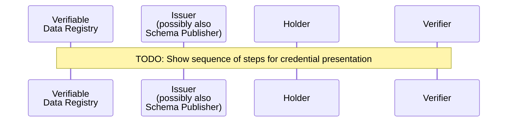

### AnonCreds Presentation Data Flow

::: todo
Document the steps of Presentation -- Presentation Request, Generate Presentation and Verify Presentation
:::

#### Construct Presentation Request

#### Generate Presentation

#### Verify Presentation
