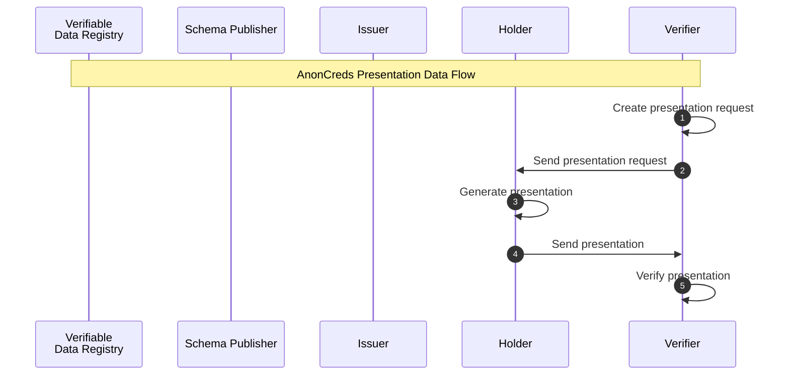

### AnonCreds Presentation Data Flow



The flow of operations to request, create, and verify a verifiable presentation is illustrated in
the  [AnonCreds Presentation Data Flow](#anoncreds-presentation-data-flow) sequence diagram.


In step 2, the Verifier sends the presentation request to the Holder.

#### Generate Presentation

In step 3, the Holder creates the verifiable presentation according to the 
presentation request received from the Verifier.

Either a corresponding credential with optionally revealed attributes or a self-attested attribute must 
be provided for each requested attribute.
A presentation request may request multiple credentials from different schemas and multiple issuers.

All required schemas, public keys and revocation registries must be provided. 

The presentation created by the Holder has the following JSON format:

```json
{
    "requested_proof": {
        "revealed_attrs": {
            "requested_attr1_id": {
                "sub_proof_index": number,
                "raw": string,
                "encoded": string
            },
            "requested_attr4_id": {
                "sub_proof_index": number,
                "raw": string,
                "encoded": string
            }
        },
        "revealed_attr_groups": {
            "requested_attr5_id": {
                "sub_proof_index": number,
                "values": {
                    "attribute_name": {
                        "raw": string,
                        "encoded": string
                    }
                }
            }
        },
        "unrevealed_attrs": {
            "requested_attr3_id": {
                "sub_proof_index": number
            }
        },
        "self_attested_attrs": {
            "requested_attr2_id": self_attested_value
        },
        "predicates": {
            "requested_predicate_1_referent": {
                "sub_proof_index": int
            },
            "requested_predicate_2_referent": {
                "sub_proof_index": int
            }  
        }
    }
    "proof": {
        "proofs": [
            <credential_proof>,
            <credential_proof>,
            <credential_proof>
        ],
        "aggregated_proof": <aggregated_proof>
    }
    "identifiers": [{schema_id, cred_def_id, Optional<rev_reg_id>, Optional<timestamp>}]
}

```

Example:

```json
{
    "requested_proof": {
        "revealed_attrs": {
            "attr4_referent": {
                "sub_proof_index": 0,
                "raw": "graduated",
                "encoded": "2213454313412354"
            },
            "attr5_referent": {,
                "sub_proof_index": 0,
                "raw": "123-45-6789",
                "encoded": "3124141231422543541"
            },
            "attr3_referent": {
                "sub_proof_index": 0, 
                "raw": "Bachelor of Science, Marketing",
                "encoded": "12434523576212321"
            }
        },
        "self_attested_attrs": {
            "attr1_referent": "Alice",
            "attr2_referent": "Garcia",
            "attr6_referent": "123-45-6789"
        },
     "unrevealed_attrs": {

     },
     "predicates": {
      "predicate1_referent": {
       "sub_proof_index": 0
      }
     }
     },
     "proof": [

     ]#ValidityProofthatAcmecancheck"identifiers": [
      #IdentifiersofcredentialswereusedforProofbuilding{
      "schema_id": job_certificate_schema_id,
      "cred_def_id": faber_transcript_cred_def_id,
      "rev_reg_id": None,
      "timestamp": None
     }
     }
    }
```


    wallet_handle: wallet handler (created by Wallet::open_wallet).
    proof_request_json: proof request json { "name": string, "version": string, "nonce": string, "requested_attributes": { // set of requested attributes "<attr_referent>": <attr_info>, // see below ..., }, "requested_predicates": { // set of requested predicates "<predicate_referent>": <predicate_info>, // see below ..., }, "non_revoked": Optional<<non_revoc_interval>>, // see below, // If specified prover must proof non-revocation // for date in this interval for each attribute // (can be overridden on attribute level) }
    requested_credentials_json: either a credential or self-attested attribute for each requested attribute { "self_attested_attributes": { "self_attested_attribute_referent": string }, "requested_attributes": { "requested_attribute_referent_1": {"cred_id": string, "timestamp": Optional, revealed: }}, "requested_attribute_referent_2": {"cred_id": string, "timestamp": Optional, revealed: }} }, "requested_predicates": { "requested_predicates_referent_1": {"cred_id": string, "timestamp": Optional }}, } }
    master_secret_id: the id of the master secret stored in the wallet
    schemas_json: all schemas json participating in the proof request { <schema1_id>: <schema1_json>, <schema2_id>: <schema2_json>, <schema3_id>: <schema3_json>, }
    credential_defs_json: all credential definitions json participating in the proof request { "cred_def1_id": <credential_def1_json>, "cred_def2_id": <credential_def2_json>, "cred_def3_id": <credential_def3_json>, }
    rev_states_json: all revocation states json participating in the proof request { "rev_reg_def1_id": { "timestamp1": <rev_state1>, "timestamp2": <rev_state2>, }, "rev_reg_def2_id": { "timestamp3": <rev_state3> }, "rev_reg_def3_id": { "timestamp4": <rev_state4> }, }


#### Verify Presentation
