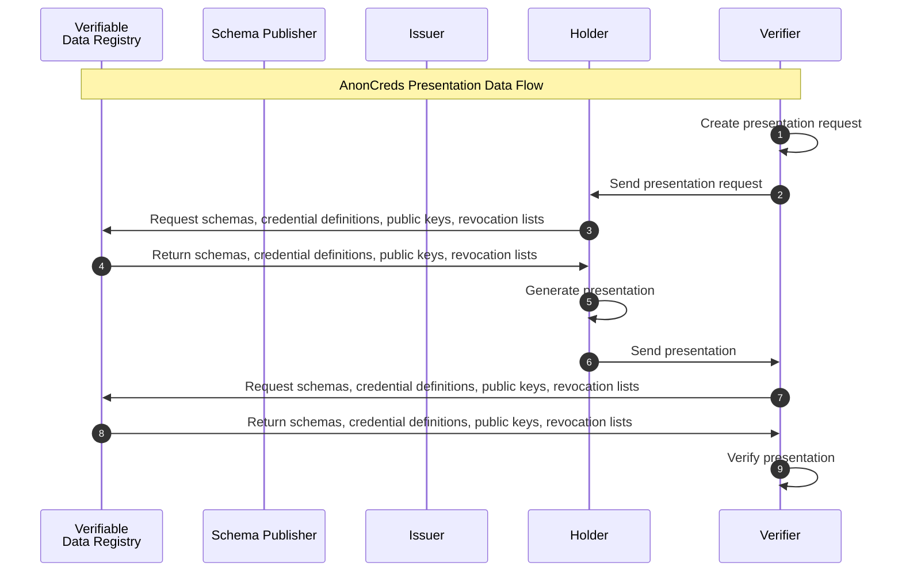

### AnonCreds Presentation Data Flow

The flow of operations to request, create, and verify a verifiable presentation is illustrated in
the  [AnonCreds Presentation Data Flow](#anoncreds-presentation-data-flow) sequence diagram.

The Verifier starts the process in step 1 by creating and sending a presentation request to the Holder.

In step 2, the Verifier sends the presentation request to the Holder.

In steps 3, 4, and 5, the Holder collects the required information and creates the verifiable presentation according to the 
presentation request received from the Verifier.

In step 6, the Holder sends the verifiable presentation according to the 
presentation request to the Verifier.

In step 7, 8, and 9, the Verifier collects the required information and verifies the verifiable presentation and accepts it if the 
signature is valid, otherwise rejects the verifiable presentation.

::: todo Question: VDR access for schema, revocation etc. retrieval mandatory?
:::
