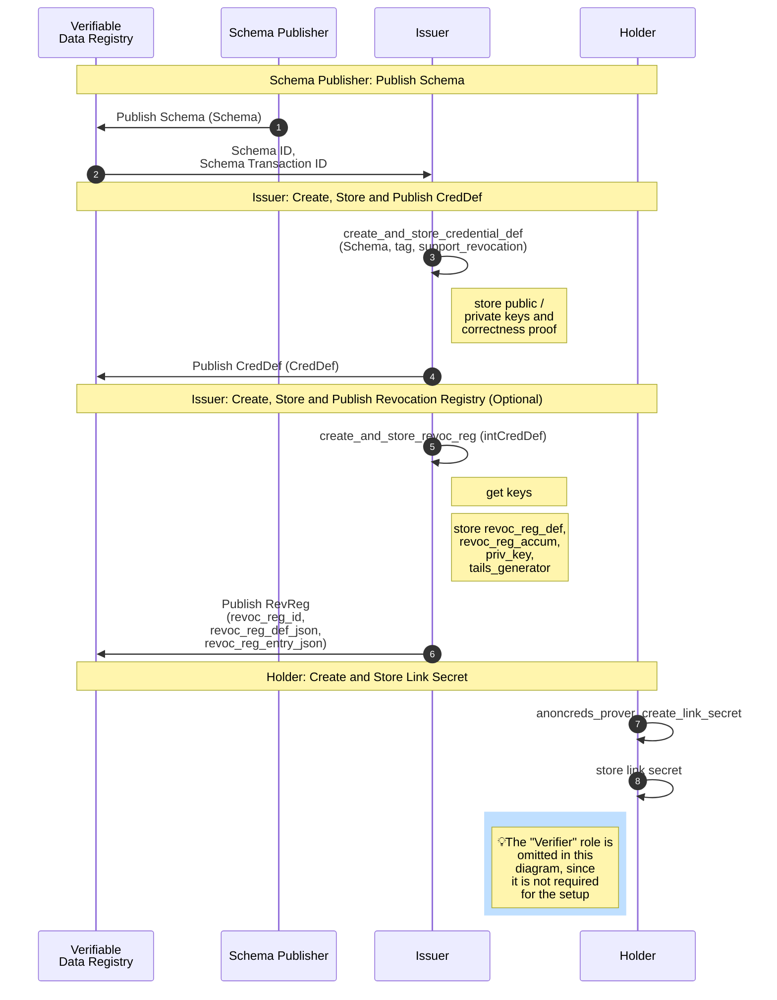

## AnonCreds Setup Data Flow

The following sequence diagram summarizes the setup operations performed by a [[ref: Schema Publisher]], the [[ref: Issuer]] (one required and one optional) in preparing to issue an AnonCred credential based on provided [[ref:Schema]], and the one setup operation performed by each [[ref: Holder]]. On successfully completing the operations, the [[ref: Issuer]] is able to issue credentials based on the given [[ref:Schema]] to the [[ref: Holder]]. The subsections below the diagram detail each of these operations.



::: note

Those with a knowledge of DIDs might expect that in the flow above, the first
step would be for the [[ref: issuer]] to publish a DID. However, in AnonCreds,
DIDs are not used in the processing of credentials, and notably, the public keys
used in AnonCreds signatures come not from DIDs, but rather from [[def:
CRED_DEF]] objects. DIDs may be used to identify the entity publishing the
objects that are then used in the processing of credentials -- the [[def:
SCEHMA]], [[def: CRED_DEF]], [[def: Revocation Registry Definition]] and [[def: Revocation Registry Entry]]
objects. There is an enforced relationship between an identifier (such as a DID)
for the entity publishing the AnonCred objects, and the objects themselves. For
example, in the Hyperledger Indy implementation of AnonCreds, for a credential
issuer to publish a [[def: CRED_DEF]] on an instance of Indy it must have a DID
on that instance, and it must use that DID to sign the transaction to write the
[[def: CRED_DEF]].

The DID of the publisher of an AnonCreds object MUST be identifiable from the
published object and enforcement of the relationship between the DID and the
object must be enforced. For example, in the Hyperledger Indy implementation of
AnonCreds, the DID of the object publisher is part of the identifier of the
object -- given the identifier for the AnonCreds object (e.g. one found in
proving a verifiable credential), the DID of the publisher can be found.
Further, the Hyperledger Indy ledger enforces, and makes available for
verification, the requirement that the writing of the AnonCreds object must be
signed by the DID that is writing the object.

If a DID-based messaging protocol, such as
[DIDComm](https://identity.foundation/didcomm-messaging/spec/) is used between
the AnonCreds participants (the [[ref: issuer]], [[ref: holder]] and [[ref:
verifier]]) the use of DIDs for messaging is independent of their use (or not)
in the publishing AnonCreds objects. Such DIDs are used to facilitate secure
messaging between the participants to enable the issuing of credentials and the
presentation of proofs.

:::

### Schema Publisher: Publish Schema Object

Each type of AnonCred credential is based on a [[ref:Schema]] published to a Verifiable
Data Registry (VDR), an instance of Hyperledger Indy in this version of
AnonCreds. The [[ref:Schema]] is defined and published by the [[ref: Schema Publisher]]. Any issuer
who can reference the [[ref:Schema]] (including the [[ref: Schema Publisher]]) MAY issue
credentials of that type by creating and publishing a [[ref: Credential Definition]] based on the
[[ref:Schema]]. This part of the specification covers the operation to create and
publish a [[ref:Schema]]. The flow of operations to publish a [[ref:Schema]] is illustrated in
the `Schema Publisher: Publish Schema` section of the [AnonCreds Setup Data
Flow](#anoncreds-setup-data-flow) sequence diagram.

The [[ref:Schema]] is a JSON structure that can be manually constructed,
containing the list of attributes (claims) that will be included in each
AnonCreds credential of this type. The following is an example [[ref: Schema]]:
```json
{
    "id": "https://www.did.example/schema.json",
    "name": "Example schema",
    "version": "0.0.1",
    "attr_names": ["name", "age", "vmax"]
}
```

* `id` - (string) The identifier of the [[ref: Schema]]. The format of the identifier is dependent on the [[ref: AnonCreds Objects Method]] used in publishing the [[ref: Schema]].
* `name` (string) - the name of the schema
* `version` (string) - the schema version
* `attr_names` (str[]) - an array of strings with each string being the name of an attribute of the schema

Once constructed, the [[ref: Schema]] is published to a Verifiable Data Registry
(VDR) using the Schema Publishers selected [[ref: AnonCreds Objects Method]].
The `schemaId` identifier for the [[ref: schema]] is dependent on where the
[[ref: Schema]] is published. For example, see [this
 Schema](https://indyscan.io/tx/SOVRIN_MAINNET/domain/73904) that is published on
the Sovrin MainNet instance of Hyperledger Indy. The `schemaId` for that object
is: `Y6LRXGU3ZCpm7yzjVRSaGu:2:BasicIdentity:1.0.0`

### Issuer Create and Publish CRED_DEF Object

Each Issuer of credentials of a given type (e.g. based on a specific [[ref: Schema]]) must
create a [[ref: Credential Definition]] for that credential type. The flow of operations to create and
publish a [[ref: Credential Definition]] is illustrated in the `Issuer: Create, Store and Publish CRED_DEF`
section of the [AnonCreds Setup Data Flow](#anoncreds-setup-data-flow) sequence
diagram.

In AnonCreds, the [[ref: Credential Definition]] and [[ref: Credential Definition]] identifier include the following elements.

- A link to the Issuer of the credentials via the DID used to publish the
  [[ref: Credential Definition]].
* A link to the [[ref: Schema]] upon which the [[ref: Credential Definition]] is based (the credential type).
* A set of public/private key pairs, one per attribute (claim) in the
  credential. The private keys will later be used to sign the claims when
  credentials to be issued are created.
- Other information necessary for the cryptographic signing of credentials.
- Information necessary for the revocation of credentials, if revocation is to
  be enabled by the Issuer for this type of credential.

We'll initially cover the generation and data for a [[ref: Credential Definition]] created without the
option of revoking credentials. In the succeeding
[section](#generating-a-cred_def-with-revocation-enabled), we describe the
additions to the generation process and data structures when
credential revocation is enabled for a given [[ref: Credential Definition]].

#### Retrieving the Schema Object

Prior to creating a [[ref: Credential Definition]], the Issuer must get an instance of the
[[ref: Schema]] upon which the [[ref: Credential Definition]] will be created. If the Issuer
is also the [[ref: Schema Publisher]], they will already have the [[ref:
Schema]]. If not, the Issuer must request that information from the [[ref: VDR]]
on which the [[ref:Schema]] is published. In some [[ref: AnonCreds Objects
Methods]] there is a requirement that the [[ref: Schema]] and [[ref: Credential Definition]]
must be on the same [[ref: VDR]].

#### Generating a CRED_DEF Without Revocation Support

The [[ref: Credential Definition]] is a JSON structure that is generated using cryptographic primitives
(described below) given the following inputs.

* A [[ref: Schema]] for the credential type.
* A `tag`, an arbitrary string defined by the Issuer, enabling an Issuer to
  create multiple [[ref: Credential Definition]]s for the same [[ref: Schema]].
* An optional flag `support_revocation` (default `false`) which if true
  generates some additional data in the [[ref: Credential Definition]] to enable credential
  revocation. The additional data generated when this flag is `true` is covered
  in the [next section](#issuer-create-and-publish-revocation-registry-object)
  of this document.

The operation produces two objects, as follows.

- The [[ref: PRIVATE_CRED_DEF]], an internally managed object that includes the private keys
  generated for the [[ref: Credential Definition]] and stored securely by the issuer.
- The [[ref: Credential Definition]], that includes the public keys generated for the [[ref:
CRED_DEF]], returned to the calling function and then published on a VDR
  (currently Hyperledger Indy).

The following describes the process for generating the [[ref: Credential Definition]] and
[[ref: PRIVATE_CRED_DEF]] data.

::: todo
Describe the generation process for the CRED_DEF.
:::

The [[ref: PRIVATE_CRED_DEF]] produced by the generation process has the following format:

```json
{
  "p_key": {
    "p": "123...782",
    "q": "234...456"
  },
  "r_key": null
}
```

* `p_key` stands for the CredentialPrimaryPrivateKey and is defined by two safe primes `p` and `q`, which when multiplied together produce  `n` defining the Safe RSA group made public in the [[ref: CRED_DEF]] (see below).
    * `p` a safe prime such that `p = 2p'+ 1`,
    * `q` a safe prime such that `q = 2q'+ 1`,
* `r_key` is for the RevocationPrivateKey and is defined in section on revocable CRED_DEF's below. If the credential is not revocable, `r_key` is set to null.

The [[ref: CRED_DEF]] has the following format (from [this example
CRED_DEF](https://indyscan.io/tx/SOVRIN_MAINNET/domain/99654) on the Sovrin
MainNet):

```json
{
  "data": {
    "primary": {
      "n": "779...397",
      "r": {
        "birthdate": "294...298",
        "birthlocation": "533...284",
        "citizenship": "894...102",
        "expiry_date": "650...011",
        "facephoto": "870...274",
        "firstname": "656...226",
        "link_secret": "521...922",
        "name": "410...200",
        "uuid": "226...757"
      },
      "rctxt": "774...977",
      "s": "750..893",
      "z": "632...005"
    }
  },
  "ref": 54177,
  "signature_type": "CL",
  "tag": "latest"
}
```

The [[ref: Credential Definition]] contains a cryptographic public key that can be used to
verify CL-RSA signatures over a block of `L` messages `m1,m2,...,mL`. The [[ref:
CRED_DEF]] contains a public key fragment for each message being signed by
signatures generated with the respective private key. The length of the block of
messages, `L`, being signed is defined by referencing a specific Schema with a
certain number of attributes, `A = a1,a2,..` and setting `L` to `A+1`. The
additional message being signed as part of a credential is for a `link_secret`
(called the [[ref: link_secret]] everywhere except in the existing open source
code and data models) attribute which is included in all credentials. This value
is blindly contributed to the credential during issuance and used to bind the
issued credential to the entity to which it was issued.

All integers within the above [[ref: Credential Definition]] example json are shown with ellipses (e.g. `123...789`). They are 2048-bit integers represented as `617` decimal digits. These integers belong to an RSA-2048 group characterised by the `n` defined in the [[ref: Credential Definition]].

* `primary` is the data used for generating credentials.
* `n` is a safe RSA-2048 number. A large semiprime number such that `n = p.q`, where `p` and `q` are safe primes. A safe prime `p` is a prime number such that `p = 2p'+ 1`, where `p'` is also a prime. Note: `p` and `q` are the private key for the public CL-RSA key this [[ref: Credential Definition]] represents.
* `r` is an object that defines a CL-RSA public key fragment for each attribute in the credential. Each fragment is a large number generated by computing `s^{xri}` where `xri` is a randomly selected integer between 2 and `p'q'-1`.
  * `master_secret` (***deprecated*** - should be [[ref: link secret]]) is the name of an attribute that can be found in each [[ref: Credential Definition]]. The associated private key is used for signing a blinded value given by the [[ref: Holder]] to the [[ref: Issuer]] during credential issuance, binding the credential to the [[ref: Holder]].
  * The rest of the attributes in the list are those defined in the [[ref: SCHEMA]].
  * The attribute names are normalized (lower case, spaces removed) and listed in the [[ref: Credential Definition]] in alphabetical order.
* `rctxt` is equal to `s^(xrctxt)`, where `xrctxt` is a randomly selected integer between `2` and `p'q'-1`. (I believe this is used for the commitment scheme, allowing entities to blindly contribute values to credentials.)
* `s` is a randomly selected quadratic residue of `n`. This makes up part of the CL-RSA public key, independent of the message blocks being signed.
* `z` is equal to `s^(xz)`, where `xz` is a randomly selected integer between `2` and `p'q'-1`. This makes up part of the CL-RSA public key, independent of the message blocks being signed.
* `ref` is the identifier of the schema. The format of the identifier is dependent on the [[ref: AnonCreds Objects Method]] used in publishing the [[ref: SCHEMA]].
* `signature_type` is always `CL` in this version of AnonCreds.
* `tag` is the `tag` value (a string) passed in by the [[ref: Issuer]] to an AnonCred's [[ref: Credential Definition]] create and store implementation.

::: todo
Evaluate the impact in the existing implementations of making the `ref`
an identifier vs. the current Hyperledger Indy Txn number -- an integer.
:::

The `credDefId` identifier for the [[ref: Cred_Def]] is dependent on the [[ref:
AnonCreds Objects Method]] used in publishing the [[ref: Schema]].

#### Generating a CRED_DEF With Revocation Support

The issuer enables the ability to revoke credentials produced from a [[ref: Credential Definition]] by
passing to the [[ref: Credential Definition]] generation process the flag `support_revocation` as
`true`. When revocation is to enabled for a [[ref: Credential Definition]], additional data related to
revocation is generated and added to the [[ref: Credential Definition]] JSON objects defined above. In
the following the additional steps in the [[ref: Credential Definition]] generation process to enable
revocation are described, along with the additional data produced in that
process.

The following describes the process for generating the revocation portion of the
[[ref: Credential Definition]] data when the [[ref: Credential Definition]] is created with the `support_revocation` flag
set to `true`. This process extends the process for generating a [[ref: Credential Definition]] in the
[previous section](#generating-a-creddef-without-revocation-support) of this document.

The revocation scheme uses a pairing-based dynamic accumulator based on the [CKS scheme](https://link.springer.com/content/pdf/10.1007/978-3-642-00468-1_27.pdf). 

Pairing cryptography makes use of two pairing-friendly elliptic curve groups (G1, G2) with a known, computable pairing function e(G1,G2) -> Gt that maps any two group elements from G1 and G2 respectively to an element in the third group Gt. All groups have the same order, q, the number of elements in the group. The accumulator scheme implemented uses Type-3 pairings such that G1 != G2 and there are no efficiently computable homomorphisms between G1 and G2. An introduction to pairings can be found [here](https://www.math.uwaterloo.ca/~ajmeneze/publications/pairings.pdf).
 
NOTE: This scheme must use a specific pairing friendly elliptic curve. Believe it will be using BLS-381. But should confirm. For implementations to be interoperable they must use the same curve (or possibly support multiple, but then would have to identify the curve in this data somewhere. Feels like unnecessary complexity)

::: todo
Formally define a type-3 bilinear curve setup? Should this go in the appendix?
:::

A [[ref: PRIVATE_CRED_DEF]] with revocation enabled has the following format. In this, the
details of the `p_key` element are hidden, as they are the same as was covered
above.

```json
{
  "p_key": {
    "p": "123...782",
    "q": "234...456"
  },
  "r_key": {
    "x": "332...566",
    "sk": "992...237"
  }
}
```

* `r_key` is an object defining the private key for the CKS revocation scheme.
    * `x` is a Big (128-bit?) integer selected at random from the the group of integers defined by the order of the bilinear groups `q`
    * `sk` is a Big (128-bit?) integer selected at random from the the group of integers defined by the order of the bilinear groups `q`

`x` and `sk` are used as part of the revocation public key generation as defined below.

A [[ref: Credential Definition]] with revocation enabled has the following format (from [this
example CRED_DEF](https://indyscan.io/tx/SOVRIN_MAINNET/domain/55204) on the
Sovrin MainNet). In this, the details of the `primary` element are hidden, as
they are the same as was covered above.

```json
{
  "data": {
    "primary": {...},
    "revocation": {
      "g": "1 154...813 1 11C...D0D 2 095..8A8",
      "g_dash": "1 1F0...000",
      "h": "1 131...8A8",
      "h0": "1 1AF...8A8",
      "h1": "1 242...8A8",
      "h2": "1 072...8A8",
      "h_cap": "1 196...000",
      "htilde": "1 1D5...8A8",
      "pk": "1 0E7...8A8",
      "u": "1 18E...000",
      "y": "1 068...000"
    }
  },
  "ref": 54753,
  "signature_type": "CL",
  "tag": "state_license"
}
```

All attributes in the `revocation` item represent elliptic curve points that are members of either G1 or G2. Group elements of G1 are represented using 3 64 digit hex integers, wheras G2 elements are represented using 6 64 digit hex integers. The `revocation` attributes define a CKS public key that can be used to authenticate updates from the issuer to the accumulator.

In the following, only the `revocation` item is described, as the rest of items (`primary`, `ref`, etc.) are described in the previous section of this document.

- `revocation` is the data used for managing the revocation status of
  credentials issued using this [[ref: CRED_DEF]].
* `g` is a generator for the elliptic curve group G1
* `g_dash` is a generator for the elliptic curve group G2
* `h` is a random elliptic curve element selected from G1
* `h0` is a random elliptic curve element selected from G1
* `h1` is a random elliptic curve element selected from G1
* `h2` is a random elliptic curve element selected from G1
* `h_cap` is a random elliptic curve element selected from G2
* `htilde` is a random elliptic curve element selected from G1
* `pk` is the public key in G1 for the issuer respective to this accumulator. (g^sk)
* `u` is a random elliptic curve element selected from G2
* `y` is the an elliptic curve element in G1 calculated as h_cap^x, where x is selected at random by the issuer from the set Z_q.


#### Publishing the CRED_DEF on a Verifiable Data Registry

Once constructed, the [[ref: Credential Definition]] is published by the Issuer to a [[ref:
Verifiable Data Registry]] using the issuers preferred [[ref: AnonCreds Objects
Method]]. For example, see [this
CRED_DEF](https://indyscan.io/tx/SOVRIN_MAINNET/domain/73905) that is published
in the Sovrin MainNet instance of Hyperledger Indy. The full contents of the
[[ref: Credential Definition]] is placed in the ledger, including the revocation section if
present.

### Issuer Create and Publish Revocation Registry Objects

Once the [[ref: issuer]] has created a [[ref: Credential Definition]] with revocation
enabled, the [[ref: issuer]] must also create and publish a [[ref: Revocation Registry Definition]] and
create and publish the first [[ref: Revocation Registry Entry]] for the registry.

In this section, we'll cover the create and publish steps for each
of the [[ref: Revocation Registry Definition]] and [[ref: Revocation Registry Entry]] objects. The creation and
publishing of the [[ref: Revocation Registry Definition]] includes creating and publishing the
[[ref: TAILS_FILE]] for the [[ref: Revocation Registry]].

#### Creating the Revocation Registry Object

A secure process must be run to create the revocation registry object, taking
the following input parameters.

- `type`: the type of revocation registry being created. For Hyperledger Indy
  this is always "CL_ACCUM."
- `cred_def_id`: the ID of the [[ref: Credential Definition]] to which the [[ref: Revocation Registry]]
  is to be associated
- `tag`: an [[ref: issuer]]-defined tag that is included in the identifier for
  the [[ref: Revocation Registry]]
- `issuanceType`: an enumerated value that defines the initial state of
  credentials in the [[ref: Revocation Registry]]: revoked ("ISSUANCE_ON_DEMAND") or
  non-revoked ("ISSUANCE_BY_DEFAULT"). See the [warning and recommendation
  against the use of
  `ISSUANCE_ON_DEMAND`](#recommend-not-using-issuanceondemand).
- `maxCredNum`: The capacity of the [[ref: Revocation Registry]], a count of the number of
  credentials that can be issued using the [[ref: Revocation Registry]].
- `tailsLocation`: A URL indicating where the [[ref: TAILS_FILE]] for the [[ref
Revocation Registry]] will be available to all [[ref: holders]] of credential issued using
  this revocation registry.

Three outputs are generated from the process to generate the [[ref; Revocation Registry]]:
the [[ref: Revocation Registry]] object itself, the [[ref: TAILS_FILE]] content, and the
[[ref: Private Revocation Registry]] object.

##### Recommend Not Using ISSUANCE_ON_DEMAND

::: warning

Based on the experience of the AnonCreds community in the use of revocable
credentials, it is highly recommended the `ISSUANCE_ON_DEMAND` approach **NOT** be
used unless absolutely required by your use case.

The reason this approach is not recommended is that if the [[ref: issuer]]
creates the [[ref: Revocation Registry]] with the `issuanceType` item set to
`ISSUANCE_ON_DEMAND`, the [[ref:issuer]] must publish a [[ref: RevRegEntry]] (as
described in the [revocation
section](#anoncreds-credential-activationrevocation-and-publication)) as each
credential is issued resulting in many [[ref: RevRegEntry]] transactions being
performed, one per credential issued. Of course, with either `issueanceType`, there must
still be one transaction for each batch of (1 or more) credentials revoked.

Further, if a credential contains some kind of "Issue Date" attribute in the
credential and it is shared with verifiers, those verifiers can use that value
to find the [[ref: RevRegEntry]] transaction that activated the credential at
the same time to learn the index of the holder's credential within the [[ref:
RevReg]], giving the verifiers both a correlatable identifier (RevRegId+index)
for the holder's credential and a way to monitor if that credential is ever
revoked in the future.

For these reasons we anticipate the deprecation or removal of the
`ISSUANCE_ON_DEMAND` approach in the next version of AnonCreds specification.
Feedback from the community on this would be appreciated. We are particularly
interested in understanding what use cases there are for `ISSUANCE_ON_DEMAND`.

:::

##### Revocation Registry Definition Object Generation

The [[ref: Revocation Registry Definition]] object has the following data model. This example is from
[this transaction](https://indyscan.io/tx/SOVRIN_MAINNET/domain/140386) on the
Sovrin MainNet and instance of Hyperledger Indy.

```json
{
    "type": "CL_ACCUM",
    "credDefId": "Gs6cQcvrtWoZKsbBhD3dQJ:3:CL:140384:mctc",
    "id": "Gs6cQcvrtWoZKsbBhD3dQJ:4:Gs6cQcvrtWoZKsbBhD3dQJ:3:CL:140384:mctc:CL_ACCUM:1-1024",
    "tag": "MyCustomCredentialDefinition",
    "publicKeys": {
      "accumKey": {
        "z": "1 0BB...386"
      }
    },
    "maxCredNum": 666,
    "tailsLocation": "https://my.revocations.tails/tailsfile.txt",
    "tailsHash": "91zvq2cFmBZmHCcLqFyzv7bfehHH5rMhdAG5wTjqy2PE"
}
```

The items within the data model are as follows:

::: todo
Update this to be the inputs for generating a Revocation Registry vs. the already published object
:::

* `type` - the type of revocation registry (This is currently always `CL_ACCUM`)
* `id` - the identifier of the [[ref: Revocation Registry]]. The format of the identifier is dependent on the [[ref: AnonCreds Objects Method]] is to publish the object.
* `credDefId` - The id of the [[ref: Credential Definition]] on which the [[ref: Revocation Registry]] is based.
* `tag` - the tag of the credential definition 
* `public_keys` - Public keys data for signing the accumulator; the public key of a private/public key pair
  * `accumKey` - Accumulator key for signing the accumulator
    * `z` - a public key used to sign the accumulator (described further below)
* `maxCredNumber` - The maximum amount of Credentials that can be revoked in the Revocation Registry before a new one needs to be started
* `tailsLocation` - The URL pointing to the related tails file
* `tailsHash` - The hash of the tails file [[ref: TAILS_FILE]] (see also: [next section](#tails-file-and-tails-file-generation)) resulting from hashing the tails file version prepended to the tails file as SHA256 and then encoded to base58.

As noted, most of the items come directly from the input parameters provided by
the [[ref: issuer]]. The `z` [[ref: Revocation Registry]] accumulator public key is
generated using (TODO: fill in details) algorithm. The use of the accumulator
public key is discussed in the Credential Issuance section, when the publication
of revocations is described. The calculation of the tailsHash is described in
the [next section](#tails-file-and-tails-file-generation) on [[ref: TAILS_FILE]]
generation.

##### Tails File and Tails File Generation

The second of the outcomes from creating of a [[ref: Revocation Registry]] is a [[ref:
TAILS_FILE]]. The contents of a [[ref: TAILS_FILE]] is an array of calculated
prime integers, one for each credential in the registry. Thus, if the [[ref:
Revocation Registry]] has a capacity (`maxCredNum`) of 1000, the [[ref: TAILS_FILE]] holds
an array of 1000 primes. Each credential issued using the [[ref: Revocation Registry]] is
given its own index (1 to the capacity of the [[ref: Revocation Registry]]) into the array,
the index of the prime for that credential. The contents of the [[ref;
TAILS_FILE]] is needed by the [[ref: issuer]] to publish the current state of
revocations within the [[ref: Revocation Registry]] and by the [[ref: holder]] to produce
(if possible) a "proof of non-revocation" to show their issued credential has
not been revoked.

The process of generating the primes that populate the [[ref: TAILS_FILE]] is as
follows:

::: todo
To Do: Document hashing of the tails file ([see also](https://github.com/hyperledger/indy-shared-rs/blob/d22373265f7c4cf93d59dd3c111251ef96d6a63d/indy-credx/src/services/tails.rs#L151)).
:::

::: todo
To Do: Document the process for generating the primes.
:::

Once generated, the array of primes is static, regardless of credential issuance
or revocation events. Once generated, the SHA256 (TO BE VERIFIED) hash of the
array of primes is calculated and returned to be inserted into the `tailsHash`
item of the [[ref: Revocation Registry]] object (as described in the [previous
section](#revocation-registry-definition-object-generation)). Typically, the array is streamed into a
file (hence, the term "Tails File") and published to a [[def: URL]] indicated by
the `tailsLocation` input parameter provided by the [[ref: issuer]].

The format of a [[ref: TAILS_FILE]] is as follows:

::: todo
To Do: Define the format of the Tails File
:::

While not required, the Hyperledger Indy community has created a component, the "[Indy Tails
Server](https://github.com/bcgov/indy-tails-server)," which is basically a web
server for tails files. [[ref: Holders]] get the `tailsLocation` during the
issuance process, download the [[ref: TAILS_FILE]] (ideally) once and cache it
for use when generating proofs of non-revocation when creating a presentation
that uses its revocable verifiable credential. How the [[ref: TAILS_FILE]] is
used is covered elsewhere in this specification:

- in the section about the [[ref: issuer]] publishing credential revocation
  state updates, and
- in the section about [[ref: holders]] creating a proof of non-revocation.

#####  Revocation Registry Definition Object Generation

In addition to generating the [[ref: Revocation Registry]] object, a [[ref:
Private Revocation Registry]] object is generated and securely stored by the [[ref:
issuer]]. The data model and definition of the items in the [[ref:
Private Revocation Registry]] is as follows:

::: todo
To Do: Fill in the details about the  Revocation Registry Definition
:::

#### Publishing the Revocation Registry Object

Once constructed, the [[ref: Revocation Registry]] is published by the [[ref: issuer]] in a
[[ref: Verifiable Data Registry]] using the issuer's [[ref: AnonCreds Objects
Method]]. For example, see [this
Revocation Registry](https://indyscan.io/tx/SOVRIN_MAINNET/domain/140386) that is published
on the Sovrin MainNet instance of Hyperledger Indy. The binary [[ref:
TAILS_FILE]] associated with the [[ref: Revocation Registry]] can be downloaded from the
`tailsLocation` in the [[ref: Revocation Registry]] object.

#### Creating the Initial Revocation Registry Entry Object

Published [[ref: Revocation Registry Entry]] objects contain the state of the [[ref:
Revocation Registry]] at a given point in time such that [[ref: holders]] can generate a
proof of non-revocation (or not) about their specific credential and [[ref:
verifiers]] can verify that proof. An initial [[ref: Revocation Registry Entry]] is
generated and published immediately on creation of the [[ref: Revocation Registry]] so that
it can be used immediately by [[ref: holders]]. Over time, additional [[ref:
Revocation Registry Entry]] objects are generated and published as the revocation status of
one or more credentials within the [[ref: Revocation Registry]] change.

A secure process must be run to create the initial [[ref: Revocation Registry Entry]] object,
taking the following input parameters.

- `type`: the type of revocation registry being created. For Hyperledger Indy
  this is always "CL_ACCUM."
- `rev_reg_id`: the ID of the [[ref: Revocation Registry]] for which the initial [[ref:
Revocation Registry Entry]] is to be generated.
  - The process uses this identifier to find the associated [[ref:
Private Revocation Registry]] to access the information within that object.

The process collects from the identified [[ref: Private Revocation Registry]] information to
calculate the cryptographic accumulator value for the initial [[ref:
Revocation Registry Entry]], including:

- `issuanceType`: an enumerated value that defines the initial state of
  credentials in the [[ref: Revocation Registry]]: revoked ("ISSUANCE_ON_DEMAND") or
  non-revoked ("ISSUANCE_BY_DEFAULT"). See the [warning and recommendation
  against the use of
  `ISSUANCE_ON_DEMAND`](#recommend-not-using-issuanceondemand).
- `maxCredNum`: The capacity of the [[ref: Revocation Registry]], a count of the number of
  credentials that can be issued using the [[ref: Revocation Registry]].
- `tailsArray`: The contents of the [[ref: TAILS_FILE]], the array of primes,
  one for each credential to be issued from the [[ref: Revocation Registry]].
- `private_key`: The accumulator private key for the [[ref: Revocation Registry]].

With the collected information, the process the initial cryptographic
accumulator for the [[ref: Revocation Registry]]. The format of the identifier for the
[[ref: Revocation Registry Entry]] is dependent on the [[ref: AnonCreds Objects Method]]
used by the issuer.

In simple terms, the cryptographic accumulator at any given point in time is the
(modulo) product of the primes for each non-revoked credential in the [[ref:
Revocation Registry]]. Based on the value of `issuanceType`, all of the
credentials are initially either revoked, or unrevoked. If all of the credentials are
initially revoked, the accumulator value is `0`, if all are unrevoked, the
accumulator value has contributions from all of the entries in the array of
primes.

The accumulator is calculated using the following steps:

::: todo
To Do: Adding the algorithm for calculating the accumulator
:::

THe following is an example of an initial, published [[ref: Revocation Registry Entry]] object:

```json
{
  "revocDefType": "CL_ACCUM",
  "revocRegDefId": "Gs6cQcvrtWoZKsbBhD3dQJ:4:Gs6cQcvrtWoZKsbBhD3dQJ:3:CL:140389:mctc:CL_ACCUM:1-1024",
  "value": {
    "accum": "21 10B...33D"
  }
}
```

The items in the data model are:

* `revocDefType`: the input parameter `type`
* `revocRegDefId`: the identifier of the associated [[ref: Revocation Registry Definition]]. The
  format of the identifier is dependent on the [[ref: AnonCreds Objects Method]]
  used by the issuer.
- `accum`: the calculated cryptographic accumulator reflecting the initial state
  of the [[ref: Revocation Registry]]

To see what [[ref: Revocation Registry Entry]] transactions look like on a [[ref: VDR]], this is [a
link](https://indyscan.io/tx/SOVRIN_MAINNET/domain/55326) to an initial [[ref:
Revocation Registry Entry]] where the credentials are initially all revoked, while this is
[a link](https://indyscan.io/tx/SOVRIN_MAINNET/domain/140392) to an initial
[[ref: Revocation Registry Entry]] where all of the credentials are unrevoked.

#### Publishing the Initial Initial Revocation Registry Entry Object

Once constructed, the initial [[ref: Revocation Registry Entry]] is published by the [[ref:
issuer]] in a [[ref: Verifiable Data Registry]] using their selected [[ref:
AnonCreds Objects Method]]. For example, see [this
Revocation Registry Entry](https://indyscan.io/tx/SOVRIN_MAINNET/domain/140392) that is
published on the Sovrin MainNet instance of Hyperledger Indy.

### Holder Create and Store Link Secret

To prepare to use AnonCreds credentials, the [[ref: Holder]] must create a
[[ref: link secret]], a unique identifier that allows credentials issued to a
[[ref: Holder]] to be bound to that [[ref: Holder]] and presented without
revealing a unique identifier, thus avoiding correlation of credentials by
[[ref: Verifier]]s. The [[ref: link_secret]] is kept private by the [[ref:
Holder]]. The [[ref: link secret]] is used during the credential issuance
process to bind the credential to the [[ref: holder]] and in the generation of a
presentation. For the latter, it allows the [[ref: holder]] to create a zero
knowledge proof that they were issued the credential by demonstrating knowledge
of the value of the [[ref: link_secret]] without sharing it. The details of how
the [[ref: link_secret]] is used to do this is provided in the issuance,
presentation generation and verification sections of this specification.

The [[ref: link secret]] is a sufficiently random unique identifier. For
example, in the Hyperledger Indy implementation, the [[ref: link secret]] is
produced by a call to the Rust
[uuid](https://docs.rs/uuid/0.5.1/uuid/index.html) Crate's `new_v4()` method to
achieve sufficient randomness.

Once generated, the [[ref: link_secret]] is stored locally by the [[ref:
Holder]] for use in subsequent issuance and presentation interactions. If lost,
the [[ref: Holder]] will not be able to generate a proof that the credential was
issued to them. The [[ref: holder]] generates only a single [[ref:
link_secret]], using it for all credentials the [[ref: holder]] is issued. This
allows for [[ref: verifier]]s to verify that all of the credentials used in
generating a presentation with attributes from multiple credentials were all
issued to the same [[ref: Holder]] without requiring the [[ref: Holder]] to
disclose the unique identifier ([[ref: link_secret]]) that binds these
credentials together.

There is nothing to stop a [[ref: Holder]] from generating multiple [[ref:
link_secret]]s and contributing them to different credential issuance processes.
However, doing so prevents the [[ref: Holder]] from producing a presentation
combining credentials issued to distinct [[ref: link_secret]]s that can be
proven to have been issued to the same entity. It is up to the [[ref: Verifier]]
to require and enforce the binding between multiple credentials used in a
presentation.
