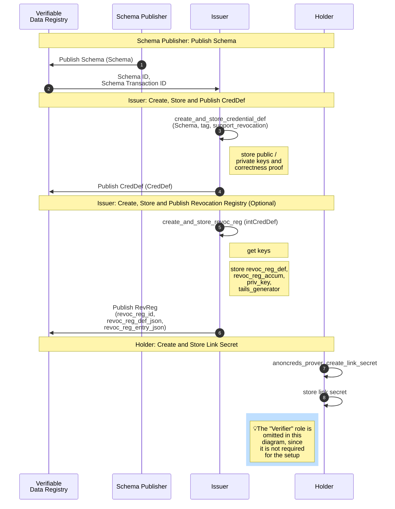

## AnonCreds Setup Data Flow

The following sequence diagram summarizes the setup operations performed by a [[ref: Schema Publisher]], the [[ref: Issuer]] (one required and one optional) in preparing to issue an AnonCred credential based on provided [[ref:Schema]], and the one setup operation performed by each [[ref: Holder]]. On successfully completing the operations, the [[ref: Issuer]] is able to issue credentials based on the given [[ref:Schema]] to the [[ref: Holder]]. The subsections below the diagram detail each of these operations.



::: note

Those with a knowledge of DIDs might expect that in the flow above, the first
step would be for the [[ref: issuer]] to publish a DID. However, in AnonCreds,
DIDs are not used in the processing of credentials, and notably, the public keys
used in AnonCreds signatures come not from DIDs, but rather from [[ref:
Credential Definition]] objects. DIDs may be used to identify the entity publishing the
objects that are then used in the processing of credentials -- the [[ref:
Schema]], [[ref: Credential Definition]], [[ref: Revocation Registry Definition]] and [[ref: Revocation Status List]]
objects. There is an enforced relationship between an identifier (such as a DID)
for the entity publishing the AnonCred objects, and the objects themselves. For
example, in the Hyperledger Indy implementation of AnonCreds, for a credential
issuer to publish a [[ref: Credential Definition]] on an instance of Indy it must have a DID
on that instance, and it must use that DID to sign the transaction to write the
[[ref: Credential Definition]].

The DID of the publisher of an AnonCreds object MUST be identifiable from the
published object and enforcement of the relationship between the DID and the
object must be enforced. For example, in the Hyperledger Indy implementation of
AnonCreds, the DID of the object publisher is part of the identifier of the
object -- given the identifier for the AnonCreds object (e.g. one found in
proving a verifiable credential), the DID of the publisher can be found.
Further, the Hyperledger Indy ledger enforces, and makes available for
verification, the requirement that the writing of the AnonCreds object must be
signed by the DID that is writing the object.

If a DID-based messaging protocol, such as
[DIDComm](https://identity.foundation/didcomm-messaging/spec/) is used between
the AnonCreds participants (the [[ref: issuer]], [[ref: holder]] and [[ref:
verifier]]) the use of DIDs for messaging is independent of their use (or not)
in the publishing AnonCreds objects. Such DIDs are used to facilitate secure
messaging between the participants to enable the issuing of credentials and the
presentation of proofs.

:::

### Schema Publisher: Publish Schema Object

Each type of AnonCred credential is based on a [[ref:Schema]] published to a Verifiable
Data Registry (VDR), an instance of Hyperledger Indy in this version of
AnonCreds. The [[ref:Schema]] is defined and published by the [[ref: Schema Publisher]]. Any issuer
who can reference the [[ref:Schema]] (including the [[ref: Schema Publisher]]) MAY issue
credentials of that type by creating and publishing a [[ref: Credential Definition]] based on the
[[ref:Schema]]. This part of the specification covers the operation to create and
publish a [[ref:Schema]]. The flow of operations to publish a [[ref:Schema]] is illustrated in
the `Schema Publisher: Publish Schema` section of the [AnonCreds Setup Data
Flow](#anoncreds-setup-data-flow) sequence diagram.

The [[ref:Schema]] is a JSON structure that can be manually constructed,
containing the list of attributes (claims) that will be included in each
AnonCreds credential of this type. The following is an example [[ref: Schema]]:

```json
{
  "issuerId": "https://example.org/issuers/74acabe2-0edc-415e-ad3d-c259bac04c15",
  "name": "Example schema",
  "version": "0.0.1",
  "attrNames": ["name", "age", "vmax"]
}
```

- `issuerId` - the [[ref: Issuer Identifier]] of the schema. MUST adhere to [Issuer Identifiers](#issuer-identifiers) rules.
- `name` (string) - the name of the schema
- `version` (string) - the schema version as a documentation string that it's not validated. The format is up to each implementor or publisher. For example, Indy uses [Semantic Versioning](https://semver.org)  
- `attrNames` (str[]) - an array of strings with each string being the name of an attribute of the schema

Once constructed, the [[ref: Schema]] is published to a Verifiable Data Registry
(VDR) using the Schema Publishers selected [[ref: AnonCreds Objects Method]].
For example, see [this
Schema](https://indyscan.io/tx/SOVRIN_MAINNET/domain/73904) that is published on
the Sovrin MainNet instance of Hyperledger Indy. The `schemaId` for that object
is: `Y6LRXGU3ZCpm7yzjVRSaGu:2:BasicIdentity:1.0.0`.

The identifier for the [[ref: schema]] is dependent on where the [[ref: Schema]]
is published and the [[ref: AnonCreds method]] used.

### Issuer Create and Publish Credential Definition Object

Each Issuer of credentials of a given type (e.g. based on a specific [[ref: Schema]]) must
create a [[ref: Credential Definition]] for that credential type. The flow of operations to create and
publish a [[ref: Credential Definition]] is illustrated in the `Issuer: Create, Store and Publish Credential Definition`
section of the [AnonCreds Setup Data Flow](#anoncreds-setup-data-flow) sequence
diagram.

In AnonCreds, the [[ref: Credential Definition]] and [[ref: Credential Definition]] identifier include the following elements.

- A link to the Issuer of the credentials via the DID used to publish the
  [[ref: Credential Definition]].
- A link to the [[ref: Schema]] upon which the [[ref: Credential Definition]] is based (the credential type).
- A set of public/private key pairs, one per attribute (claim) in the
  credential. The private keys will later be used to sign the claims when
  credentials to be issued are created.

* Other information necessary for the cryptographic signing of credentials.
* Information necessary for the revocation of credentials, if revocation is to
  be enabled by the Issuer for this type of credential.

We'll initially cover the generation and data for a [[ref: Credential Definition]] created without the
option of revoking credentials. In the succeeding
[section](#generating-a-cred_def-with-revocation-enabled), we describe the
additions to the generation process and data structures when
credential revocation is enabled for a given [[ref: Credential Definition]].

#### Retrieving the Schema Object

Prior to creating a [[ref: Credential Definition]], the Issuer must get an instance of the
[[ref: Schema]] upon which the [[ref: Credential Definition]] will be created. If the Issuer
is also the [[ref: Schema Publisher]], they will already have the [[ref:
Schema]]. If not, the Issuer must request that information from the [[ref: VDR]]
on which the [[ref:Schema]] is published. In some [[ref: AnonCreds Objects
Methods]] there is a requirement that the [[ref: Schema]] and [[ref: Credential Definition]]
must be on the same [[ref: VDR]].

#### Generating a Credential Definition Without Revocation Support

The [[ref: Credential Definition]] is a JSON structure that is generated using cryptographic primitives
(described below) given the following inputs.

- A [[ref: Schema]] and identifier for the [[ref: schema]] for the credential type.
- A `tag`, an arbitrary string defined by the Issuer, enabling an Issuer to
  create multiple [[ref: Credential Definition]]s for the same [[ref: Schema]].
- An optional flag `support_revocation` (default `false`) which if true
  generates some additional data in the [[ref: Credential Definition]] to enable credential
  revocation. The additional data generated when this flag is `true` is covered
  in the [next section](#issuer-create-and-publish-revocation-registry-object)
  of this document.

The operation produces two objects, as follows.

- The [[ref: Private Credential Definition]], an internally managed object that includes the private keys
  generated for the [[ref: Credential Definition]] and stored securely by the issuer.
- The [[ref: Credential Definition]], that includes the public keys generated for the [[ref:
Credential Definition]], returned to the calling function and then published on a VDR
  (currently Hyperledger Indy).

The following describes the process for generating the [[ref: Credential Definition]] and
[[ref: Private Credential Definition]] data.

- Build a credential schema using the schema definition.
- Build a non-credential schema that contains the single attribute `master_secret`, that will be used to hold the holder's blinded link secret. The non-credential schema attribute is included in all AnonCreds verifiable credentials.
- Generate random 1536-bit primes $p'$, $q'$, such that $p \leftarrow 2p'+1$ and $q \leftarrow 2q'+1$ are primes too. $p'$, $q'$, and $2p'+1$, $2q'+1$ are [Sophie Germain and Safe primes](https://en.wikipedia.org/wiki/Safe_and_Sophie_Germain_primes). 
- Compute $n \leftarrow pq$.
- Compute random $x_z, x_{R_1}, ..., x_{R_l}$ in the range of safe primes, using the non-credential and credential schema attributes.
- Compute random quadratic residue $S$ modulo $n$ (select a random number from $1$ to $n$, and square it $mod \, n$).
- Compute $Z \leftarrow S^{x_z}(mod \, n)$, and $\{R_i = S^{x_{R_i}}(mod \, n)\}_{1\leq i\leq l}$
- Credential Definition public key is $P_k = ( n, S, Z, \{R_i\}_{i\leq i\leq l} )$ and the private key is $s_k = (p, q)$

[Here](https://github.com/hyperledger/anoncreds-clsignatures-rs/blob/32398a67a4bdacf327c12eb4ecf5234857cc0a24/src/issuer.rs#L61) is the rust implementation of the above process.

The [[ref: Private Credential Definition]] produced by the generation process has the following format:

```json
{
  "p_key": {
    "p": "123...782",
    "q": "234...456"
  },
  "r_key": null
}
```

::: warning

A weakness in this specification is that the [[ref: Issuer]] does not provide a
key correctness proof to demonstrate that the generated private key is
sufficiently strong enough to meet the unlinkability guarantees of AnonCreds.

The proof should demonstrate that:

- `p` and `q` are both prime numbers
- `p` and `q` are not equal
- `p` and `q` are the same, sufficiently large, size
  - For example, using two values both 1024 bits long is sufficient, whereas
  using one value 2040 bits long and the other 8 bits long is not.

The [[ref: Issuer]] **SHOULD** provide a published key correctness proof based
on the approach described in [Jan Camenisch and Markus Michels. Proving in
zero-knowledge that a number is the product of two safe primes] (pages 12-13).
In a future version of AnonCreds, the additional key correctness proof could be
published separately or added to the [[ref: Credential Definition]] prior to
publication. In the meantime, [[ref: Issuers]] in existing ecosystems can share
such a proof with their ecosystem co-participants in an ad hoc manner.

[Jan Camenisch and Markus Michels. Proving in zero-knowledge that a number is the product of two safe primes]: https://www.brics.dk/RS/98/29/BRICS-RS-98-29.pdf

The lack of such a published key correctness proof allows a malicious [[ref:
Issuer]] to deliberately generate a private key that lacks the requirements
listed above, enabling the potential of a brute force attack that breaks the
unlinkability guarantee of AnonCreds.

:::

The [[ref: Credential Definition]] has the following format (based on this [example
Credential Definition](https://indyscan.io/tx/SOVRIN_MAINNET/domain/99654) on the Sovrin
MainNet):

```json
{
  "issuerId": "did:indy:sovrin:SGrjRL82Y9ZZbzhUDXokvQ",
  "schemaId": "did:indy:sovrin:SGrjRL82Y9ZZbzhUDXokvQ/anoncreds/v0/SCHEMA/MemberPass/1.0",
  "type": "CL",
  "tag": "latest",
  "value": {
    "primary": {
      "n": "779...397",
      "r": {
        "birthdate": "294...298",
        "birthlocation": "533...284",
        "citizenship": "894...102",
        "expiry_date": "650...011",
        "facephoto": "870...274",
        "firstname": "656...226",
        "link_secret": "521...922",
        "name": "410...200",
        "uuid": "226...757"
      },
      "rctxt": "774...977",
      "s": "750..893",
      "z": "632...005"
    }
  }
}
```

The [[ref: Credential Definition]] contains a cryptographic public key that can be used to
verify CL-RSA signatures over a block of `L` messages `m1,m2,...,mL`. The [[ref:
Credential Definition]] contains a public key fragment for each message being signed by
signatures generated with the respective private key. The length of the block of
messages, `L`, being signed is defined by referencing a specific Schema with a
certain number of attributes, `A = a1,a2,..` and setting `L` to `A+1`. The
additional message being signed as part of a credential is for a `link_secret`
(called the [[ref: link secret]] everywhere except in the existing open source
code and data models) attribute which is included in all credentials. This value
is blindly contributed to the credential during issuance and used to bind the
issued credential to the entity to which it was issued.

All integers within the above [[ref: Credential Definition]] example json are shown with ellipses (e.g. `123...789`). They are 2048-bit integers represented as `617` decimal digits. These integers belong to an RSA-2048 group characterised by the `n` defined in the [[ref: Credential Definition]].

- `issuerId` - the [[ref: Issuer Identifier]] of the credential definition. MUST adhere to [Issuer Identifiers](#issuer-identifiers) rules.
- `schemaId` - (string) The identifier of the [[ref: Schema]] on which the [[ref: Credential Definition]] is based. The format of the identifier is dependent on the [[ref: AnonCreds Objects Method]] used in publishing the [[ref: Schema]].
- `type` - (string) The signature type of the [[ref: Credential Definition]]. For this version of AnonCreds the value is always `CL`.
- `tag` (string) - the tag value passed in by the [[ref: Issuer]] to an AnonCred’s [[ref: Credential Definition]] create and store implementation.
- `value` - (object) an Ursa native object with the `primary` and `revocation` fields.
  - `primary` is the data used for generating credentials.
    - `n` is a safe RSA-2048 number. A large semiprime number such that `n = p.q`, where `p` and `q` are safe primes. A safe prime `p` is a prime number such that `p = 2p'+ 1`, where `p'` is also a prime. Note: `p` and `q` are the private key for the public CL-RSA key this [[ref: Credential Definition]] represents.
    - `r` is an object that defines a CL-RSA public key fragment for each attribute in the credential. Each fragment is a large number generated by computing `s^{xri}` where `xri` is a randomly selected integer between 2 and `p'q'-1`.
      - `master_secret` (also known as [[ref: link secret]], but kept as master_secret for backwards compatibility) is the name of an attribute that can be found in each [[ref: Credential Definition]]. The associated private key is used for signing a blinded value given by the [[ref: Holder]] to the [[ref: Issuer]] during credential issuance, binding the credential to the [[ref: Holder]].
      - The rest of the attributes in the list are those defined in the [[ref: Schema]].
      - The attribute names are normalized (lower case, spaces removed) and listed in the [[ref: Credential Definition]] in alphabetical order.
    - `rctxt` is equal to `s^(xrctxt)`, where `xrctxt` is a randomly selected integer between `2` and `p'q'-1`. (I believe this is used for the commitment scheme, allowing entities to blindly contribute values to credentials.)
    - `s` is a randomly selected quadratic residue of `n`. This makes up part of the CL-RSA public key, independent of the message blocks being signed.
    - `z` is equal to `s^(xz)`, where `xz` is a randomly selected integer between `2` and `p'q'-1`. This makes up part of the CL-RSA public key, independent of the message blocks being signed.

The identifier for the [[ref: Credential Definition]] is dependent on where the
[[ref: Credential Definition]] is published and the [[ref: AnonCreds method]] used.

#### Generating a Credential Definition With Revocation Support

The issuer enables the ability to revoke credentials produced from a [[ref: Credential Definition]] by
passing to the [[ref: Credential Definition]] generation process the flag `support_revocation` as
`true`. 
When using revocation in a credential, private key material is added
to the [[ref: Private Credential Definition]] to allow the issuer to
revoke credentials, and public key material is added to the
[[ref: Credential Definition]] to allow a verifier to check revocation
status.  The following describes the fields added to the [[ref: Private Credential Definition]] and  the
[[ref: Credential Definition]].


The revocation scheme uses a pairing-based dynamic accumulator defined
as a variant of the [CKS scheme](https://ia.cr/2008/539) but with a
Type 3 elliptic curve pairing instead of a Type 1 pairing.  The curve
$E$ is [BN254](https://neuromancer.sk/std/bn/bn254), which is defined
over a 254-bit prime $p$.  The pairing is an Ate pairing $e : G_1
\times G_2 \rightarrow G_T$ where $G_1 = E(\mathbb{F}_p)$, $G_2 =
E(\mathbb{F}_{p^2})$, and $G_T$ is the group of $q^{\text{th}}$ roots
of unity in $\mathbb{F}_{p^{12}}$ where $q=|E(\mathbb{F}_p)|$, which
is another 254-bit prime.  

In the amcl library used for the elliptic curve arithmetic, points are
represented using projective co-ordinates, i.e. a point $(X/Z,Y/Z)$ on
the curve $E$ is mapped to a projective point $(X: Y: Z)$.
Additionally, the big-integer co-ordinates are strings of 64
hexadecimal characters, meaning there are up to 64 * 4 - 254 = 2 bits of
'excess' in each encoding.  The library includes the excess number of
bits as an integer (i.e. `1` or `2`) before the hexadecimal
string.  The upshot is:
- Elements of $G_1$ are encoded as three 64-character
  strings of hexadecimal characters, each preceded by the excess, e.g.
  `1 1D1...A04 1 146...8BC 1 095...8A8`.
- Elements of $G_2$ are encoded as six 64-character 
  strings of hexadecimal characters, each preceded by the excess.
  `1 104...EC9 1 01A...FC2 1 226...1EB 1 234...D08 1 095...8A8 1 000...000`.

::: note

In this section, multiplicative notation is used: a point $P$
on an elliptic curve $E$ is considered an element $g$ in the group $G$
of points on the curve $E$, and for an integer $k$ modulo the group
order $q$, we write $g^k$ to mean the point $k \cdot P$.

:::


##### Private Revocation Keys
A [[ref: Private Credential Definition]] with revocation enabled has the following format. In this, the
details of the `p_key` element are omitted, as they are the same as was covered
in [the section above](generating-a-credential-definition-without-revocation-support).  The implementation can be found in the [anoncreds-clsignatures-rs](https://github.com/hyperledger/anoncreds-clsignatures-rs/blob/main/src/types.rs) repository.

```json
{
  "p_key": {
    "p": "123...782",
    "q": "234...456"
  },
  "r_key": {
    "x": "332...566",
    "sk": "992...237"
  }
}
```

- `r_key` is an object defining the revocation private key for the credential.
  - `x` is an integer modulo $q$
  - `sk` is an integer modulo $q$

The value $q$ is the order of the group $G_1=E(\mathbb{F}_p)$ on the curve BN254 (see above: $q$ is a 254-bit prime).
`x` and `sk` are used to generate parts of the revocation public key as described below.

::: note

The issuer additionally holds a secret value `gamma` used to construct
the accumulator.  This is inside the `RevocationKeyPrivate` object in
[anoncreds-clsignatures-rs](https://github.com/hyperledger/anoncreds-clsignatures-rs.git),
which is separate from the `CredentialRevocationPrivateKey` object
that stores `sk` and `x`.

:::

##### Public Revocation Keys

A [[ref: Credential Definition]] with revocation enabled has the following format (from [this
example Credential Definition](https://indyscan.io/tx/SOVRIN_MAINNET/domain/55204) on the
Sovrin MainNet). In this, the details of the `primary` element are omitted, as
they are the same as was covered above.

```json
{
  "issuerId": "did:indy:sovrin:F72i3Y3Q4i466efjYJYCHM",
  "schemaId": "did:indy:sovrin:F72i3Y3Q4i466efjYJYCHM/anoncreds/v0/SCHEMA/state_license/4.2.0",
  "type": "CL",
  "tag": "latest",
  "value": {
    "primary": {...},
    "revocation": {
      "g": "1 154...813 1 11C...D0D 2 095..8A8",
      "g_dash": "1 1F0...3B5 1 229...41D 1 04B...F7D 1 061...8B7 2 095...8A8 1 000...000",
      "h": "1 131...0DD 1 0D5...66E 2 095...8A8",
      "h0": "1 1AF...246 1 127...361 2 095...8A8",
      "h1": "1 242...F14 1 1AC...2FF 2 095...8A8",
      "h2": "1 072...7A1 1 09E...622 2 095...8A8",
      "h_cap": "1 196...C53 1 238...38B 1 196...C7E 1 198...D31 2 095...8A8 1 000...000",
      "htilde": "1 1D5...797 1 034...232 2 095...7A8",
      "pk": "1 0E7...A88 1 007...4B8 2 095...8A8",
      "u": "1 18E...44B 1 018...F71 1 0D8...2C2 1 003...4CF 2 095...8A8 1 000...000",
      "y": "1 068...F6B 1 16C...F7E 1 01F...68A 1 1E3...9F9 2 095...8A8 1 000...000"
    }
  }
}
```

In the following, only the `revocation` item is described, as the rest of items (`primary`, `ref`, etc.) are described in the previous section of this document.

- `revocation` is the data used for managing the revocation status of
  credentials issued using this [[ref: Credential Definition]]
  - `g` is a generator for the elliptic curve group $G_1$
  - `g_dash` is a generator for the elliptic curve group $G_2$
  - `h` is an elliptic curve point selected uniformly at random from $G_1$
  - `h0` is an elliptic curve point selected uniformly at random from $G_1$
  - `h1` is an elliptic curve point selected uniformly at random from $G_1$
  - `h2` is an elliptic curve point selected uniformly at random from $G_1$
  - `h_cap` is an elliptic curve point selected uniformly at random from $G_2$
  - `htilde` is an elliptic curve point selected uniformly at random from $G_1$
  - `pk` is the public key in $G_1$ for the issuer with respect to this accumulator, computed as `g^sk` (in multiplicative notation), where `sk` is from `r_key` above
  - `u` is an elliptic curve point selected uniformly at random from $G_2$
  - `y` is the an elliptic curve point in $G_2$, computed as `h_cap^x` (in multiplicative notation), where `x` is from `r_key` above

#### Publishing the Credential Definition on a Verifiable Data Registry

Once constructed, the [[ref: Credential Definition]] is published by the Issuer to a [[ref:
Verifiable Data Registry]] using the issuers preferred [[ref: AnonCreds Objects
Method]].

For example, see [this
Credential Definition](https://indyscan.io/tx/SOVRIN_MAINNET/domain/73905) that is published
in the Sovrin MainNet instance of Hyperledger Indy. Note that the contents of the [[ref: Credential Definition]] that have are published to the Hyperledger Indy ledger, do not exactly match the [[ref: Credential Definition]] data model. The specific [[ref: AnonCreds Objects
Method]] can describe how to resolve the contents stored on the ledger into the [[ref: Credential Definition]] data model.

### Issuer Create and Publish Revocation Registry Objects

Once the [[ref: issuer]] has created a [[ref: Credential Definition]] with revocation
enabled, the [[ref: issuer]] must also create and publish a [[ref: Revocation Registry Definition]] and
create and publish the first [[ref: Revocation Status List]] for the registry.

In this section, we'll cover the create and publish steps for each
of the [[ref: Revocation Registry Definition]] and [[ref: Revocation Status List]] objects. The creation and
publishing of the [[ref: Revocation Registry Definition]] includes creating and publishing the
[[ref: TAILS_FILE]] for the [[ref: Revocation Registry]].

#### Creating the Revocation Registry Object

A secure process must be run to create the revocation registry object, taking
the following input parameters.

- `revocDefType`: the type of revocation registry being created. This is always `CL_ACCUM`
- `credDefId`: the ID of the [[ref: Credential Definition]] to which the [[ref: Revocation Registry]] is to be associated
- `tag`: an arbitrary string defined by the [ref: issuer], enabling an [ref: issuer] to create multiple [[ref: Revocation Registry Definition]]s for the same [[ref: Credential Definition]].
- `maxCredNum`: The capacity of the [[ref: Revocation Registry]], a count of the number of
  credentials that can be issued using the [[ref: Revocation Registry]].
- `tailsLocation`: A URL indicating where the [[ref: TAILS_FILE]] for the [[ref Revocation Registry]] will be available to all [[ref: holders]] of credential issued using this revocation registry.

Three outputs are generated from the process to generate the [[ref: Revocation Registry]]: the [[ref: Revocation Registry]] object itself, the [[ref: TAILS_FILE]] content, and the [[ref: Private Revocation Registry]] object.

##### Revocation Registry Definition Object Generation

The [[ref: Revocation Registry Definition]] object has the following data model. This example is from
[this transaction](https://indyscan.io/tx/SOVRIN_MAINNET/domain/140386) on the
Sovrin MainNet and instance of Hyperledger Indy.

```json
{
  "issuerId": "did:web:example.org",
  "revocDefType": "CL_ACCUM",
  "credDefId": "Gs6cQcvrtWoZKsbBhD3dQJ:3:CL:140384:mctc",
  "tag": "MyCustomCredentialDefinition",
  "value": {
    "publicKeys": {
      "accumKey": {
        "z": "1 0BB...386"
      }
    },
    "maxCredNum": 666,
    "tailsLocation": "https://my.revocations.tails/tailsfile.txt",
    "tailsHash": "91zvq2cFmBZmHCcLqFyzv7bfehHH5rMhdAG5wTjqy2PE"
  }
}
```

The items within the data model are as follows:

::: todo
Update this to be the inputs for generating a Revocation Registry vs. the already published object
:::

- `issuerId` - the [[ref: Issuer Identifier]] of the revocation registry. MUST adhere to [Issuer Identifiers](#issuer-identifiers) rules and MUST be the same `issuerId` as the [[ref: Credential Definition]] on which the [[ref: Revocation Registry]] is based.
- `revocDefType` - the type of revocation registry (This is currently always `CL_ACCUM`)
- `credDefId` - The id of the [[ref: Credential Definition]] on which the [[ref: Revocation Registry]] is based.
- `tag` - an arbitrary string defined by the [ref: issuer], enabling an [ref: issuer] to create multiple [[ref: Revocation Registry Definition]]s for the same [[ref: Credential Definition]].
- `value` - The value of the revocation registry definition
  - `publicKeys` - Public keys data for signing the accumulator; the public key of a private/public key pair
    - `accumKey` - Accumulator key for signing the accumulator
      - `z` - a public key used to sign the accumulator (described further below)
  - `maxCredNum` - The maximum amount of Credentials that can be revoked in the Revocation Registry before a new one needs to be started
  - `tailsLocation` - The URL pointing to the related tails file
  - `tailsHash` - The hash of the tails file [[ref: TAILS_FILE]] (see also: [next section](#tails-file-and-tails-file-generation)) resulting from hashing the tails file version prepended to the tails file as SHA256 and then encoded to base58.

As noted, most of the items come directly from the input parameters provided by
the [[ref: issuer]]. The `z` [[ref: Revocation Registry]] accumulator public key is
generated using (TODO: fill in details) algorithm. The use of the accumulator
public key is discussed in the Credential Issuance section, when the publication
of revocations is described. The calculation of the tailsHash is described in
the [next section](#tails-file-and-tails-file-generation) on [[ref: TAILS_FILE]]
generation.

The identifier for the [[ref: Revocation Registry]] is dependent on where the
[[ref: Revocation Registry]] is published and the [[ref: AnonCreds method]] used.

##### Tails File and Tails File Generation

The second of the outcomes from creating of a [[ref: Revocation Registry]] is a [[ref:
TAILS_FILE]]. The contents of a [[ref: TAILS_FILE]] is an array of calculated
points on curve `G2`, one for each credential in the registry. Thus, if the [[ref:
Revocation Registry]] has a capacity (`maxCredNum`) of 1000, the [[ref: TAILS_FILE]] holds
an array of 1000 `G2` curve points. Each credential issued using the [[ref: Revocation Registry]] is
given its own index (1 to the capacity of the [[ref: Revocation Registry]]) into the array,
the index of the point for that credential. The contents of the [[ref:
TAILS_FILE]] is needed by the [[ref: holder]] to produce
(if possible) a "proof of non-revocation" to show their issued credential has
not been revoked.

The process of generating the points that populate the [[ref: TAILS_FILE]] are `tail[index] = g_dash * (gamma ** index)`

::: note
Detailed process for tails file generation:
- Create and open the tails file.
- To generate a tail point for an attribute located at a specific index, follow the steps.
- Convert index into an array of bytes(`u8`) using little endian ordering.
- Create an element belonging to the finite field group from the `u8` array.
- Calculate `pow` by doing modular exponentiation of revocation private key(`gamma`) with the finite field element previously calculated.
- Multiply `pow` by `g_dash`, which is the generator of elliptic curve group `G2`, and this should be the required point on the curve.
- Convert this tail point to an array of bytes(`u8`), and put them into the file as a slice buffer.
- Repeat for all the attributes from index $1$ to $L$, by calculating $([\gamma], [\gamma^2], [\gamma^3], ...[\gamma^L], [\gamma], [\gamma^{L+2}], [\gamma^{L+3}], ..., [\gamma^{2L}])$. Note that Instead of inserting $[\gamma^{L+1}]$ in the sequence, insert the value $[\gamma]$ (the first value in the sequence) in its place, and then continue with $[\gamma^{L+2}]$ and on to $[\gamma^{2L}]$. $[\gamma^{L+1}]$ is not used by holders generating the [[ref: Non-Revocation Proof]] and a dummy value is inserted in its place.
- Close the file buffer.

Relevant links: [Anoncreds-rs repository](https://github.com/hyperledger/anoncreds-rs/blob/9c915bb77bc4e033cc6d28d45e330ee5bda26211/src/services/tails.rs#LL148C1-L148C37), [Anoncreds-CLSignatures repository](https://github.com/hyperledger/anoncreds-clsignatures-rs/blob/f1ae666656054cd73fe765928c0dada64ef21d87/src/mod.rs#L517)
:::

The process for hashing the [[ref: TAILS_FILE]] is as follows:

- Append the tails file version and all the bytes of `G2` curve points one by one into a hasher.
- Compute the hash digest using `SHA256` hashing algorithm.


The SHA256 hash of the array of points is returned to be inserted into the `tailsHash`
item of the [[ref: Revocation Registry]] object (as described in the [previous
section](#revocation-registry-definition-object-generation)). Typically, the array is streamed into a
file (hence, the term "Tails File") and published to a [[ref: URL]] indicated by
the `tailsLocation` input parameter provided by the [[ref: issuer]].

The format of a [[ref: TAILS_FILE]] is as follows:

- First two bytes are version number(currently `0u8 2u8`)
- A list of the points, one per credential in the Revocation Registry. Each point is a collection of three integers implemented as points in 3 dimensions as per `ECP2`. Each point is 3x4 = 12 bytes long.

Thus the total size of a Tails File is 2+ 12*`Size of the Revocation Registry`+6 (the L+1 entry).

While not required, the Hyperledger Indy community has created a component, the "[Indy Tails
Server](https://github.com/bcgov/indy-tails-server)," which is basically a web
server for tails files. [[ref: Holders]] get the `tailsLocation` during the
issuance process, download the [[ref: TAILS_FILE]] (ideally) once and cache it
for use when generating proofs of non-revocation when creating a presentation
that uses its revocable verifiable credential. How the [[ref: TAILS_FILE]] is
used is covered elsewhere in this specification:

- in the section about the [[ref: issuer]] publishing credential revocation
  state updates, and
- in the section about [[ref: holders]] creating a proof of non-revocation.

##### Revocation Registry Definition Object Generation

In addition to generating the [[ref: Revocation Registry]] object, a [[ref:
Private Revocation Registry]] object is generated and securely stored by the [[ref:
issuer]]. The data model and definition of the items in the [[ref:
Private Revocation Registry]] is as follows:

::: todo
To Do: Fill in the details about the Revocation Registry Definition
:::

#### Publishing the Revocation Registry Object

Once constructed, the [[ref: Revocation Registry]] is published by the [[ref: issuer]] in a
[[ref: Verifiable Data Registry]] using the issuer's [[ref: AnonCreds Objects
Method]]. For example, see [this
Revocation Registry](https://indyscan.io/tx/SOVRIN_MAINNET/domain/140386) that is published
on the Sovrin MainNet instance of Hyperledger Indy. The binary [[ref:
TAILS_FILE]] associated with the [[ref: Revocation Registry]] can be downloaded from the
`tailsLocation` in the [[ref: Revocation Registry]] object.

#### Creating the Initial Revocation Status List Object

Published [[ref: Revocation Status List]] objects contain the state of the [[ref:
Revocation Registry]] at a given point in time such that [[ref: holders]] can generate a
proof of non-revocation (or not) about their specific credential and [[ref:
verifiers]] can verify that proof. An initial [[ref: Revocation Status List]] is
generated and published immediately on creation of the [[ref: Revocation Registry]] so that
it can be used immediately by [[ref: holders]]. Over time, additional [[ref:
Revocation Status List]] objects are generated and published as the revocation status of
one or more credentials within the [[ref: Revocation Registry]] change.

A secure process must be run to create the initial [[ref: Revocation Status List]] object,
taking the following input parameters.

- `revRegId`: the ID of the [[ref: Revocation Registry]] for which the initial [[ref:
Revocation Status List]] is to be generated.
  - The process uses this identifier to find the associated [[ref:
Private Revocation Registry]] to access the information within that object.
- `revocationList` - A bit array of length `maxCredNum` that indicates whether a credential
  is initially revoked or not. The value of `1` indicates the credential is
  initially revoked, the value of `0` indicates the credential is initially unrevoked.

The process collects from the identified [[ref: Private Revocation Registry]] information to
calculate the cryptographic accumulator value for the initial [[ref:
Revocation Status List]], including:

- `revocDefType`: the type of revocation registry. This is currently always `CL_ACCUM`
- `maxCredNum`: The capacity of the [[ref: Revocation Registry]], a count of the number of
  credentials that can be issued using the [[ref: Revocation Registry]].
- `tailsArray`: The contents of the [[ref: TAILS_FILE]], the array of primes,
  one for each credential to be issued from the [[ref: Revocation Registry]].
- `privateKey`: The accumulator private key for the [[ref: Revocation Registry]].

With the collected information, the initial cryptographic accumulator for the [[ref: Revocation Registry]] can be created. The format of the identifier for the
[[ref: Revocation Status List]] is dependent on the [[ref: AnonCreds Objects Method]]
used by the issuer.

In simple terms, the cryptographic accumulator at any given point in time is the
(modulo) product of the primes for each non-revoked credential in the [[ref:
Revocation Registry]].

If all of the credentials are initially revoked (`revocationList` only contains `1` values), the accumulator value is `0`.

The accumulator is calculated using the following steps:

::: todo
To Do: Adding the algorithm for calculating the accumulator
:::

THe following is an example of an initial, published [[ref: Revocation Status List]] object:

```json
{
  "revRegDefId": "4xE68b6S5VRFrKMMG1U95M:4:4xE68b6S5VRFrKMMG1U95M:3:CL:59232:default:CL_ACCUM:4ae1cc6c-f6bd-486c-8057-88f2ce74e960",
  "revocationList": [0, 1, 1, 0],
  "currentAccumulator": "21 124C594B6B20E41B681E92B2C43FD165EA9E68BC3C9D63A82C8893124983CAE94 21 124C5341937827427B0A3A32113BD5E64FB7AB39BD3E5ABDD7970874501CA4897 6 5438CB6F442E2F807812FD9DC0C39AFF4A86B1E6766DBB5359E86A4D70401B0F 4 39D1CA5C4716FFC4FE0853C4FF7F081DFD8DF8D2C2CA79705211680AC77BF3A1 6 70504A5493F89C97C225B68310811A41AD9CD889301F238E93C95AD085E84191 4 39582252194D756D5D86D0EED02BF1B95CE12AED2FA5CD3C53260747D891993C",
  "timestamp": 1669640864487
}
```

The items in the data model are:

- `revRegDefId`: the identifier of the associated [[ref: Revocation Registry Definition]]. The
  format of the identifier is dependent on the [[ref: AnonCreds Objects Method]]
  used by the issuer.
- `revocationList`: Bit array defining the status of the credential in the [ref: Revocation Registry]. A value of `1` means the credential is revoked, a value of `0` means the credential is not revoked.
- `currentAccumulator`: the calculated cryptographic accumulator reflecting the initial state of the [[ref: Revocation Registry]]
- `timestamp`: the timestamp at which the accumulator value is valid

#### Publishing the Initial Initial Revocation Status List Object

Once constructed, the initial [[ref: Revocation Status List]] is published by the [[ref:
issuer]] in a [[ref: Verifiable Data Registry]] using their selected [[ref:
AnonCreds Objects Method]].

It is not required for the [[ref: Verifiable Data Registry]] to store the revocation list as defined in this model. For example, the Indy ledger uses deltas ([Revocation Registry Entries](https://github.com/hyperledger/indy-node/blob/main/docs/source/transactions.md#revoc_reg_entry)) to store the change in revoked/un-revoked indices instead of storing the entire revocation list. It is also possible to compress the `revocationList` entry using e.g. GZIP to reduce the size on the ledger.

### Holder Create and Store Link Secret

To prepare to use AnonCreds credentials, the [[ref: Holder]] must create a
[[ref: link secret]], a unique identifier that allows credentials issued to a
[[ref: Holder]] to be bound to that [[ref: Holder]] and presented without
revealing a unique identifier, thus avoiding correlation of credentials by
[[ref: Verifier]]s. The [[ref: link secret]] is kept private by the [[ref:
Holder]]. The [[ref: link secret]] is used during the credential issuance
process to bind the credential to the [[ref: holder]] and in the generation of a
presentation. For the latter, it allows the [[ref: holder]] to create a zero
knowledge proof that they were issued the credential.This proof demonstrates knowledge the [[ref: link secret]] and prove that it is one of the signed credential attributes, without revealing the [[ref: link secret]] to the [[ref: verifier]]. The details of how
the [[ref: link secret]] is used to do this is provided in the issuance,
presentation generation and verification sections of this specification.

The [[ref: link secret]] is a sufficiently random unique identifier. For
example, in the Hyperledger Indy implementation, the [[ref: link secret]] is
produced by a call to the Rust
[uuid](https://docs.rs/uuid/0.5.1/uuid/index.html) Crate's `new_v4()` method to
achieve sufficient randomness.

Once generated, the [[ref: link secret]] is stored locally by the [[ref:
Holder]] for use in subsequent issuance and presentation interactions. If lost,
the [[ref: Holder]] will not be able to generate a proof that the credential was
issued to them. The [[ref: holder]] generates only a single [[ref:
link secret]], using it for all credentials the [[ref: holder]] is issued. This
allows for [[ref: verifier]]s to verify that all of the credentials used in
generating a presentation with attributes from multiple credentials were all
issued to the same [[ref: Holder]] without requiring the [[ref: Holder]] to
disclose the unique identifier ([[ref: link secret]]) that binds these
credentials together.

There is nothing to stop a [[ref: Holder]] from generating multiple [[ref:
link secret]]s and contributing them to different credential issuance processes.
However, doing so prevents the [[ref: Holder]] from producing a presentation
combining credentials issued to distinct [[ref: link secret]]s that can be
proven to have been issued to the same entity. It is up to the [[ref: Verifier]]
to require and enforce the binding between multiple credentials used in a
presentation.
