## AnonCreds Data Flows

This section of the specification describes the major data flows within AnonCreds:

* [AnonCreds Setup](#anoncreds-setup-data-flow), including operations by an Issuer (possibly also the Schema Publisher) and Holder
* [AnonCreds Issuance](#anoncreds-issuance-data-flow), including operations by both the Issuer and Holder
* [AnonCreds Presentation](#anoncreds-presentation-data-flow), including operations by both the Holder and the Verifier
* [AnonCreds Revocation](#anoncreds-revocation-data-flow), including operations by the Verifier (and optionally by the holder)


Each of the aforementioned data flows involve different data objects and actors, which are described in detail in the following sections.

### AnonCreds Setup Data Flow

The following sequence diagram summarizes the setup operations performed by a [[ref: SCHEMA Publisher]], the [[ref: Issuer]] (one required and one optional) in preparing to issue an AnonCred credential based on provided [[ref: SCHEMA]], and the one setup operation performed by each [[ref: Holder]]. On successfully completing the operations, the [[ref: Issuer]] is able to issue credentials based on the given [[ref: SCHEMA]] to the [[ref: Holder]]. The subsections below the diagram detail each of these operations.

::: todo
Question: Should there be an operation to cover creating the published DID for the SCHEMA Publisher and Issuer?
:::



```mermaid
sequenceDiagram
    autonumber
    participant L as Verifiable<br>Data Registry
    participant SP as Schema Publisher
    participant I as Issuer
    participant H as Holder   
    
    Note over L, H: Schema Publisher: Publish Schema
    
    SP ->> L: Publish Schema (Schema)
    L ->> I: Schema ID,<br>Schema Transaction ID
        
    Note over L, H: Issuer: Create, Store and Publish CredDef
   
    I ->> L: Request Schema (schema_id)
    L ->> I: Return Schema
    I ->> I: create_and_store_credential_def<br>(Schema, tag, support_revocation)
    Note right of I:   store public / <br> private keys and<br>correctness proof    
    I ->> L: Publish CredDef (CredDef)

    Note over L, H: Issuer: Create, Store and Publish Revocation Registry (Optional)
    
    I ->> I: create_and_store_revoc_reg (intCredDef)
    Note right of I: get keys
    Note right of I: store revoc_reg_def,<br>revoc_reg_accum,<br>priv_key,<br>tails_generator
    I ->> L: Publish RevReg <br>(revoc_reg_id,<br>revoc_reg_def_json,<br>revoc_reg_entry_json)
    
    Note over L, H: Holder: Create and Store Link Secret
    
    H ->> H: indy_prover_create_master_secret
    H ->> H: store master secret
    rect rgb(191, 223, 255)
      Note left of H: 💡The "Verifier" role is<br>omitted in this<br>diagram, since<br>it is not required<br>for the setup
    end
```

#### SCHEMA Publisher: Publish SCHEMA Object

Each type of AnonCred credential is based on a [[ref: SCHEMA]] published to a Verifiable
Data Registry (VDR), an instance of Hyperledger Indy in this version of
AnonCreds. The [[ref: SCHEMA]] is defined and published by the [[ref: SCHEMA Publisher]]. Any issuer
who can reference the [[ref: SCHEMA]] (including the [[ref: SCHEMA Publisher]]) MAY issue
credentials of that type by creating and publishing a [[ref: CRED_DEF]] based on the
[[ref: SCHEMA]]. This part of the specification covers the operation to create and
publish a [[ref: SCHEMA]]. The flow of operations to publish a [[ref: SCHEMA]] is illustrated in
the `SCHEMA Publisher: Publish SCHEMA` section of the [AnonCreds Setup Data
Flow](#anoncreds-setup-data-flow) sequence diagram.

The [[ref: SCHEMA]] is a JSON structure that can be manually constructed, containing the
list of attributes (claims) that will be included in each AnonCred credential of
this type and the items that will make up the `schema_id` for the [[ref: SCHEMA]]. The
following is an example [[ref: SCHEMA]]:

``` json
{
    "attr_names": [
        "birthlocation",
        "facephoto",
        "expiry_date",
        "citizenship",
        "name",
        "birthdate",
        "firstname",
        "uuid"
    ],
    "name": "BasicIdentity",
    "version": "1.0.0"
}
```

* `attr_names` is the array of attribute names (claim names) that will constitute the AnonCred credential of this type.
* `name` is a string, the name of the schema, which will be a part of the published `schema_id`.
* `version` is a string, the version of the schema in [semver](https://semver.org/) format. The three part, period (".")
    separated format MAY be enforced. The `version` will be part of the published `schema_id`.

The `name` and `version` items are used to form a schema_id for the [[ref: SCHEMA]]. The
`schema_id` is namespaced by the Publisher of the [[ref: SCHEMA]], as follows: `<publisher
DID>:<object type>:<name>:version>`. The elements of the identifier, separated
by `:`'s are:

* `publisher DID`: The DID of the [[ref: SCHEMA Publisher]].
* `object type`: The type of object. `2` is used for [[ref: SCHEMA]].
* `name`: The `name` item from the [[ref: SCHEMA]].
* `version`: The `version` item from the [[ref: SCHEMA]].

Once constructed, the [[ref: SCHEMA]] is published to a Verifiable Data Registry (VDR),
currently a Hyperledger Indy ledger. For example, see [this
SCHEMA](https://indyscan.io/tx/SOVRIN_MAINNET/domain/73904) that is published on
the Sovrin MainNet ledger. Once published on a Hyperledger Indy ledger, an
additional identifier for the published [[ref: SCHEMA]], the `TXN_ID`, is available to
those reading from the ledger. As defined in the next subsection, the `TXN_ID`
is used as part of the [[ref: CRED_DEF]] identifier created in the next setup process.

#### Issuer Create and Publish CRED_DEF Object

Each Issuer of a credential type (e.g. one based on a specific [[ref: SCHEMA]]) needs to
create a [[ref: CRED_DEF]] for that credential type. The flow of operations to create and
publish a [[ref: CRED_DEF]] is illustrated in the `Issuer: Create, Store and Publish CRED_DEF`
section of the [AnonCreds Setup Data Flow](#anoncreds-setup-data-flow) sequence
diagram.

In AnonCreds, the [[ref: CRED_DEF]] and [[ref: CRED_DEF]] identifier include the following elements.

* A link to the Issuer of the credentials via the DID used to publish the
  [[ref: CRED_DEF]].
* A link to the [[ref: SCHEMA]] upon which the [[ref: CRED_DEF]] is based (the credential type).
* A set of public/private key pairs, one per attribute (claim) in the
  credential. The private keys will later be used to sign the claims when
  credentials to be issued are created.
* Other information necessary for the cryptographic signing of credentials.
* Information necessary for the revocation of credentials, if revocation is to
  be enabled by the Issuer for this type of credential.

We'll initially cover the generation and data for a [[ref: CRED_DEF]] created without the
option of revoking credentials. In the succeeding
[section](#generating-a-cred_def-with-revocation-enabled), we describe the
additions to the generation process and data structures when
credential revocation is enabled for a given [[ref: CRED_DEF]].

##### Retrieving the SCHEMA Object

Prior to creating a [[ref: CRED_DEF]], the Issuer must get an instance of the
[[ref: SCHEMA]] upon which the [[ref: CRED_DEF]] will be created, including the
identifier for the [[ref: SCHEMA]] in the form of a Hyperledger Indy `TXN_ID`.
If the Issuer is also the [[ref: SCHEMA Publisher]], they will already have the
[[ref: SCHEMA]] (with `TXN_ID`). If not, the Issuer must request that information
from the VDR (Hyperledger Indy instance) on which the [[ref: SCHEMA]] is
published. Hyperledger Indy requires that the [[ref: SCHEMA]] and [[ref: CRED_DEF]]
must be on the same ledger instance.

##### Generating a CRED_DEF Without Revocation Support

The [[ref: CRED_DEF]] is a JSON structure that is generated using cryptographic primitives
(described below) given the following inputs.

* A [[ref: SCHEMA]] for the credential type.
* A `tag`, an arbitrary string defined by the Issuer, enabling an Issuer to
  create multiple [[ref: CRED_DEF]]s for the same [[ref: SCHEMA]].
* An optional flag `support_revocation` (default `false`) which if true
  generates some additional data in the [[ref: CRED_DEF]] to enable credential
  revocation. The additional data generated when this flag is `true` is covered
  in the [next section](#issuer-create-and-publish-revocation-registry-object)
  of this document.

The operation produces two objects, as follows.

* The [[ref: PRIVATE_CRED_DEF]], an internally managed object that includes the private keys
  generated for the [[ref: CRED_DEF]] and stored securely by the issuer.
* The [[ref: CRED_DEF]], that includes the public keys generated for the [[ref:
  CRED_DEF]], returned to the calling function and then published on a VDR
  (currently Hyperledger Indy).

The following describes the process for generating the [[ref: CRED_DEF]] and
[[ref: PRIVATE_CRED_DEF]] data.

::: todo
Describe the generation process for the CRED_DEF.
:::

The [[ref: PRIVATE_CRED_DEF]] produced by the generation process has the following format:

```json

To Do.

```

The [[ref: CRED_DEF]] has the following format (from [this example
CRED_DEF](https://indyscan.io/tx/SOVRIN_MAINNET/domain/99654) on the Sovrin
MainNet):

```json
{
  "data": {
    "primary": {
      "n": "779...397",
      "r": {
            "birthdate": "294...298",
            "birthlocation": "533...284",
            "citizenship": "894...102",
            "expiry_date": "650...011",
            "facephoto": "870...274",
            "firstname": "656...226",
            "master_secret": "521...922",
            "name": "410...200",
            "uuid": "226...757"
      },
      "rctxt": "774...977",
      "s": "750..893",
      "z": "632...005"
    }
  },
  "ref": 54177,
  "signature_type": "CL",
  "tag": "latest"
}
```

The integers shown with ellipses (e.g. `123...789`) are all very long integers of length 617 digits.

* `primary` is the data used for generating credentials.
* `n` is the ...
* `r` is a list of attribute names which are going to be used in the credential, each with an associated public key.
  * `master_secret` (should be [[ref: link secret]]) is the name of an attribute that can be found in each [[ref: CRED_DEF]]. The associated private key is used for signing a blinded value given by the [[ref: Holder]] to the [[ref: Issuer]] during credential issuance, binding the credential to the [[ref: Holder]].
  * The rest of the attributes in the list are those defined in the [[ref: SCHEMA]].
  * The attribute names are normalized (lower case, spaces removed) and listed in the [[ref: CRED_DEF]] in alphabetical order.
* `rctxt` is the ...
* `s` is the ...
* `z` is the ...
* `ref` is the `TXN_ID` on the Hyperledger Indy ledger for the [[ref: SCHEMA]] from which the list of attributes is pulled.
* `signature_type` is always `CL` in this version of AnonCreds.
* `tag` is the `tag` value (a string) passed in by the Issuer to an AnonCred's [[ref: CRED_DEF]] create and store implementation.

The [[ref: SCHEMA]] `TXN_ID` and `tag` items are used to form a `cred_def_id` for the [[ref: CRED_DEF]]. The `CRED_DEF_id` is namespaced by the Issuer of the CreDef,
as follows: `<issuer DID>:<object type>:<signature_type>:<SCHEMA TXN_ID>:tag>`. The elements of the identifier, separated by `:`'s are:

* `issuer DID`: The DID of the Issuer, the issuer of the [[ref: CRED_DEF]].
* `object type`: The type of object. `3` is used for [[ref: CRED_DEF]]s.
* `signature_type`: The `signature_type` item from the [[ref: CRED_DEF]].
* `SCHEMA TXN_ID`: The `ref` item from the [[ref: CRED_DEF]]
* `tag`: The `tag` item from the [[ref: CRED_DEF]].

##### Generating a CRED_DEF With Revocation Support

The issuer enables the ability to revoke credentials produced from a [[ref: CRED_DEF]] by
passing to the [[ref: CRED_DEF]] generation process the flag `support_revocation` as
`true`. When revocation is to enabled for a [[ref: CRED_DEF]], additional data related to
revocation is generated and added to the [[ref: CRED_DEF]] JSON objects defined above. In
the following the additional steps in the [[ref: CRED_DEF]] generation process to enable
revocation are described, along with the additional data produced in that
process.

The following describes the process for generating the revocation portion of the
[[ref: CRED_DEF]] data when the [[ref: CRED_DEF]] is created with the `support_revocation` flag
set to `true`. This process extends the process for generating a [[ref: CRED_DEF]] in the
[previous section](#issuer-create-and-publish-CRED_DEF-object) of this document.

::: todo
Describe the revocation data generation process for the CRED_DEF.
Provide a reference to the published articles on revocation used here.
:::

An [[ref: PRIVATE_CRED_DEF]] with revocation enabled has the following format.  In this, the
details of the `primary` element are hidden, as they are the same as was covered
above.

```json

To Do.

```

A [[ref: CRED_DEF]] with revocation enabled has the following format (from [this
example CRED_DEF](https://indyscan.io/tx/SOVRIN_MAINNET/domain/55204) on the
Sovrin MainNet). In this, the details of the `primary` element are hidden, as
they are the same as was covered above.

```json
{
  "data": {
    "primary": {...},
    "revocation": {
      "g": "1 154...813 1 11C...D0D 2 095..8A8",
      "g_dash": "1 1F0...000",
      "h": "1 131...8A8",
      "h0": "1 1AF...8A8",
      "h1": "1 242...8A8",
      "h2": "1 072...8A8",
      "h_cap": "1 196...000",
      "htilde": "1 1D5...8A8",
      "pk": "1 0E7...8A8",
      "u": "1 18E...000",
      "y": "1 068...000"
    }
  },
  "ref": 54753,
  "signature_type": "CL",
  "tag": "state_license"
}
```

The elements with ellipses (e.g. `1F0...000`) in `g` are 64 digits hex integers.
The rest of the elements are the same structure as `g` but containing either 3
or 6 hex integers, as noted below. In the following, only the `revocation` item
is described, as the rest of items (`primary`, `ref`, etc.) are described in the
previous section of this document.

* `revocation` is the data used for managing the revocation status of
  credentials issued using this [[ref: CRED_DEF]].
* `g` is the ...
* `g_dash` is the ...
* `h` is the ...
* `h0` is the ...
* `h1` is the ...
* `h2` is the ...
* `h_cap` is the ...
* `htilde` is the ...
* `pk` is the ...
* `u` is the ...
* `y` is the ...

##### Publishing the CRED_DEF on a Verifiable Data Registry

Once constructed, the [[ref: CRED_DEF]] is published by the Issuer in a [[ref:
Verifiable Data Registry]], currently a Hyperledger Indy ledger. For example,
see [this CRED_DEF](https://indyscan.io/tx/SOVRIN_MAINNET/domain/73905) that is
published in the Sovrin MainNet ledger. The full contents of the [[ref:
CRED_DEF]] is placed in the ledger including the revocation section, if present.

#### Issuer Create and Publish Revocation Registry Objects

Once the [[ref: issuer]] has created a [[ref: CRED_DEF]] with revocation
enabled, the [[ref: issuer]] must also create and publish a [[ref: REV_REG]] and
create and publish the first [[ref: REV_REG_ENTRY]] for the registry.

In this section, we'll cover the create and publish steps for each
of the [[ref: REV_REG]] and [[ref: REV_REG_ENTRY]] objects. The creation and
publishing of the [[ref: REV_REG]] includes creating and publishing the
[[ref: TAILS_FILE]] for the [[ref: REG_REV]].

##### Creating the Revocation Registry Object

A secure process must be run to create the revocation registry object, taking
the following input parameters.

* `type`: the type of revocation registry being created. For Hyperledger Indy
  this is always "CL_ACCUM."
* `cred_def_id`: the ID of the [[ref: CRED_DEF]] to which the [[ref: REV_REG]]
  is to be associated
* `tag`: an [[ref: issuer]]-defined tag that is included in the identifier for
  the [[ref: REV_REG]]
* `issuanceType`: an enumerated value that defines the initial state of
  credentials in the [[ref: REV_REG]]: revoked ("ISSUANCE_ON_DEMAND") or
  non-revoked ("ISSUANCE_BY_DEFAULT").
* `maxCredNum`: The capacity of the [[ref: REV_REG]], a count of the number of
  credentials that can be issued using the [[ref: REV_REG]].
* `tailsLocation`: A URL indicating where the [[ref: TAILS_FILE]] for the [[ref
  REV_REG]] will be available to all [[ref: holders]] of credential issued using
  this revocation registry.

Three outputs are generated from the process to generate the [[ref; REV_REG]]:
the [[ref: REV_REG]] object itself, the [[ref: TAILS_FILE]] content, and the
[[ref: PRIVATE_REV_REG]] object.

###### REV_REG Object Generation

The [[ref: REV_REG]] object has the following data model. This example is from
[this transaction](https://indyscan.io/tx/SOVRIN_MAINNET/domain/140386) on the
Hyperledger Indy Sovrin MainNet.

``` json
{
  "credDefId": "Gs6cQcvrtWoZKsbBhD3dQJ:3:CL:140384:mctc",
  "id": "Gs6cQcvrtWoZKsbBhD3dQJ:4:Gs6cQcvrtWoZKsbBhD3dQJ:3:CL:140384:mctc:CL_ACCUM:1-1024",
  "revocDefType": "CL_ACCUM",
  "tag": "1-1024",
  "value": {
    "issuanceType": "ISSUANCE_BY_DEFAULT",
    "maxCredNum": 1024,
    "publicKeys": {
      "accumKey": {
        "z": "1 0BB...386"
      }
    },
    "tailsHash": "BrCqQS487HcdLeihGwnk65nWwavKYfrhSrMaUpYGvouH",
    "tailsLocation": "https://api.portal.streetcred.id/agent/tails/BrCqQS487HcdLeihGwnk65nWwavKYfrhSrMaUpYGvouH"
  }
}
```

The items within the data model are as follows:

* `credDefId`: the input parameter `cred_def_id`
* `id`: the identifier of the [[ref: REV_REG]], a concatenation of the following
  items separated by ":"s. An example [[ref: REV_REG]] identifier is in the data
  model above.
    * Issuer's DID -- the DID of the Issuer
    * Object Type -- hardcoded to "`4`" for a [[ref: REV_REG]]
    * The [[ref: CRED_DEF]] identifier, the input parameter `cred_def_id`
    * Revocation Type, the input parameter `type`
    * Tag, the input parameter `tag`
* `revocDefType`, the input parameter `type`
* `tag`, the input parameter `tag`
* `issuanceType`, the input parameter `issuanceType`
* `maxCredNum`, the input parameter `maxCredNum`
* `z`, a public key used to sign the accumulator (described further below)
* `tailsHash`, the calculated hash of the contents of the [[ref: TAILS_FILE]],
  as described in the [next section](#tails-file-and-tails-file-generation) on
  [[ref: TAILS_FILE]] generation.
* `tailsFileLocation`, the input parameter `tailsLocation`

As noted, most of the items come directly from the input parameters provided by
the [[ref: issuer]]. The `z` [[ref: REV_REG]] accumulator public key is
generated using (TODO: fill in details) algorithm. The use of the accumulator
public key is discussed in the Credential Issuance section, when the publication
of revocations is described. The calculation of the tailsHash is described in
the [next section](#tails-file-and-tails-file-generation) on [[ref: TAILS_FILE]]
generation.

###### Tails File and Tails File Generation

The second of the outcomes from creating of a [[ref: REV_REG]] is a [[ref:
TAILS_FILE]]. The contents of a [[ref: TAILS_FILE]] is an array of calculated
prime integers, one for each credential in the registry. Thus, if the [[ref:
REV_REG]] has a capacity (`maxCredNum`) of 1000, the [[ref: TAILS_FILE]] holds
an array of 1000 primes. Each credential issued using the [[ref: REV_REG]] is
given its own index (1 to the capacity of the [[ref: REV_REG]]) into the array,
the index of the prime for that credential. The contents of the [[ref;
TAILS_FILE]] is needed by the [[ref: issuer]] to publish the current state of
revocations within the [[ref: REV_REG]] and by the [[ref: holder]] to produce
(if possible) a "proof of non-revocation" to show their issued credential has
not been revoked.

The process of generating the primes that populate the [[ref: TAILS_FILE]] is as
follows:

::: todo
To Do: Document the process for generating the primes.
:::

Once generated, the array of primes is static, regardless of credential issuance
or revocation events. Once generated, the SHA256 (TO BE VERIFIED) hash of the
array of primes is calculated and returned to be inserted into the `tailsHash`
item of the [[ref: REV_REG]] object (as described in the [previous
section](#rev_reg-object-generation)). Typically, the array is streamed into a
file (hence, the term "Tails File") and published to the location indicated by
the `tailsLocation` input parameter provided by the [[ref: issuer]].

The format of a [[ref: TAILS_FILE]] is as follows:

::: todo
To Do: Define the format of the Tails File
:::

While not required, the Indy community has created a component, the "[Indy Tails
Server](https://github.com/bcgov/indy-tails-server)," which is basically a web
server for tails files. [[ref: Holders]] get the `tailsLocation` during the
issuance process, download the [[ref: TAILS_FILE]] (ideally) once and cache it
for use when generating proofs of non-revocation when creating a presentation
that uses its revocable verifiable credential. How the [[ref: TAILS_FILE]] is
used is covered elsewhere in this specification:

* in the section about the [[ref: issuer]] publishing credential revocation
  state updates, and
* in the section about [[ref: holders]] creating a proof of non-revocation.

###### PRIVATE_REV_REG Object Generation

In addition to generating the [[ref: REV_REG]] object, a [[ref:
PRIVATE_REV_REG]] object is generated and securely stored by the [[ref:
issuer]]. The data model and definition of the items in the [[ref:
PRIVATE_REV_REG]] is as follows:

::: todo
To Do: Fill in the details about the PRIVATE_REV_REG
:::

##### Publishing the Revocation Registry Object

Once constructed, the [[ref: REV_REG]] is published by the [[ref: issuer]] in a
[[ref: Verifiable Data Registry]], currently a Hyperledger Indy ledger. For
example, see [this REV_REG](https://indyscan.io/tx/SOVRIN_MAINNET/domain/140386)
that is published on the Sovrin MainNet ledger. The binary [[ref: TAILS_FILE]]
associated with the [[ref: REV_REG]] can be downloaded from the `tailsLocation`
in the [[ref: REV_REG]] object.

##### Creating the Initial Revocation Registry Entry Object

Published [[ref: REV_REG_ENTRY]] objects contain the state of the [[ref:
REV_REG]] at a given point in time such that [[ref: holders]] can generate a
proof of non-revocation (or not) about their specific credential and [[ref:
verifiers]] can verify that proof. An initial [[ref: REV_REG_ENTRY]] is
generated and published immediately on creation of the [[ref: REV_REG]] so that
it can be used immediately by [[ref: holders]]. Over time, additional [[ref:
REV_REG_ENTRY]] objects are generated and published as the revocation status of
one or more credentials within the [[ref: REV_REG]] change.

A secure process must be run to create the initial [[ref: REV_REG_ENTRY]] object,
taking the following input parameters.

* `type`: the type of revocation registry being created. For Hyperledger Indy
  this is always "CL_ACCUM."
* `rev_reg_id`: the ID of the [[ref: REV_REG]] for which the initial [[ref:
  REV_REG_ENTRY]] is to be generated.
    * The process uses this identifier to find the associated [[ref:
      PRIVATE_REV_REG]] to access the information within that object.

The process collects from the identified [[ref: PRIVATE_REV_REG]] information to
calculate the cryptographic accumulator value for the initial [[ref:
REV_REG_ENTRY]], including:

* `issuanceType`: an enumerated value that defines the initial state of
  credentials in the [[ref: REV_REG]]: revoked ("ISSUANCE_ON_DEMAND") or
  non-revoked ("ISSUANCE_BY_DEFAULT").
* `maxCredNum`: The capacity of the [[ref: REV_REG]], a count of the number of
  credentials that can be issued using the [[ref: REV_REG]].
* `tailsArray`: The contents of the [[ref: TAILS_FILE]], the array of primes,
  one for each credential to be issued from the [[ref: REV_REG]].
* `private_key`: The accumulator private key for the [[ref: REV_REG]].

With the collected information, the process generates an identifier for the
[[ref: REV_REG_ENTRY]] and the initial cryptographic accumulator for the [[ref:
REV_REG]].

The [[ref: REV_REG_ENTRY]] identifier is the [[ref: REV_REG]] identifier
prefixed with the `REV_REG_ENTRY` object type (`5`) and a `:`. For example:

* [[ref: REV_REG]] identifier:
  `Gs6cQcvrtWoZKsbBhD3dQJ:4:Gs6cQcvrtWoZKsbBhD3dQJ:3:CL:140389:mctc:CL_ACCUM:1-1024`
* [[ref: REV_REG_ENTRY]] identifier:
  `5:Gs6cQcvrtWoZKsbBhD3dQJ:4:Gs6cQcvrtWoZKsbBhD3dQJ:3:CL:140389:mctc:CL_ACCUM:1-1024`

All of the [[ref: REV_REG_ENTRY]] transactions for a given [[ref: REV_REG]]
share the same identifier.

In simple terms, the cryptographic accumulator at any given point in time is the
(modulo) product of the primes for each non-revoked credential in the [[ref:
REV_REG]]. Initially, based on the value of `ISSUANCE_TYPE`, all of the
credentials are either revoked, or unrevoked. If all of the credentials are
revoked, the accumulator value is effectively `0`, if all are unrevoked, the
accumulator value has contributions from all of the entries in the array of
primes.

Specifically, the accumulator is calculated using the following steps:

::: todo
To Do: Adding the algorithm for calculating the accumulator
:::

The initial [[ref: REV_REG_ENTRY]] object uses the following data model:

```json
{
  "revocDefType": "CL_ACCUM",
  "revocRegDefId": "Gs6cQcvrtWoZKsbBhD3dQJ:4:Gs6cQcvrtWoZKsbBhD3dQJ:3:CL:140389:mctc:CL_ACCUM:1-1024",
  "value": {
    "accum": "21 10B...33D"
  }
}
```

The items in the data model are:

* `revocDefTyep`: the input parameter `type`
* `revocRegDefId`:
* `accum`: the calculated cryptographic accumulator reflecting the initial state
  of the [[ref: REV_REG]]

To see what [[ref: REV_REG_ENTRY]] transactions look like on a [[ref: VDR]], this is [a
link](https://indyscan.io/tx/SOVRIN_MAINNET/domain/55326) to an initial [[ref:
REV_REG_ENTRY]] where the credentials are initially all revoked, while this is
[a link](https://indyscan.io/tx/SOVRIN_MAINNET/domain/140392) to an initial
[[ref: REV_REG_ENTRY]] where all of the credentials are unrevoked.

##### Publishing the Initial Initial Revocation Registry Entry Object

Once constructed, the initial [[ref: REV_REG_ENTRY]] is published by the [[ref:
issuer]] in a [[ref: Verifiable Data Registry]], currently a Hyperledger Indy
ledger. For example, see [this
REV_REG_ENTRY](https://indyscan.io/tx/SOVRIN_MAINNET/domain/140392) that is
published on the Sovrin MainNet ledger.

#### Holder Create and Store Link Secret
