## AnonCreds Data Flows

This section of the specification describes the major data flows within AnonCreds:

* [AnonCreds Setup](#anoncreds-setup-data-flow), including operations by an Issuer (possibly also the Schema Publisher) and Holder
* [AnonCreds Issuance](#anoncreds-issuance-data-flow), including operations by both the Issuer and Holder
* [AnonCreds Presentation](#anoncreds-presentation-data-flow), including operations by both the Holder and the Verifier
* [AnonCreds Revocation](#anoncreds-revocation-data-flow), including operations by the Verifier (and optionally by the holder)


Each of the aforementioned data flows involve different data objects and actors, which are described in detail in the following sections.

### AnonCreds Setup Data Flow

The following sequence diagram summarizes the setup operations performed by a [[ref: SCHEMA Publisher]], the [[ref: Issuer]] (one required and one optional) in preparing to issue an AnonCred credential based on provided [[ref: SCHEMA]], and the one setup operation performed by each [[ref: Holder]]. On successfully completing the operations, the [[ref: Issuer]] is able to issue credentials based on the given [[ref: SCHEMA]] to the [[ref: Holder]]. The subsections below the diagram detail each of these operations.

::: todo
Question: Should there be an operation to cover creating the published DID for the SCHEMA Publisher and Issuer?
:::



```mermaid
sequenceDiagram
    autonumber
    participant L as Verifiable<br>Data Registry
    participant SP as Schema Publisher
    participant I as Issuer
    participant H as Holder   
    
    Note over L, H: Schema Publisher: Publish Schema
    
    SP ->> L: Publish Schema (Schema)
    L ->> I: Schema ID,<br>Schema Transaction ID
        
    Note over L, H: Issuer: Create, Store and Publish CredDef
   
    I ->> L: Request Schema (schema_id)
    L ->> I: Return Schema
    I ->> I: create_and_store_credential_def<br>(Schema, tag, support_revocation)
    Note right of I:   store public / <br> private keys and<br>correctness proof    
    I ->> L: Publish CredDef (CredDef)

    Note over L, H: Issuer: Create, Store and Publish Revocation Registry (Optional)
    
    I ->> I: create_and_store_revoc_reg (intCredDef)
    Note right of I: get keys
    Note right of I: store revoc_reg_def,<br>revoc_reg_accum,<br>priv_key,<br>tails_generator
    I ->> L: Publish RevReg <br>(revoc_reg_id,<br>revoc_reg_def_json,<br>revoc_reg_entry_json)
    
    Note over L, H: Holder: Create and Store Link Secret
    
    H ->> H: indy_prover_create_master_secret
    H ->> H: store master secret
    rect rgb(191, 223, 255)
      Note left of H: 💡The "Verifier" role is<br>omitted in this<br>diagram, since<br>it is not required<br>for the setup
    end
```

#### SCHEMA Publisher: Publish SCHEMA Object

Each type of AnonCred credential is based on a [[ref: SCHEMA]] published to a Verifiable
Data Registry (VDR), an instance of Hyperledger Indy in this version of
AnonCreds. The [[ref: SCHEMA]] is defined and published by the [[ref: SCHEMA Publisher]]. Any issuer
who can reference the [[ref: SCHEMA]] (including the [[ref: SCHEMA Publisher]]) MAY issue
credentials of that type by creating and publishing a [[ref: CRED_DEF]] based on the
[[ref: SCHEMA]]. This part of the specification covers the operation to create and
publish a [[ref: SCHEMA]]. The flow of operations to publish a [[ref: SCHEMA]] is illustrated in
the `SCHEMA Publisher: Publish SCHEMA` section of the [AnonCreds Setup Data
Flow](#anoncreds-setup-data-flow) sequence diagram.

The [[ref: SCHEMA]] is a JSON structure that can be manually constructed, containing the
list of attributes (claims) that will be included in each AnonCred credential of
this type and the items that will make up the `schema_id` for the [[ref: SCHEMA]]. The
following is an example [[ref: SCHEMA]]:

``` json
{
    "attr_names": [
        "birthlocation",
        "facephoto",
        "expiry_date",
        "citizenship",
        "name",
        "birthdate",
        "firstname",
        "uuid"
    ],
    "name": "BasicIdentity",
    "version": "1.0.0"
}
```

* `attr_names` is the array of attribute names (claim names) that will constitute the AnonCred credential of this type.
* `name` is a string, the name of the schema, which will be a part of the published `schema_id`.
* `version` is a string, the version of the schema in [semver](https://semver.org/) format. The three part, period (".")
    separated format MAY be enforced. The `version` will be part of the published `schema_id`.

The `name` and `version` items are used to form a schema_id for the [[ref: SCHEMA]]. The
`schema_id` is namespaced by the Publisher of the [[ref: SCHEMA]], as follows: `<publisher
DID>:<object type>:<name>:version>`. The elements of the identifier, separated
by `:`'s are:

* `publisher DID`: The DID of the [[ref: SCHEMA Publisher]].
* `object type`: The type of object. `2` is used for [[ref: SCHEMA]].
* `name`: The `name` item from the [[ref: SCHEMA]].
* `version`: The `version` item from the [[ref: SCHEMA]].

Once constructed, the [[ref: SCHEMA]] is published to a Verifiable Data Registry (VDR),
currently a Hyperledger Indy ledger. For example, see [this
SCHEMA](https://indyscan.io/tx/SOVRIN_MAINNET/domain/73904) that is published on
the Sovrin MainNet ledger. Once published on a Hyperledger Indy ledger, an
additional identifier for the published [[ref: SCHEMA]], the `TXN_ID`, is available to
those reading from the ledger. As defined in the next subsection, the `TXN_ID`
is used as part of the [[ref: CRED_DEF]] identifier created in the next setup process.

#### Issuer Create and Publish CRED_DEF Object

Each Issuer of a credential type (e.g. one based on a specific [[ref: SCHEMA]]) needs to
create a [[ref: CRED_DEF]] for that credential type. The flow of operations to create and
publish a [[ref: CRED_DEF]] is illustrated in the `Issuer: Create, Store and Publish CRED_DEF`
section of the [AnonCreds Setup Data Flow](#anoncreds-setup-data-flow) sequence
diagram.

In AnonCreds, the [[ref: CRED_DEF]] and [[ref: CRED_DEF]] identifier include the following elements.

* A link to the Issuer of the credentials via the DID used to publish the
  [[ref: CRED_DEF]].
* A link to the [[ref: SCHEMA]] upon which the [[ref: CRED_DEF]] is based (the credential type).
* A set of public/private key pairs, one per attribute (claim) in the
  credential. The private keys will later be used to sign the claims when
  credentials to be issued are created.
* Other information necessary for the cryptographic signing of credentials.
* Information necessary for the revocation of credentials, if revocation is to
  be enabled by the Issuer for this type of credential.

We'll initially cover the generation and data for a [[ref: CRED_DEF]] created without the
option of revoking credentials. In the succeeding
[section](#generating-a-cred_def-with-revocation-enabled), we describe the
additions to the generation process and data structures when
credential revocation is enabled for a given [[ref: CRED_DEF]].

##### Retrieving the SCHEMA Object

Prior to creating a [[ref: CRED_DEF]], the Issuer must get an instance of the
[[ref: SCHEMA]] upon which the [[ref: CRED_DEF]] will be created, including the
identifier for the [[ref: SCHEMA]] in the form of a Hyperledger Indy `TXN_ID`.
If the Issuer is also the [[ref: SCHEMA Publisher]], they will already have the
[[ref: SCHEMA]] (with `TXN_ID`). If not, the Issuer must request that information
from the VDR (Hyperledger Indy instance) on which the [[ref: SCHEMA]] is
published. Hyperledger Indy requires that the [[ref: SCHEMA]] and [[ref: CRED_DEF]]
must be on the same ledger instance.

##### Generating a CRED_DEF Without Revocation Support

The [[ref: CRED_DEF]] is a JSON structure that is generated using cryptographic primitives
(described below) given the following inputs.

* A [[ref: SCHEMA]] for the credential type.
* A `tag`, an arbitrary string defined by the Issuer, enabling an Issuer to
  create multiple [[ref: CRED_DEF]]s for the same [[ref: SCHEMA]].
* An optional flag `support_revocation` (default `false`) which if true
  generates some additional data in the [[ref: CRED_DEF]] to enable credential
  revocation. The additional data generated when this flag is `true` is covered
  in the [next section](#issuer-create-and-publish-revocation-registry-object)
  of this document.

The operation produces two objects, as follows.

* The [[ref: PRIVATE_CRED_DEF]], an internally managed object that includes the private keys
  generated for the [[ref: CRED_DEF]] and stored securely by the issuer.
* The [[ref: CRED_DEF]], that includes the public keys generated for the [[ref:
  CRED_DEF]], returned to the calling function and then published on a VDR
  (currently Hyperledger Indy).

The following describes the process for generating the [[ref: CRED_DEF]] and
[[ref: PRIVATE_CRED_DEF]] data.

::: todo
Describe the generation process for the CRED_DEF.
:::

The [[ref: PRIVATE_CRED_DEF]] produced by the generation process has the following format:

```json

To Do.

```

The [[ref: CRED_DEF]] has the following format (from [this example
CRED_DEF](https://indyscan.io/tx/SOVRIN_MAINNET/domain/99654) on the Sovrin
MainNet):

```json
{
  "data": {
    "primary": {
      "n": "779...397",
      "r": {
            "birthdate": "294...298",
            "birthlocation": "533...284",
            "citizenship": "894...102",
            "expiry_date": "650...011",
            "facephoto": "870...274",
            "firstname": "656...226",
            "master_secret": "521...922",
            "name": "410...200",
            "uuid": "226...757"
      },
      "rctxt": "774...977",
      "s": "750..893",
      "z": "632...005"
    }
  },
  "ref": 54177,
  "signature_type": "CL",
  "tag": "latest"
}
```

The integers shown with ellipses (e.g. `123...789`) are all very long integers of length 617 digits.

* `primary` is the data used for generating credentials.
* `n` is the ...
* `r` is a list of attribute names which are going to be used in the credential, each with an associated public key.
  * `master_secret` (should be [[ref: link secret]]) is the name of an attribute that can be found in each [[ref: CRED_DEF]]. The associated private key is used for signing a blinded value given by the [[ref: Holder]] to the [[ref: Issuer]] during credential issuance, binding the credential to the [[ref: Holder]].
  * The rest of the attributes in the list are those defined in the [[ref: SCHEMA]].
  * The attribute names are normalized (lower case, spaces removed) and listed in the [[ref: CRED_DEF]] in alphabetical order.
* `rctxt` is the ...
* `s` is the ...
* `z` is the ...
* `ref` is the `TXN_ID` on the Hyperledger Indy ledger for the [[ref: SCHEMA]] from which the list of attributes is pulled.
* `signature_type` is always `CL` in this version of AnonCreds.
* `tag` is the `tag` value (a string) passed in by the Issuer to an AnonCred's [[ref: CRED_DEF]] create and store implementation.

The [[ref: SCHEMA]] `TXN_ID` and `tag` items are used to form a `cred_def_id` for the [[ref: CRED_DEF]]. The `CRED_DEF_id` is namespaced by the Issuer of the CreDef,
as follows: `<issuer DID>:<object type>:<signature_type>:<SCHEMA TXN_ID>:tag>`. The elements of the identifier, separated by `:`'s are:

* `issuer DID`: The DID of the Issuer, the issuer of the [[ref: CRED_DEF]].
* `object type`: The type of object. `3` is used for [[ref: CRED_DEF]]s.
* `signature_type`: The `signature_type` item from the [[ref: CRED_DEF]].
* `SCHEMA TXN_ID`: The `ref` item from the [[ref: CRED_DEF]]
* `tag`: The `tag` item from the [[ref: CRED_DEF]].

##### Generating a CRED_DEF With Revocation Support

The issuer enables the ability to revoke credentials produced from a [[ref: CRED_DEF]] by
passing to the [[ref: CRED_DEF]] generation process the flag `support_revocation` as
`true`. When revocation is to enabled for a [[ref: CRED_DEF]], additional data related to
revocation is generated and added to the [[ref: CRED_DEF]] JSON objects defined above. In
the following the additional steps in the [[ref: CRED_DEF]] generation process to enable
revocation are described, along with the additional data produced in that
process.

The following describes the process for generating the revocation portion of the
[[ref: CRED_DEF]] data when the [[ref: CRED_DEF]] is created with the `support_revocation` flag
set to `true`. This process extends the process for generating a [[ref: CRED_DEF]] in the
[previous section](#issuer-create-and-publish-CRED_DEF-object) of this document.

::: todo
Describe the revocation data generation process for the CRED_DEF.
Provide a reference to the published articles on revocation used here.
:::

An [[ref: PRIVATE_CRED_DEF]] with revocation enabled has the following format.  In this, the
details of the `primary` element are hidden, as they are the same as was covered
above.

```json

To Do.

```

A [[ref: CRED_DEF]] with revocation enabled has the following format (from [this
example CRED_DEF](https://indyscan.io/tx/SOVRIN_MAINNET/domain/55204) on the
Sovrin MainNet). In this, the details of the `primary` element are hidden, as
they are the same as was covered above.

```json
{
  "data": {
    "primary": {...},
    "revocation": {
      "g": "1 154...813 1 11C...D0D 2 095..8A8",
      "g_dash": "1 1F0...000",
      "h": "1 131...8A8",
      "h0": "1 1AF...8A8",
      "h1": "1 242...8A8",
      "h2": "1 072...8A8",
      "h_cap": "1 196...000",
      "htilde": "1 1D5...8A8",
      "pk": "1 0E7...8A8",
      "u": "1 18E...000",
      "y": "1 068...000"
    }
  },
  "ref": 54753,
  "signature_type": "CL",
  "tag": "state_license"
}
```

The elements with ellipses (e.g. `1F0...000`) in `g` are 64 digits hex integers.
The rest of the elements are the same structure as `g` but containing either 3
or 6 hex integers, as noted below. In the following, only the `revocation` item
is described, as the rest of items (`primary`, `ref`, etc.) are described in the
previous section of this document.

* `revocation` is the data used for managing the revocation status of
  credentials issued using this [[ref: CRED_DEF]].
* `g` is the ...
* `g_dash` is the ...
* `h` is the ...
* `h0` is the ...
* `h1` is the ...
* `h2` is the ...
* `h_cap` is the ...
* `htilde` is the ...
* `pk` is the ...
* `u` is the ...
* `y` is the ...

##### Publishing the CRED_DEF on a Verifiable Data Registry

Once constructed, the [[ref: CRED_DEF]] is published by the Issuer to a Verifiable Data
Registry, currently a Hyperledger Indy ledger. For example, see [this
CRED_DEF](https://indyscan.io/tx/SOVRIN_MAINNET/domain/73905) that is published
on the Sovrin MainNet ledger. There is no difference in publishing
a [[ref: CRED_DEF]] with or without the ability to revoke credentials.

#### Issuer Create and Publish Revocation Registry Object


#### Holder Create and Store Link Secret

To prepare to use AnonCreds credentials, the [[ref: Holder]] must create a
[[ref: link secret]], a unique identifier that is kept private. The [[ref: link
secret]] is used during the credential issuance process and in the generation of
a presentation. For the latter, it allows the [[ref: holder]] to create a zero
knowledge proof that they were issued the credential by demonstrating knowledge
of the value of the [[ref: link_secret]] without sharing it. The details of how
the [[ref: link_secret]] is used to do this is provided in the issuance,
presentation generation and verification sections of this specification.

The [[ref: link secret]] is a sufficiently random unique identifier. For
example, in the Hyperledger Indy implementation, the [[ref: link secret]] is
produced by a call to the Rust
[uuid](https://docs.rs/uuid/0.5.1/uuid/index.html) Crate's `new_v4()` method to
achieve sufficient randomness.

Once generated, the [[ref: link_secret]] is stored locally by the [[ref:
Holder]] for use in subsequent issuance and presentation interactions. If lost,
the [[ref: Holder]] will not be able to generate a proof that the credential was
issued to them. The [[ref: holder]] generates only a single [[ref:
link_secret]], using it for all credentials the [[ref: holder]] is issued. This allows for
[[ref: verifier]]s to know that all of the credentials used in generating a presentation
with attributes from multiple credentials were all issued with the same [[ref:
link_secret]].
