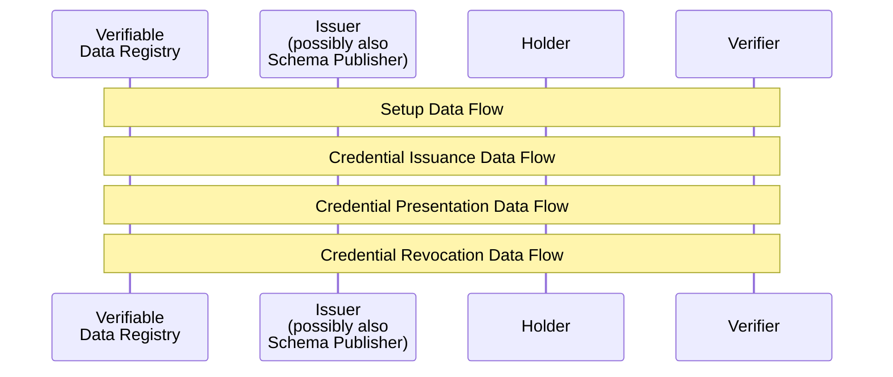
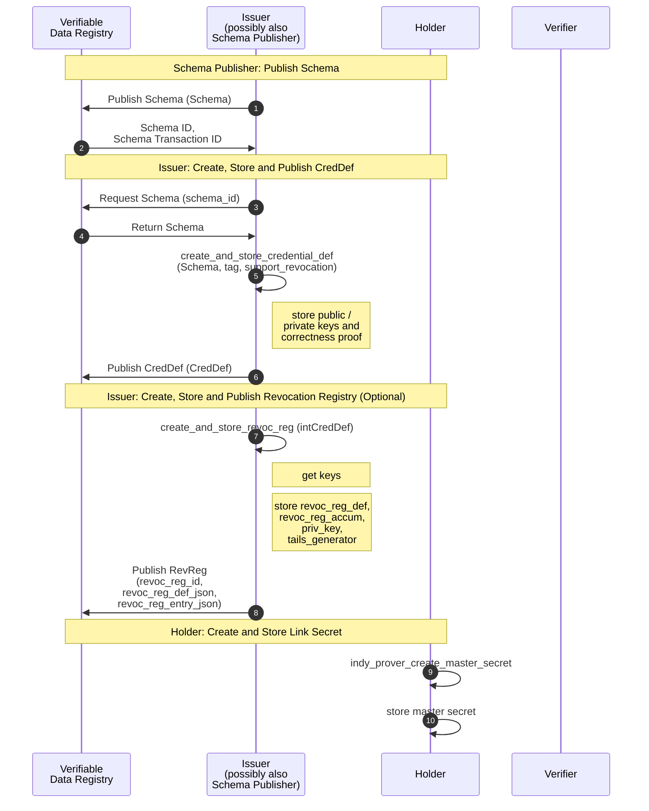

## AnonCreds Data Flows

This section of the specification describes the major data flows within AnonCreds:

* [Setup Data Flow](#setup-data-flow), including operations by an Issuer (possibly also the Schema Publisher) and Holder
* [Credential Issuance](#credential-issuance-data-flow), including operations by both the Issuer and Holder
* [Credential Presentation](#credential-presentation-data-flow), including operations by both the Holder and the Verifier
* [Credential Revocation](#credential-revocation-data-flows), including operations by the Verifier (and optionally by the holder)



Each of the aforementioned data flows involve different data objects and actors, which are described in detail in the following sections.

### Setup Data Flow

The following sequence diagram summarizes the the setup operations performed by a Schema Publisher, the Issuer (one required and one optional) in preparing to issue a type of AnonCred credential, and the one setup operation performed by each Holder. On successfully completing the operations, the Issuer is able to issue credentials of the given type to the Holder. The subsections below the diagram detail each of the operations.

``` todo
Question: Should there be an operation to cover creating the published DID for the Schema Publisher and Issuer?
```



#### Schema Publisher: Publish Schema Object

Each type of AnonCred credential is based on a Schema published to a Verifiable
Data Registry (VDR), an instance of Hyperledger Indy in this version of
AnonCreds. The Schema is defined and published by the Schema Publisher. Any issuer
who can reference the Schema (including the Schema Publisher) MAY issue
credentials of that type by creating and publishing a CredDef based on the
Schema. This part of the specification covers the operation to create and
publish a Schema. The flow of operations to publish a Schema is illustrated in
the `Schema Publisher: Publish Schema` section of the [AnonCreds Setup Data
Flow](#anoncreds-setup-data-flow) sequence diagram.

The Schema is a JSON structure that can be manually constructed containing the
list of attributes (claims) that will be included in each AnonCred credential of
this type and the items that will make up the `schema_id` for the Schema. The
following is an example Schema:

``` jsonc
{
    "attr_names": [
        "birthlocation",
        "facephoto",
        "expiry_date",
        "citizenship",
        "name",
        "birthdate",
        "firstname",
        "uuid"
    ],
    "name": "BasicIdentity",
    "version": "1.0.0"
}
```

* `attr_names` is the array of attribute names (claim names) that will constitute the AnonCred credential of this type.
* `name` is a string, the name of the schema, which will be a part of the published `schema_id`.
* `version` is a string, the version of the schema in [semver](https://semver.org/) format. The three part, period (".")
    separated format MAY be enforced. The `version` will be part of the published `schema_id`.

The `name` and `version` items are used to form a schema_id for the Schema. The
`schema_id` is namespaced by the publisher of the Schema, as follows: `<publisher
DID>:<object type>:<name>:version>`. The elements of the identifier, separated
by `:`'s are:

* `publisher DID`: The DID of the publisher of the schema.
* `object type`: The type of object. `2` is used for Schema.
* `name`: The `name` item from the Schema.
* `version`: The `version` item from the Schema.

Once constructed, the Schema is published to a Verifiable Data Registry (VDR),
currently a Hyperledger Indy ledger. For example, see [this
Schema](https://indyscan.io/tx/SOVRIN_MAINNET/domain/73904) that is published on
the Sovrin MainNet ledger. Once published on a Hyperledger Indy ledger, an
additional identifier for the published Schema, the `TXN_ID`, is available to
those reading from the ledger. As defined in the next subsection, the `TXN_ID`
is used as part of the CredDef identifier created in the next setup process.

#### Issuer Create and Publish CredDef Object

Each Issuer of a credential type (e.g. one based on a specific Schema) needs to
create a CredDef for that credential type. The flow of operations to create and
publish a CredDef is illustrated in the `Issuer: Create, Store and Publish CredDef`
section of the [AnonCreds Setup Data Flow](#anoncreds-setup-data-flow) sequence
diagram.

In AnonCreds, the CredDef and CredDef identifier include the following elements.

* A link to the Issuer of the credentials via the DID used to publish the
  CredDef.
* A link to the Schema upon which the CredDef is based (the credential type).
* A set of public/private key pairs, one per attribute (claim) in the
  credential. The private keys will later be used to sign the claims when
  credentials to be issued are created.
* Other information necessary for the cryptographic signing of credentials.

Prior to creating the CredDef, the Issuer must get an instance of the Schema to
be used, including the identifier for the Schema in the form of a Hyperledger
Indy `TXN_ID`. If the Issuer is also the Schema Publisher, they will
already have the Schema (with `TXN_ID`). If not the Issuer must request that
information from the VDR (Hyperledger Indy instance) on which the Schema is
published.

The CredDef is a JSON structure that is generated using cryptographic primitives
(described below) given the following inputs.

* A Schema for the credential type.
* A `tag`, an arbitrary string defined by the issuer, enabling an issuer to
  create multiple CredDefs for the same Schema.
* An optional flag `support_revocation` (default `false`) which if true
  generates some additional data in the CredDef to support credential
  revocation. The additional data generated when this flag is `true` is covered
  in the [next
  subsection](#issuer-create-and-publish-revocation-registry-object) of this
  document.

The operation produces two objects, as follows.

* The intCredDef, an internally managed object that includes the private keys
  generated for the CredDef and stored securely by the issuer.
* The CredDef, that includes the public keys generated for the CredDef, returned to
  the calling function and then published on a VDR (currently Hyperledger Indy).

The following describes the process for generating the CredDef data.

``` todo
Describe the generation process for the CredDef.
```

The intCredDef produced by the generation process has the following format:

```jsonc

To Do.

```

The CredDef has the following format (from [this example
CredDef](https://indyscan.io/tx/SOVRIN_MAINNET/domain/99654) on the Sovrin
MainNet):

```jsonc
{
  "data": {
    "primary": {
      "n": "779...397",
      "r": {
            "birthdate": "294...298",
            "birthlocation": "533...284",
            "citizenship": "894...102",
            "expiry_date": "650...011",
            "facephoto": "870...274",
            "firstname": "656...226",
            "master_secret": "521...922",
            "name": "410...200",
            "uuid": "226...757"
      },
      "rctxt": "774...977",
      "s": "750..893",
      "z": "632...005"
    }
  },
  "ref": 54177,
  "signature_type": "CL",
  "tag": "latest"
}
```

The integers shown with ellipses (e.g. `123...789`) are all very long integers of length 617 digits.

* `primary` is the data used for generating credentials.
* `n` is the ...
* `r` is a list of the attributes in the credential, with an associated public key for each.
  * `master_secret` is in all CredDefs and is for signing attribute that will be put into the credential from the Holder.
  * The rest of the attributes in the list are those defined in the Schema.
  * The attribute names are normalized (lower case, spaces removed) and listed in the CredDef in alphabetical order.
* `rctxt` is the ...
* `s` is the ...
* `z` is the ...
* `ref` is the `TXN_ID` on the Hyperledger Indy ledger for the Schema from which the list of attributes is pulled.
* `signature_type` is always `CL` in this version of AnonCreds.
* `tag` is the `tag` value (a string) passed in by the Issuer to an AnonCred's CredDef create and store implementation.

The Schema `TXN_ID` and `tag` items are used to form a `cred_def_id` for the CredDef. The `creddef_id` is namespaced by the Issuer of the CreDef,
as follows: `<issuer DID>:<object type>:<signature_type>:<Schema TXN_ID>:tag>`. The elements of the identifier, separated by `:`'s are:

* `issuer DID`: The DID of the Issuer, the issuer of the CredDef.
* `object type`: The type of object. `3` is used for CredDefs.
* `signature_type`: The `signature_type` item from the CredDef.
* `Schema TXN_ID`: The `ref` item from the CredDef
* `tag`: The `tag` item from the CredDef.

Once constructed, the CredDef is published by the Issuer to a Verifiable Data
Registry, currently a Hyperledger Indy ledger. For example, see [this
CredDef](https://indyscan.io/tx/SOVRIN_MAINNET/domain/73905) that is published
on the Sovrin MainNet ledger.

#### Issuer Create and Publish Revocation Registry Object

#### Holder Create and Store Link Secret