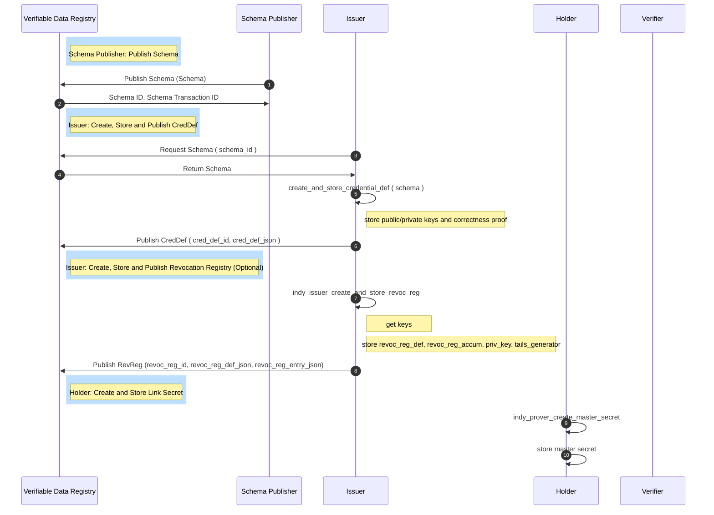

## AnonCreds Data Flows

This section of the specification describes the major data flows within AnonCreds:

* Setup, including operations by a Schema Creator (possibly the Issuer), Issuers and Holders
* Credential issuance, including operations by both the Issuer and Holder
* Present Proof, including operations by both the Verifier and the Holder

### AnonCreds Setup Data Flow

The following sequence diagram summarizes the the setup operations performed by a Schema Creator, the Issuer (one required and one optional) in preparing to issue a type of AnonCred credential, and the one setup operations performed by each Holder. On successfully completing the operations, the Issuer is able to issue credentials of the given type to the Holder. The subsections below the diagram detail each of the operations.

::: todo
Question: Should there be an operation to cover creating the published DID for the Issuer? If so, what about the DID of the Schema Creator.
:::



#### Schema Publisher: Publish Schema Object

Each type of AnonCred credential is based on a published Schema. The Schema is
defined and published by a Schema Publisher. Any issuer who can reference the
Schema (including the Schema Publisher) MAY issue credentials of that type by
creating and publishing a CredDef based on the Schema. This part of the
specification covers the operation to create and publish a Schema. The flow of
operations to publish a Schema is defined in the `Schema Publisher: Publish
Schema` section of the [AnonCreds Setup Data Flow](#anoncreds-setup-data-flow)
sequence diagram.

The Schema is a JSON structure that can be manually constructed 
containing the list of attributes (claims) that will be included in each
AnonCred credential of this type and the items that will make up the `schema_id`
for the Schema. The following is an example Schema:

``` jsonc
{
    "attr_names": [
        "birthlocation",
        "facephoto",
        "expiry_date",
        "citizenship",
        "name",
        "birthdate",
        "firstname",
        "uuid"
    ],
    "name": "BasicIdentity",
    "version": "1.0.0"
}
```

* `attr_names` is the array of attribute names (claim names) that will constitute the AnonCred credential of this type.
* `name` is a string, the name of the schema, which will be a part of the published `schema_id`.
* `version` is a string, the version of the schema in [semver](https://semver.org/) format. The three part, period (".")
    separated format MAY be enforced. The `version` will be part of the published `schema_id`.

The `name` and `version` items are used to form a schema_id for the Schema. The `schema_id` is namespaced by the creator of the Schema,
as follows: `<creator DID>:<object type>:<name>:version>`. The elements of the identifier, separated by `:`s are:

* `creator DID`: The DID of the creator of the schema.
* `object type`: The type of object. `2` is used for the Schema Object.
* `name`: The `name` item from the `schema_json` object as defined above.
* `version`: The `version` item from the `schema_json` object as defined above.

Once constructed, the Schema is published to a Verifiable Data Registry,
currently a Hyperledger Indy ledger. For example, see [this
schema](https://indyscan.io/tx/SOVRIN_MAINNET/domain/73904) that is published on
the Sovrin MainNet ledger. Once published on a Hyperledger Indy ledger, an
additional identifier for the published Schema, the `TXN_ID`, is available to
those reading from the ledger. As defined in the next subsection, the `TXN_ID`
is used as part of the CredDef identifier created in the next setup process.

#### Issuer Create and Publish CredDef Object

#### Issuer Create and Publish Revocation Registry Object

#### Holder Create and Store Link Secret
