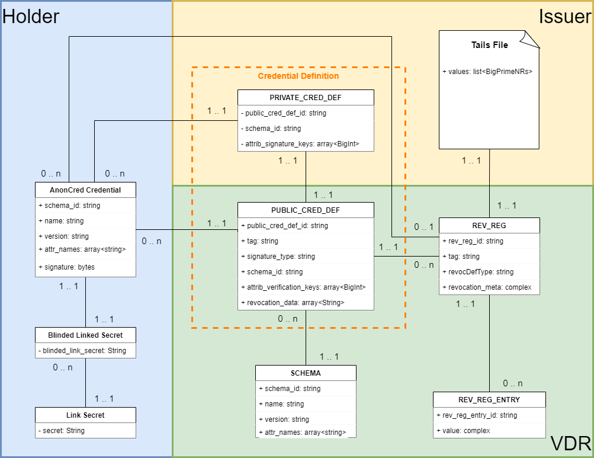

## Introduction

AnonCreds ZKP verifiable credentials provide capabilities that many see as important for digital identity use cases in particular, and verifiable data in general. These features include:

- A full implementation of the Layer 3 verifiable credential “Trust Triangle” of the [Trust over IP Model](https://trustoverip.org/wp-content/toip-model/).
- Complete flows for issuing verifiable credentials (Issuer to Holder), and requesting, generating and verifying presentations of verifiable claims (Holder to Verifier).
- Fully defined data models for all of the objects in the flows, including verifiable credentials, presentation requests and presentations sourced from multiple credentials.
- Fully defined applications of cryptographic primitives.
- The use of Zero Knowledge Proofs (ZKPs) in the verifiable presentation process to enhance the privacy protections available to the holder in presenting data to verifiers, including:
  - Blinding issuer signatures to prevent correlation based on those signatures.
  - The use of unrevealed identifiers for holder binding to prevent correlation based on such identifiers.
  - The use of predicate proofs to reduce the sharing of PII and potentially correlating data, especially dates (birth, credential issuance/expiry, etc.).
  - A revocation scheme that proves a presentation is based on credentials that have not been revoked by the issuers without revealing correlatable revocation identifiers.

The AnonCreds v0.1 Specification matches the existing [Hyperledger Indy SDK (“libindy”)](https://github.com/hyperledger/indy-sdk/blob/master/libindy/src/api/anoncreds.rs) and [Indy Credential Exchange (“cred-x”)](https://github.com/hyperledger/indy-shared-rs/tree/main/indy-credx) implementations. The next version of the specification (tentatively v1.0) will remove from the v0.1 specification any dependence on Hyperledger Indy by removing any requirements related to the storage of the objects used in AnonCreds, whether they be stored remotely on a “verifiable data registry” (including Hyperledger Indy) or in local secure storage. 

The following diagram and explanation below gives a high level overview of all AnonCreds Data objects, their relations and the owner ([[ref: Holder]] or [[ref: Issuer]]) of each of the data objects. [[ref: Verifier]] do not need to store any particular data in addition to the data available in the [[ref:VDR]] and therefore are not shown in the diagram.

AnonCreds require a [[ref: Verifiable Data Registry]] (VDR). A [[ref: VDR]] (box in green) is a public registry (e.g. a ledger) used for storing some of the AnonCreds data objects. 

[[ref: Schema]]s are public and reusable templates, which define the attributes of issued AnonCreds [[ref: credentials]] and can be written (e.g. by an [[ref: Issuer]], box in yellow) to the [[ref: VDR]]. 

Based on a [[ref: Schema]], arbitrary [[ref: Issuer]]s can create a Credential Definition ([[ref:CRED_DEF]]) which references the [[ref: Schema]]. A [[ref:CRED_DEF]] enables [[ref: Issuers]] to issue AnonCreds [[ref: Credentials]] to [[ref: Holders]] and [[ref:Verifier]] to verify [[ref: Credentials]] issued to and presented by a [[ref:Holder]]. A [[ref:CRED_DEF]] consists of two pieces of information: First, the [[ref:CRED_DEF]]_PRIVATE includes the private signing keys of the [[ref:Issuer]] for signing and issuing the AnonCreds [[ref: Credentials]] to [[ref: holders]] and is kept private by the [[ref: Issuer]]. Second, the [[ref:CRED_DEF]]_PUBLIC includes the public keys of the [[ref:issuer]], has to be stored on a [[ref:VDR]] and is used by arbitrary [[ref:Verifiers]] in order to verify AnonCreds [[ref: Credentials]] issued to and presented by [[ref: Holders]]. 

Each [[ref: Holder]] (box in blue) has a [[ref: link secret]], which enables [[ref: Credential]] to [[ref: Holder]] binding: Whenever a [[ref: Credential]] is issued to a [[ref: Holder]] by an [[ref: Issuer]], the [[ref: Holder]] sends a blinded version of the [[ref: link secret]] to the [[ref: Issuer]] before the credential is issued to the [[ref: Holder]]. The blinded version of the [[ref: link secret]] gets then signed along with the other attributes within the AnonCreds [[ref: Credential]] by the [[ref: Issuer]] and sent to the [[ref: Holder]]. Since the [[ref:Holder]] uses a blinded version of the same [[ref:link secret]] for every [[ref: Credential]] that is issued to the [[ref: Holder]], the [[ref: Holder]] can proof the affiliation of multiple [[ref:Credentials]] at presentation time.

AnonCreds allows the revocation of [[ref: Credentials]] issued to [[ref: Holders]] by [[ref: Issuers]]. In case revocation is required, at least one Revocation Definition Registry ([[ref: REV_REG_DEF ]]), which references the according [[ref: CRED_DEF]]_PUBLIC, has to be stored to the [[ref: VDR]] by the [[ref: Issuer]] (respectively author of the Credential Definition) in addition to the [[ref:CRED_DEF]]_PUBLIC. A [[ref: REV_REG_DEF]] can have Revocation Registry Entries ([[ref: REV_REG_ENTRY]]). When one or more credentials have to be revoked, the [[ref: Issuer]] stores a [[ref: REV_REG_ENTRY]] with the updated status of the credentials in question to the [[ref: VDR]]. [[ref: Verifier]] use this additional pieces of information in order to validate the revocation status of the credentials (besides the signature of the credentials). A [[ref: Tails File]] supports the revocation mechanism. Each [[ref: REV_REG_DEV]] requires exactly one Tails File.

::: todo
Finish Tails File definition in Terminology and the usage of tails file here.
:::

::: todo
Update attributes in diagram: What do we need to show, what don`t we need to show?
:::

